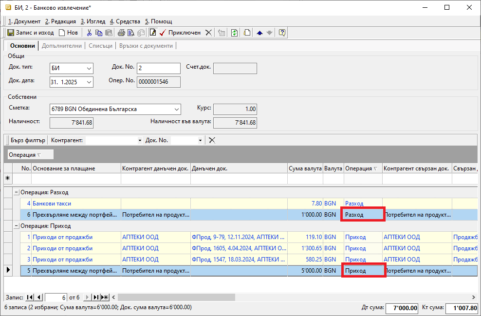
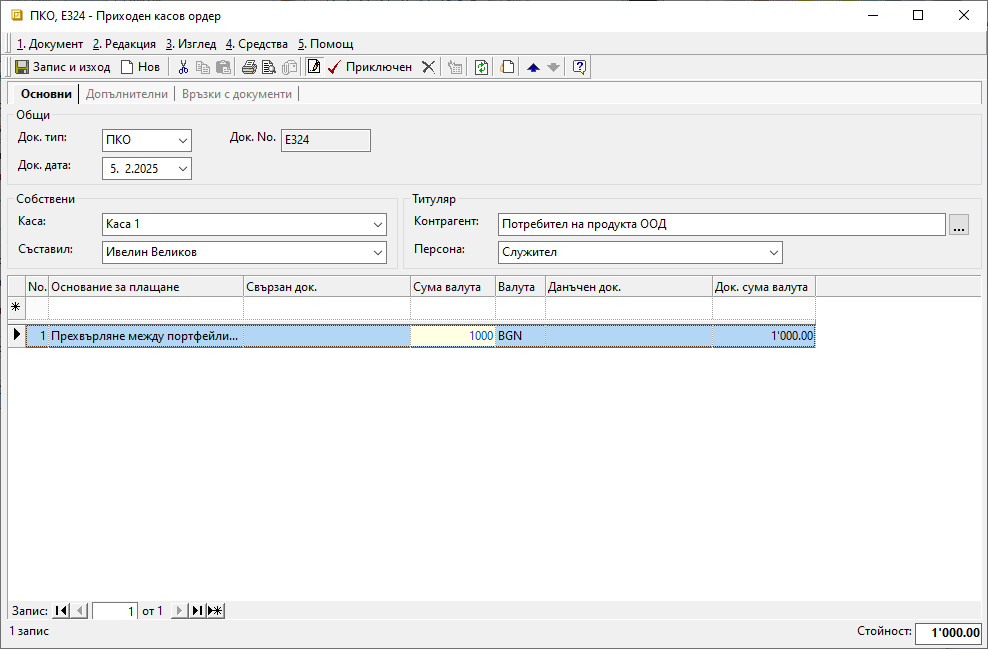

```{only} html
[Нагоре](000-index)
```

# Прехвърляне на средства между банка и каса

Трансферът на парични средства между банка и каса може да бъде двупосочен. Всяко движение на средства трябва да се отрази в системата.    

Внасянето и тегленето на пари от банковите сметки се регистрира чрез въвеждане на банкови извлечения. В тези документи посоката на движение на средствата се определя от тип на операцията - **Приход** или **Разход**.  

Прехвърлянето на средства от/в каса се регистрира в системата от **Търговска система || Касови документи**. Приходът в касата се отразява чрез въвеждане на **ПКО**-*Приходен касов ордер*. Когато се въвежда разход на средства от касата, се създава **РКО**-*Разходен касов ордер*.  

Процесът е следният:

1) Избира се **Търговска система || Банкови документи** и се отваря **Банково извлечение**. В документа за избраната банкова сметка се въвежда операцията по прехвърляне на паричните средства.  

В раздел **Основни** се попълват:

- **Док. No** - в полето се попълва номер на банковото извлечение;  
Ако полето е празно, системата не попълва пореден номер на документа при приключване на извлечението.  

- **Док. дата** - в полето се избира датата, за която се отнасят движенията по текуща банкова сметка;  

- **Банкова сметка** - от опционално меню се избира банковата сметка, за която се отнася операцията;   
Банковите сметки се настройват предварително в **Потребител на продукта**.  

> Останалите полета в секция **Общи** се попълват автоматично от системата.  

- **Основание за плащане** – в полето се избира основанието, настроено за трансфер на средства;   
Основания за плащане се дефинират предварително от **Номенклатури || Референти номенклатури || Търговска система: Основания за плащане**. 

- **Контрагент данъчен док.** и **Контрагент свързан док.** – полетата се попълват с контрагента, настроен като **Потребител на продукта**;  

- **Сума валута** и **Док. сума валута** - в тези полета се въвежда сумата, която се прехвърля в/от банковата сметка;

- **Операция** - типа операция в това поле отразява посоката на движение на парични средства;  
Използва се *Разход* при прехвърляте на пари от банковата сметка към каса. *Приход* се избира при прехвърляне на средства от каса в текущата банкова сметка.  

{ class=align-center }

2) Чрез бутон **Приключен** от лентата с инструменти се отваря форма за генерация на свързани документи. Системата дава възможност за автоматично създаване на счетоводно записване.  
 
    - **Генериране на Счетоводно записване** - опция за автоматична генерация на свързан счетоводен документ;  
    Когато за тази опция липсва отметка, системата не генерира счетоводен запис за банковото извлечение.  
    - **Приключване** - ако липсва отметка за тази опция, системата генерира счетоводния документ в редакция, а при поставена отметка - в състояние *Приключен*;  
    - **OK** - бутонът потвърждава избраните във формата опции;   

> За да се генерира коректен счетоводен запис, трябва предварително да има настройки на транзитна сметка в **Сметкоплан** и в **Автоматичен счетоводител**.  


3) Избира се **Търговска система || Касови документи** и чрез десен бутон на мишката се отваря **Нов документ**.  

В раздел **Основни** от формата за въвеждане на касов документ се попълват:   

- **Док. Тип** – поле с опционално меню за избор на тип документ;  
Избира се **ПКО** - *Приходен складов ордер*, когато средствата постъпват в касата.  
Тип **РКО** - *Разходен касов ордер* се избира, когато средствата се прехвърлят от касата в банкова сметка.  

- **Док. No** - полето се попълва с номер на документа;  
Системата автоматично попълва пореден номер за избраната каса при приключване на документа.    

- **Док. дата** - в полето се избира дата, за която се отнася приходът/разходът на избраната каса; 

- **Каса** – поле с опционално меню за избор на каса;  
Списъкът с каси се настройва предварително от **Номенклатури || Референтни номенклатури**.  

- **Съставил** - полето се обзавежда от падащо меню с предварително настроен списък служители;  
Данните в полето се попълват автоматично с настройките на текущия потребител.  

- **Контрагент** – в полето се избира контрагентът, настроен като **Потребител на продукта**;

В реда за добавяне на нов запис се избират:  
    
- **Основание за плащане** – в полето се избира основанието, настроено за трансфер на средства;   
Основания за плащане се дефинират предварително от **Номенклатури || Референти номенклатури || Търговска система: Основания за плащане**. 

- **Сума валута** и **Док. сума валута** - полета за попълване на сума, отговаряща на прихода/разхода на текущата каса;  

{ class=align-center }

4) Чрез бутон **Приключен** от лентата с инструменти се отваря форма за генерация на свързани документи. Системата дава възможност за автоматично създаване на счетоводно записване.  
 
    - **Генериране на Счетоводно записване** - опция за автоматична генерация на свързан счетоводен документ;  
    Когато за тази опция липсва отметка, системата не генерира счетоводен запис към касовия ордер.  
    - **Приключване** - при липса на отметка, системата генерира счетоводния документ в редакция, а при поставена отметка - в състояние *Приключен*;  
    - **OK** - бутонът потвърждава избраните във формата опции;   

> За да се генерира коректен счетоводен запис, трябва предварително да има настройки на транзитна сметка в **Сметкоплан** и в **Автоматичен счетоводител**.  