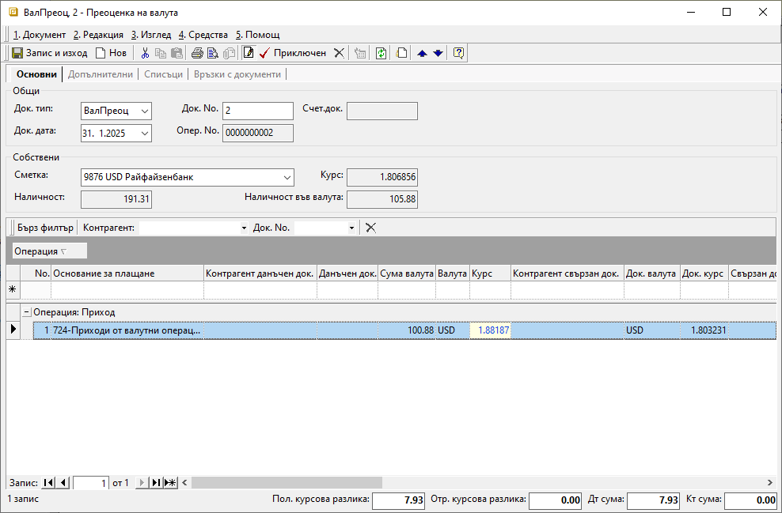

```{only} html
[Нагоре](000-index)
```

# Валутна преоценка

Преоценката на валутни наличности в края на избран период (месец, тримесечие, година или друго) може да бъде направена в **Търговска система || Банкови документи**.  
В системата има изрично създаден за целта тип документ **ВалПреоц**-*Преоценка на валута*.  

> Преди да се създаде документ за валутна преоценка, е необходимо да бъдат въведени всички предходни банкови извлечения.  

Процесът по въвеждане на банков документ за валутна преоценка е следният:

1) От справка **Оборотна ведомост на портфейли** се проверяват количество валута и цена на крайното салдо в избрания ден за преоценка.   

{ class=align-center }

2) От **Търговска система || Банкови документи** чрез десен бутон на мишката върху списъка се избира **Нов документ**.  

3)  В раздел **Основни** на формата за въвеждане на данни се попълват:  

- **Док. тип** - от опционалното меню се избира документ **ВалПреоц**-*Преоценка на валута*.  

- **Док. No** - в полето се попълва номер на документа;  
Ако полето остане празно, системата не попълва пореден номер на документа при приключване на извлечението.  

- **Док. дата** - в полето се избира дата на преоценката - например последен ден от месеца, тримесечието, годината или друго;  

- **Банкова сметка** - от опционално меню се избира валутната банковата сметка, за която се отнася текущата преоценка;   
Банкови сметки се настройват предварително в **Потребител на продукта**.  

> Останалите полета в секцията - **Курс**, **Наличност** и **Наличност във валута** се попълват автоматично от системата.  
> Данните в тях не се използват за целите на текущата валутна преоценка.   

{ class=align-center }

- **Основание за плащане** – от опционалното меню в полето се избира основанието, настроено за преоценка на валута;  
Основанията трябва да са предварително дефинирани в **Номенклатури || Референтни номенклатури || Търговска система: Основания за плащане**.  
Избраното основание определя счетоводната операция, която се генерира при приключване на документа. Необходимо е предварително да бъдат направени настроийки за това от **Счетоводство || Автоматичен осчетоводител**.  

- **Сума валута** - в това поле се попълва наличност валута, отговаряща на крайното салдо за деня на преоценка;  
Данните се вземат от **Оборотна ведомост на портфейли**, колона *Салдо в края на периода || Кол.*.  

- **Валута** - в полето се избира валутата, отговаряща на текущата банкова сметка;    

- **Курс** - в полето се попълва валутен курс по фиксинга на БНБ за датата на текущия документ;   
Към този курс се приравнява наличността на избраната банкова сметка.    

- **Док. валута** - в полето се избира валутата, отговаряща на текущата банкова сметка; 

- **Док. курс** - в полето се попълва валутният курс  ;  
Данните се вземат от **Оборотна ведомост на портфейли**, колона *Цена*.  

4) Чрез бутон **Приключен** от лентата с инструменти банковият документ се валидира. Тук системата дава възможност за генериране на счетоводно записване.  
 
    - **Генериране на Счетоводно записване** - опция за автоматична генерация на свързан счетоводен документ;  
    Когато за тази опция липсва отметка, системата не генерира счетоводен запис.  
    - **Приключване** - ако липсва отметка за тази опция, системата генерира счетоводния документ в редакция, а при поставена отметка - в състояние *Приключен*;  
    - **OK** - бутон, с който се потвърждават избраните във формата опции;  

5) След актуализиране на данните в справка **Оборотна ведомост на портфейли** може да бъде направена проверка на новите стойности.  

{ class=align-center }
