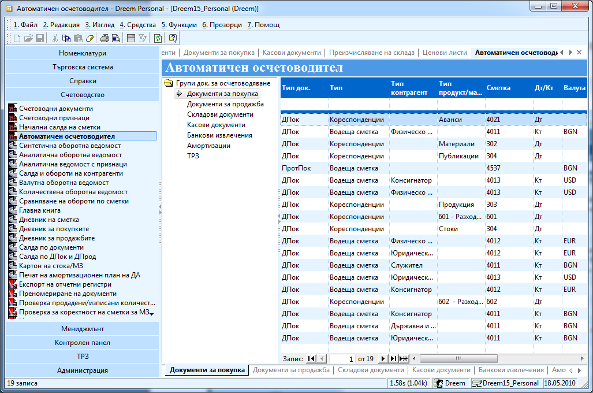
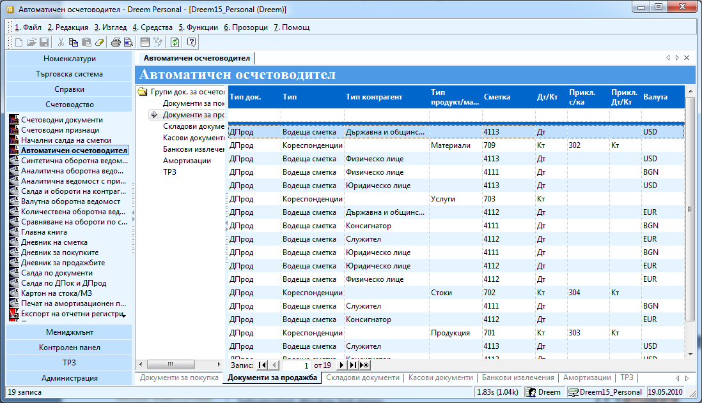
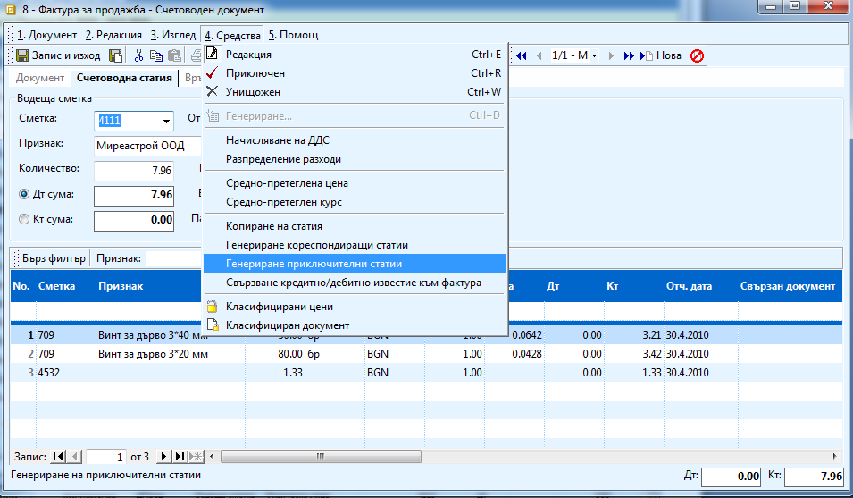
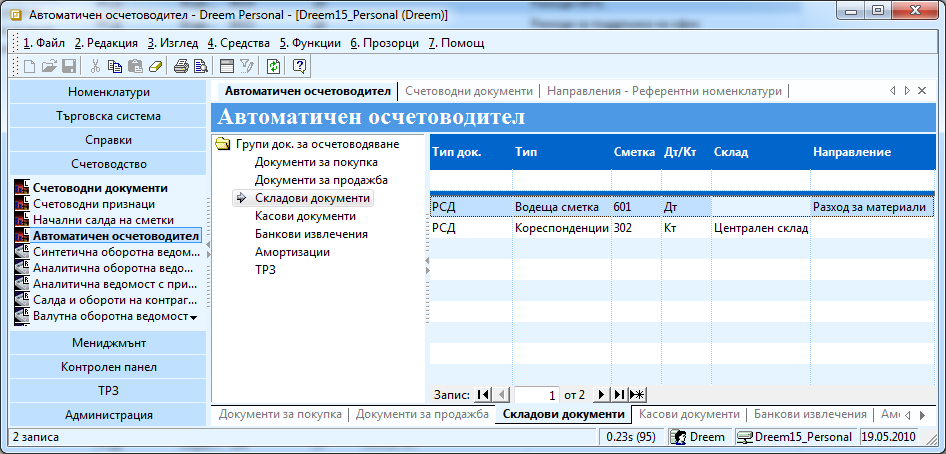
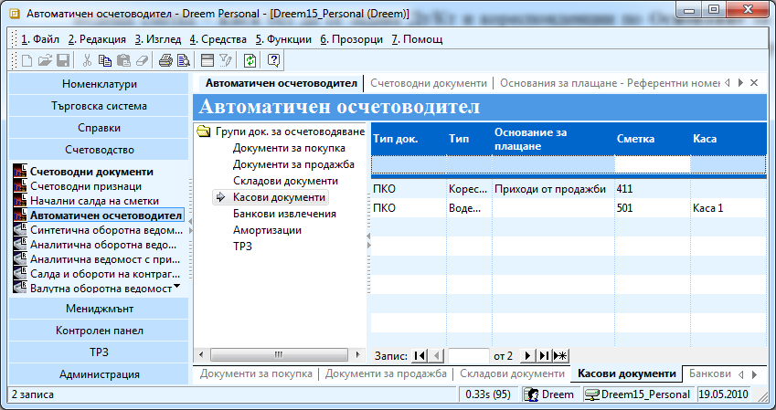
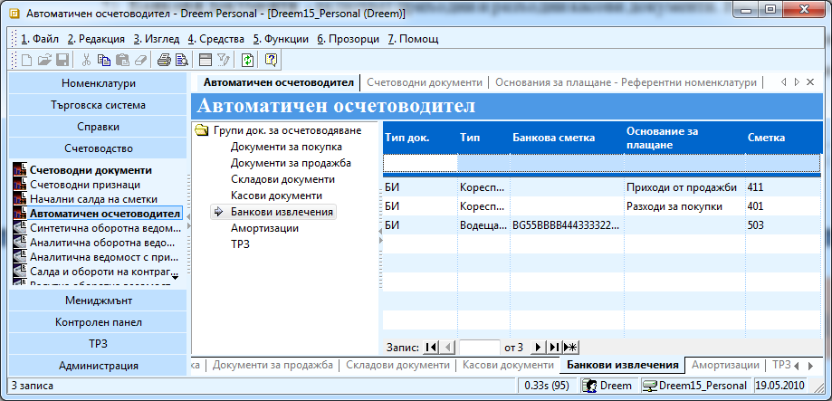
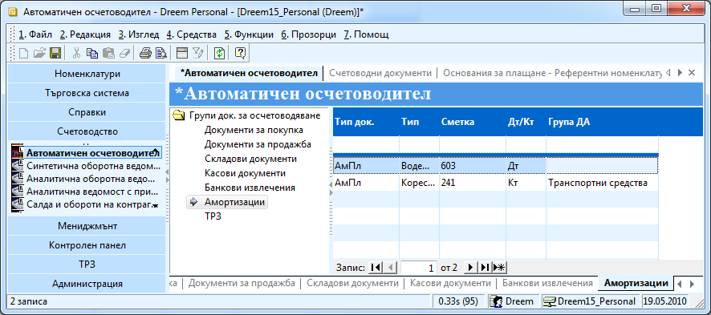

```{only} html
[Нагоре](000-index)
```

# Настройване на автоматичния осчетоводител

Системата е съставена от два основни модула Търговска и Счетоводна
система като от всеки документ от търговската система може да се
генерира автоматично счетоводен. За да се генерират автоматично
коректни счетоводни записи, системата трябва да се настрои според
счетоводната политика и индивидуалния сметкоплан на всяка фирма. Тези
настройки се правят веднъж, още със започването на работа със
Счетоводната система.

За да настроите вашата система трябва посочите как трябва да се
осчетоводява всеки един документ, на който ще правите
счетоводен запис във специална функционалност – **Автоматичен
осчетоводител**. След като веднъж направите тези настройки, всички
рутинни счетоводни операции ще се извършват автоматично.

Преди да започнете работа с настройките се уверете, че дефинирали
правилно всички типове продукти/ материали, типове контрагенти и
основания за плащане, защото от тях зависи правилното осчетоводяване.

За да настроите Автоматичния осчетоводител, го отворете от
**Счетоводство \>\> Автоматичен осчетоводител**. Там
документите са обособени в *Групи документи за осчетоводяване* –
документи за покупка, документи за продажба, складови документи, касови
документи, банкови извлечения, амортизации и ТРЗ.

За всеки един от тези документи и групи се настройват задължително по
два реда – за водеща и кореспондираща сметка. С терминът „Водеща
сметка” в системата се обозначава сметката, която се въвежда в
горната част на секцията, а в редовете на статията се въвеждат
нейните една или повече кореспонденции. Водещата сметка може да е
както по кредита, така и по дебита.

1. **Документи за покупка** - включват се всички документи от групата на данъчните документи за покупка – Фактури, Дебитни и Кредитни известия, Квитанции и Други документи за покупка – Протокол за самооблагане. При тези документи се настройва водеща сметка по **Тип Контрагент** и Кореспонденции по **Тип Продукт/Материал**. Това е така защото както вече споменахме водещата сметка е тази, която е само една в документа, а при този тип документи имаме винаги само един контрагент и един или множество продукти.

Можете да зададете едновременно настройките за всички документи от тази
група като изберете *ДПок* в **Тип док**.

За да е коректно осчетоводяването трябва да създадете отделен ред за
всеки тип контрагент и за всеки тип продукт/материал. Трябва
задължително да посочите и дали записа ще отива по кредита или
дебита на избраната счетоводна сметка.

Например желаете при осчетоводяване на фактура на контрагент от тип
*Физическо лице*, доставил ви материали счетоводният запис да е
302/4011. Създавате ред с **Тип док**. – *ДПок*, **Тип** – *Водеща
сметка*, **Тип контрагент** – *Физическо лице*, **Тип
продукт/материал** – оставяте празно, за **сметка**
посочвате – *4011*, **Дт/Кт** *– Кт*, **Валута** – *BGN* – ако
работите с тази валута. По този начин настройвате при осчетоводяване на
фактура, издадена ви от физическо лице, записът да е -/4011. След това
създавате още един ред с **Тип док**. – *ДПок*, **Тип** –
*Кореспонденции*, **Тип контрагент** – оставяте празно,
**Тип продукт/материал** – *Материали*, за **сметка** посочвате –
*302*, **Дт/Кт** *– Дт*, **Валута** – *BGN* – ако работите с тази
валута. Така настройвате при осчетоводяване на фактура с
материали, записът да е 302/-.

{ class=align-center w=15cm }

1. **Документи за продажба** - включват се всички документи от групата на данъчните документи за продажба – Фактури, Дебитни и Кредитни известия, Квитанции и други. Настройват се по същия начин като документите за покупка - водеща сметка по **Тип Контрагент** и Кореспонденции по **Тип Продукт/Материал**.

{ class=align-center w=15cm }

Единствената разлика при тази група документи е, че имате възможност на
всеки ред да посочите приключваща сметка. Тази настройка обаче работи
само, ако генерирате приключваща статия от самия счетоводен документ.

{ class=align-center w=15cm }

1. **Складови документи** – включват се всички складови документи, с които заприхождавате или извеждате стоки и материали от склада – приходни, разходни, приемно – предавателни протоколи, протоколи за брак, липси и излишък. Тези документи се настройват обикновено, ако например имате няколко счетоводни склада и при трансфер на стока между тях, искате това да се отрази и в счетоводната система или работите с незавършено производство. При тези документи се настройва водеща сметка по **Направление** и Кореспонденции по **Склад.** Колоната **Тип продукт/ материал** можете да я скриете, защото при този тип документи не се взима предвид при осчетоводяването. Всички направления трябва да ги дефинирате предварително от **Номенклатури \>\> Референтни номенклатури \>\> Счетоводство \>\> Направления.**

При този тип документи е желателно всички типове документи да се
настройват един по един.

Например работите по обект, в продължение на няколко месеца и издавате
фактура, когато работата ви по обекта приключи. Искате обаче през това
време да водите търговска и счетоводна отчетност на материалите, които
влагате. Това се реализира чрез издаване на разходни складови
документи. Искате обаче да ги настроите при осчетоводяване да
се изписват от 302 сметка и да се насочват към 601. В автоматичния
осчетоводител трябва да създадете два реда. Водещата сметка се
определя от направлението. Трябва да създадете ред с **Тип док.**
– *РСД,* **Тип** – *Водеща сметка*, **Дт/Кт** – *Дт*, **Склад** –
оставяте го празно, **Сметка** *– 601-* (ако имате отделни
подсметки за различни обекти трябва да я посочите),
**Направление** – *Разход за материали* (или друго подходящо,
което сте създали). По този начин винаги когато осчетоводите разходен
складов документ, на който сте посочили това направление, материалите
ще отиват по дебита на 601 сметка. След това създавате втори ред с
**Тип док.** – *РСД,* **Тип** – *Кореспонденции*, **Дт/Кт** – *Кт*,
**Склад** – посочвате склада, от който ще изписвате материалите,
**Сметка** *– 302-* (ако имате отделни подсметки за различните
складове трябва да я посочите), **Направление** – оставяте го
празно*.* В концепцията на системата е заложено в един склад да
има само продукти и материали от един тип т.е. не можете да имате
например в Централен склад и стоки и материали.

{ class=align-center w=15cm }

1. **Касови документи** - включват приходни и разходни касови документи. Настройват се по водеща сметка – **каса** без да се задава Дт/Кт и кореспонденции по **Основание за плащания**. Трябва предварително да дефинирате основанията за плащане **Номенклатури \>\> Референтни номенклатури \>\> Търговска система \>\> Основания на плащане.** Ако за различните каси имате различни подсметки трябва да създадете отделен запис за всяка една от тях.

{ class=align-center w=15cm }

1. **Банкови документи** - включват само банкови документи. Настройват се по същия начин като касовите документи - с водеща сметка – **Банкова сметка** без да се задава Дт/Кт и кореспонденции по **Основание за плащания**. За всяка банкова сметка трябва да създадете отделен запис.

{ class=align-center w=15cm }

1. Амортизации – включва се само документа за амортизации - АмПл. Настройките за водеща и кореспондираща сметка са еднакви с разликата, че при записа с кореспондиращата сметка трябва да посочите **Група ДА**. За всяка **Група ДА** трябва да създадете отделен запис и да посочите точната сметка (зависи как е настроен сметкопланът ви). Групите трябва да ги дефинирате предварително от **Номенклатури \>\> Референтни номенклатури \>\> Дълготрайни активи \>\> Групи ДА.**

{ class=align-center w=15cm }
