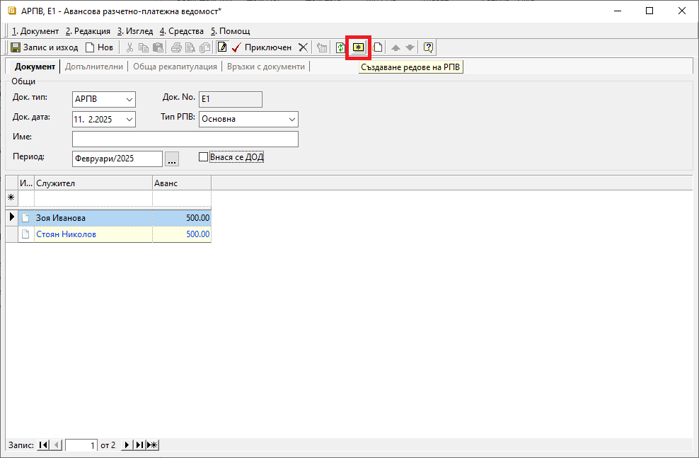

```{only} html
[Нагоре](000-index)
```

# Авансови разчетно-платежни ведомости

Системата предоставя възможност за генерация на документ, с който автоматично се начисляват аванси на служителите. 

Тази функционалност е достъпна в модул **ТРЗ || Авансови разчетно–платежни ведомости**.  

За автоматичното съставяне на тези документи е необходимо да бъде настроена номенклатура със служителите на фирмата.  

1) От **ТРЗ || Авансови разчетно–платежни ведомости** чрез десен бутон на мишката върху списъка се избира **Нов документ**.  
Отваря се нова форма за въвеждане на данни.  

2) В раздел **Документ** се попълват:  

 - **Док. тип** – поле за избор на тип на документа - **АРПВ**-*Авансова разчетно–платежна ведомост*;  

 - **Док. No.** – поле с номер на документа;  
 Ако полето остане празно, при валидиране на РПВ системата ще попълни пореден номер.  

 - **Док. дата** – в това поле се попълва дата на начисление на заплатите; 

 - **Тип РПВ** - ;  

 - **Име** – в това поле може да се въведе наименование на ведомостта, което се визуализира при печат;  

 - **Период** – в полето се избира месеца, за който се отнасят авансите;  

 - **Внася се ДОД** - при активиране на опцията чрез поставяне на отметка системата ще начисли ДОД;  

 { class=align-center }

 - **Създаване редове на РПВ** - чрез жълтия бутон в лентата с инструменти може автоматично да се генерира ред за всеки служител с настроен аванс;  
 Настройка на аванс се прави от форма за редакция на **Служител** в раздел **Допълнителни**.  

 - **Служител** - в полето се отваря форма за избор на служители;  
 Освен чрез генерация, системата позволява и ръчно въвеждане на списък служители.  

 - **Аванс** - поле със сума на аванса; 
 Данните могат да бъдат въведени и редактирани ръчко, както и да се използва жълтия бутон за генерация в лентата с инструменти.  

3) Чрез бутон **Приключен** от лентата с инструменти **АРПВ** се валидира и се отваря форма за генерация **Свързани документи**.  
    - **Плащане в** (каса) — чрез тази опцията може да се избира каса, за която се създава разходен касов ордер;  
    Използва се, когато има плащане в брой.    
        - *За дата* - избира се дата, с която системата попълва **Док. дата** в касовия документ; 
        - *Основание:* - от падащия списък се посочва основанието за плащане, което системата да обзаведе в касовия документ;
        - *Приключване* - при поставена отметка системата генерира касов документ и автоматично го приключва;  
        Ако не бъде поставена отметка, системата генерира свързания документ, който остава в състояние на редакция.  
    - **Генериране на Счетоводно записване** - опция за автоматична генерация на свързан счетоводен документ;  
    Когато за тази опция липсва отметка, системата не генерира счетоводен запис към **АРПВ**.  
        - *Приключване* - при поставена отметка системата генерира счетоводния документ и автоматично го приключва;  
        Ако не бъде поставена отметка, системата генерира счетоводен запис, който остава в състояние на редакция. 
    - **Печат** и **Преглед** - опции за директен печат на документа, или за преглед на екран на документа;     
    - **OK** - чрез този бутон се потвърждават избраните във формата опции;  

     { class=align-center }

4) **Запис и изход** - бутон в лентата с инструменти, който записва документа и затваря формата.  