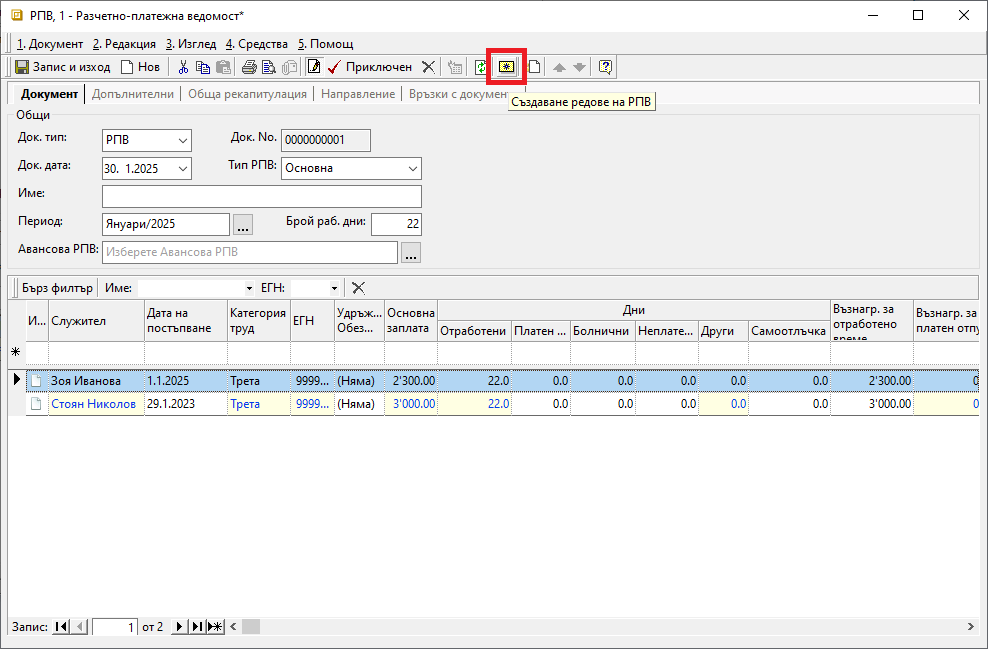
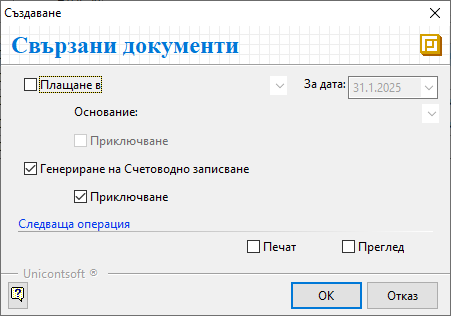

```{only} html
[Нагоре](000-index)
```

# Разчетно–платежни ведомости

Системата предоставя възможност за генерация на документ, с който автоматично се начисляват заплатите и осигуровките на служителите.  
Тази функционалност е достъпна в модул **ТРЗ || Разчетно–платежни ведомости**.  

За автоматичното съставяне на ведомостта е необходимо да бъдат извършени предварително следните действия:  

 - Дефиниране на настройки в **Номенклатури || Референтни номенклатури || ТРЗ**;  
 - Създаване на номенклатурите със служителите на фирмата;  
 - Въвеждане в системата на всички болнични документи;  
 - Въвеждане в системата на всички документи за отпуск;  
 - Генерация и валидиране на *Авансови разчетно-платежни ведомости* за дадени аванси на служители;   

1) От **ТРЗ || Разчетно–платежни ведомости** чрез десен бутон на мишката върху списъка се избира **Нов документ**.  
Отваря се нова форма за въвеждане на данни.  

2) В раздел **Документ** се попълват:  

 - **Док. тип** – поле за избор на тип на документа - **РПВ**-*Разчетно–платежна ведомост*;  

 - **Док. No.** – поле с номер на документа;  
 Ако полето остане празно, при валидиране на РПВ системата ще попълни пореден номер.  

 - **Док. дата** – в това поле се попълва дата на начисление на заплатите; 

 - **Име** – в това поле може да се въведе наименование на ведомостта, което се визуализира при печат;  

 - **Период** – в полето се избира месеца, за който се начисляват заплати на служителите;  

 - **Брой раб. дни** – в полето се попълват автоматично брой работни дни за избрания период;  
 Настройките за неработни дни и официални празници се създават в **Номенклатури || Референтни номенклатури || ТРЗ: Празници и почивни дни**.  
 Системата се актуализира и всички официално приети за неработни дни се попълват автоматично.  

 - **Авансова РПВ** – в това поле се отваря форма за избор на документи * Авансови разчетно–платежни ведомости*;  
 Полето трябва да се обзаведе, когато има създаден документ за аванси през същия месец. При изчисление на раплатите системата ще извади сумите на авансите.  

 { class=align-center }

 - **Създаване редове на РПВ** - чрез жълтия бутон в лентата с инструменти може автоматично да се генерира ред за всеки настроен служител;  
 Ако всичко е попълнено правилно, останалите полета във ведомостта  ще се обзаведат автоматично.  
 
3) В раздел **Обща рекапитулация** може да се види общата сума на дължимите осигуровките по параграфи.  
Справката може да бъде разпечатана при приключване на документа.  

4) Чрез бутон **Приключен** от лентата с инструменти **РПВ** се валидира и се отваря форма за генерация **Свързани документи**.  
    - **Плащане в** (каса) — чрез тази опцията може да се избира каса, за която се създава разходен касов ордер;  
    Използва се, когато има изплащане на заплати в брой.    
        - *За дата* - избира се дата, с която системата попълва **Док. дата** в касовия документ; 
        - *Основание:* - от падащия списък се посочва основанието за плащане, което системата да обзаведе в касовия документ;
        - *Приключване* - при поставена отметка системата генерира касов документ и автоматично го приключва;  
        Ако не бъде поставена отметка, системата генерира свързания документ, който остава в състояние на редакция. 
    - **Генериране на Счетоводно записване** - опция за автоматична генерация на свързан счетоводен документ;  
    Когато за тази опция липсва отметка, системата не генерира счетоводен запис към **РПВ**.  
        - *Приключване* - при поставена отметка системата генерира счетоводния документ и автоматично го приключва;  
        Ако не бъде поставена отметка, системата генерира счетоводен запис, който остава в състояние на редакция. 
    - **Печат** и **Преглед** - опции за директен печат на документа, или за преглед на екран на документа;    
    Могат да бъдат разпечатани **РПВ** и **Обща рекапитулация**.  
    - **OK** - чрез този бутон се потвърждават избраните във формата опции;  
    
    { class=align-center }
 
5) **Запис и изход** - бутон в лентата с инструменти, който записва документа и затваря формата.  

