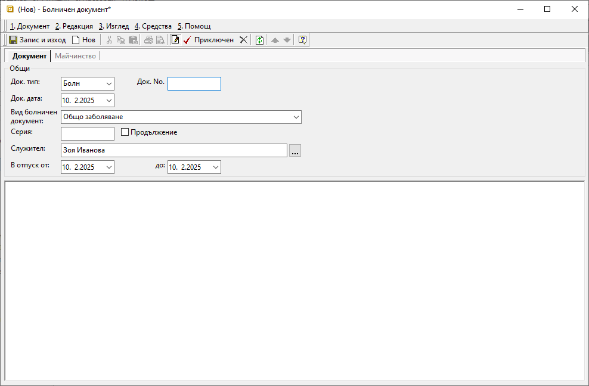

```{only} html
[Нагоре](000-index)
```

# Болнични документи

Всеки болничен документ, представен от служител на фирмата, трябва да се регистрира в системата.  

1) От **ТРЗ || Болнични документи** чрез десен бутон на мишката върху списъка се избира **Нов документ**.  
Отваря се нова форма за въвеждане на данни.  

2) В раздел **Документ** се попълват:  

 - **Док. тип** – поле с тип на документа - **Болн**-*Болничен документ*;  

 - **Док. No.** – поле с номер на болничния лист, представен от служителя;  

 - **Док. дата** – дата на болничния лист, представен от служителя; 

 - **Вид болничен документ** – поле с опционално меню за избор на заболяване, посочено на болничния лист.  
 Видовете болнични документи са предварително дефинирани в **Номенклатури || Референтни номенклатури || ТРЗ: Видове болнични документи.**  

 - **Серия** - поле за попълване на серия от болничния лист;  

 - **Продължение** - в полето се поставя отметка, когато болничният лист е продължение на вече представен първичен болничен лист;  

 - **Служител** – поле за избор на служител, за когото се отнася болничният документ;   

 - **В отпуск от / до** – в полетата се попълват първи и последен ден от болничния лист;  

{ class=align-center }

3) В раздел **Майчинство**, при регистриране на документ от вид *Бременност и майчинство* се попълват:  

- **Дата на термина**
- **Дата на раждане**

4) След попълване на необходимите полета документът се валидира с бутон **Приключен** от лентата с инструменти.  