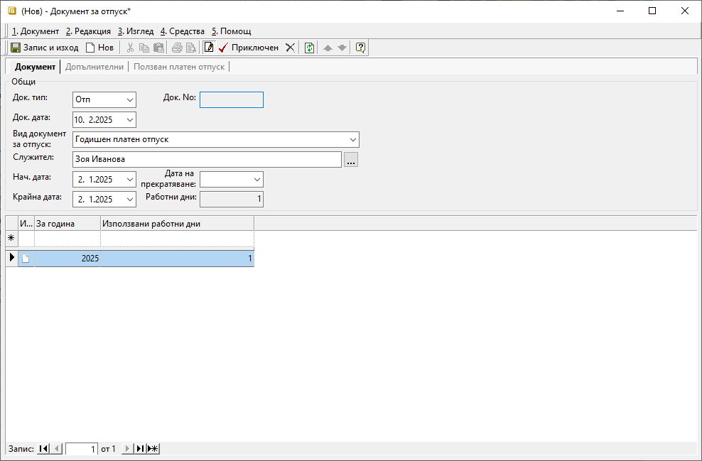

```{only} html
[Нагоре](000-index)
```

# Документи за отпуск

Използваните от служител на фирмата дни отпуск (платен, неплатен или друг вид) трябва да се регистрират в системата. Това става чрез въвеждане на тип документ **Отп**-*Документи за отпуск*.   

1) От **ТРЗ || Документи за отпуск** чрез десен бутон на мишката върху списъка се избира **Нов документ**.  
Отваря се нова форма за въвеждане на данни.  

2) В раздел **Документ** се попълват:  

 - **Док. тип** – поле за избор на тип документ - **Отп**-*Документ за отпуск*;  

 - **Док. No.** – поле с номер на документа;  
 Полето може да се попълни ръчно. Ако остане празно при приключване на документа системата ще генерира пореден номер.  

 - **Док. дата** – в полето се попълва дата на документа;  
 Датата може да съвпада или да се различава от началната дата на отпуска.  

 - **Вид документ за отпуск** – от падащия списък в това поле се избира вид отпуск;  
 настройките за отпуск са предварително дефинирани в **Номенклатури || Референтни номенклатури || ТРЗ: Видове документи за отпуск**.  

 - **Служител** – поле за избор на служител, за когото се отнася използваният отпуск;  

 - **Нач. дата** – попълвате първия ден на отпуската

 - **Крайна дата** – попълвате последния ден на отпуската

{ class=align-center }

3) **Приключен** - След попълване на необходимите полета документът се валидира с бутон **Приключен** от лентата с инструменти.  

4) **Запис и изход** - бутон в лентата с инструменти, който записва документа и затваря формата.  
