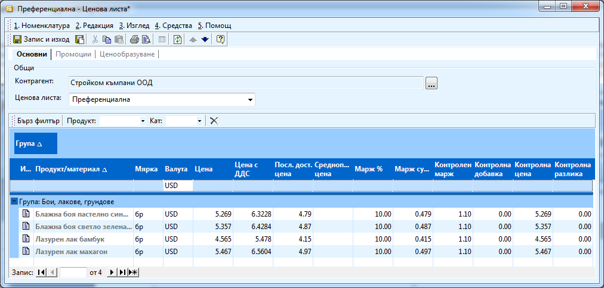
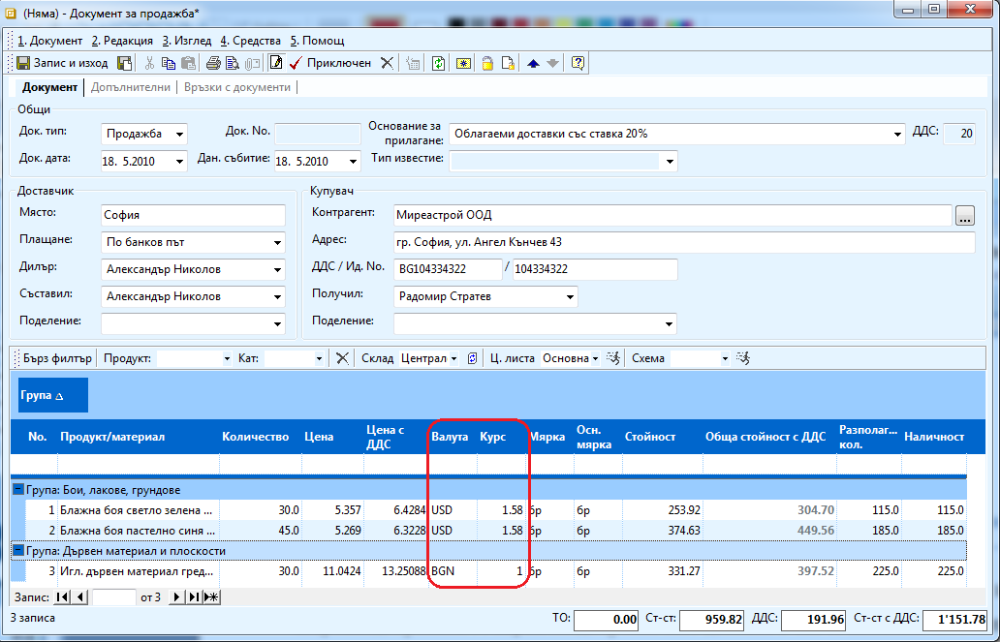

```{only} html
[Нагоре](000-index)
```

# Валутни ценови листи

Системата позволява да задавате продажна цена на всички артикули в
различни валути. Например ако работите с чуждестранни клиенти и
доставчици и искате да имате отделни ценови листи за тях.

За да създадете валутни ценови листи трябва да създадете нова ценова
листа по стандартния начин, но за валута да изберете желаната (ако
сте закупили стоките в USD например, в ценовата листа ще посочите като
валута USD).

{ align=center w=15cm }

При продажба на тези стоки трябва да приложите съответната ценова листа.
На реда на продажбата трябва да запишете курса на деня, по който се
работи. Общата стойност на реда е във валута и лева едновременно.
Стойността на продажбата е само в лева. За всяка позиция на продажбата
може да има различна валута, обща стойност и равностойност в лева, но
самото вземане, което поражда продажбата е в лева. Фактурата ще се
генерира по същият начин, като в счетоводството се взимат само
левовите стойности.

{ align=center w=15cm }

Валутните редове остават само в търговската система и служат на
търговците за справки. Ако желаете можете да разпечатате
документа със или без валутните стойности. Това зависи от шаблона
за печат, който ще изберете.
