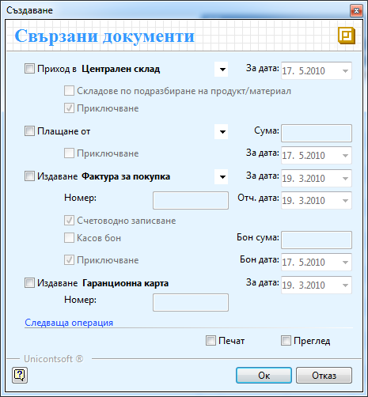
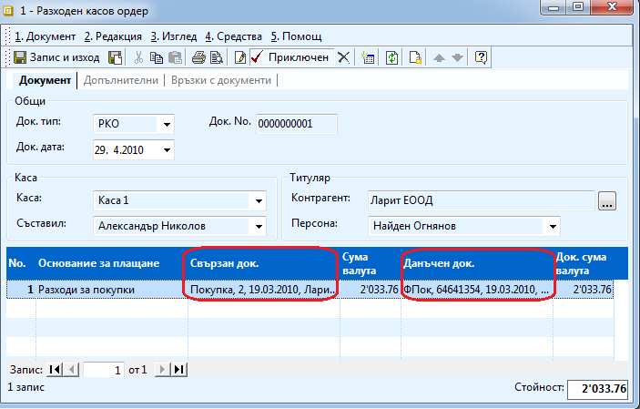
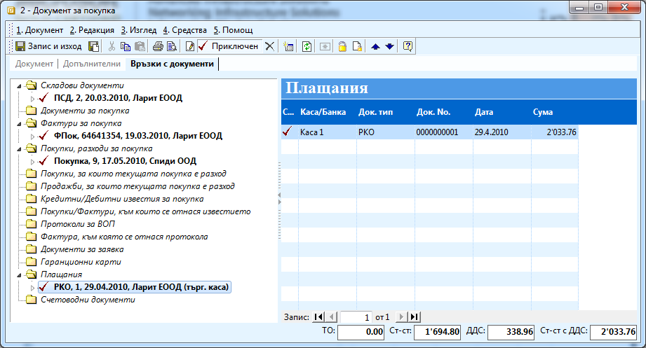
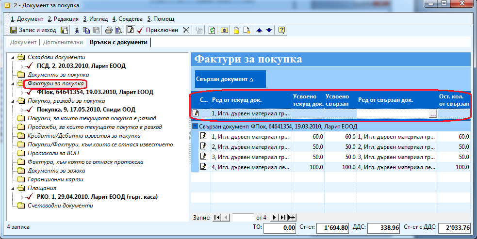
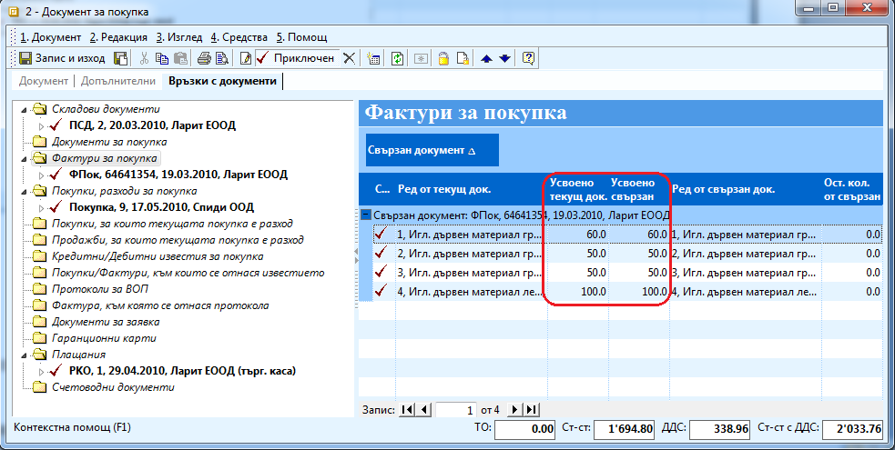

```{only} html
[Нагоре](000-index)
```

# Кросовете между документи и как да ги използваме

В системата за по – лесна и удобна работа е заложена функционалност за
генериране на свързани документи от първичен документ като данните в
тях се попълват автоматично. Например от документ за покупка можете да
генерирате – складов документ, фактура, документ за плащане и
гаранционна карта. Тази опция се появява автоматично, когато
приключвате документ. Но дори в случай че приключите документа и след
известно време решите да генерирате свързани документи чрез отваряне
на документа и натискана на бутон  от
лентата с инструменти ви се отваря същата форма, от където можете
автоматично да създадете необходимите документи.

{ class=align-center }

Друг начин да свържете документи е в ръчно да ги свържете.

Банкови и касови документи можете да свържете ръчно като отворите
документа и от поле Свързан документ и Данъчен документ изберете
съответните документи.

{ class=align-center w=15cm }

Всички в връзки на един документ с други можете да видите в секция
**Връзки с документи**.

{ class=align-center w=15cm }

Третият вариант за свързване на документи е от секция Връзки с
документи. В лявата секция са изредени всички възможни
документи, които могат да се свържат към избрания. Връщате
документа в състояние Редакция и маркирате типа документ, с който
искате да свържете текущия. В дясната част от колона Ред от свързан
документ трябва да изберете съответния документ.

{ class=align-center w=15cm }

Продуктите в документите се свързват един по един като всеки път в Ред
от текущ документ избирате продукт от текущия и в Ред от свързан
документ избирате съответстващия му продукт от свързания.
Количествата в колони **Усвоено количество** в текущ документ и
**Усвоено количество** в свързан документ трябва да съвпадат. В случай
че сте правили трансформация и искате да свържете много продукти от
текущия документ към един продукт от свързан документ, сборът на
коефициентите в Усвоено количество в свързан документ трябва да
дават единица. Това се прави в случаите например когато продаваме
няколко продукта, но ги фактурираме като обща номенклатура.

{ class=align-center w=15cm }
