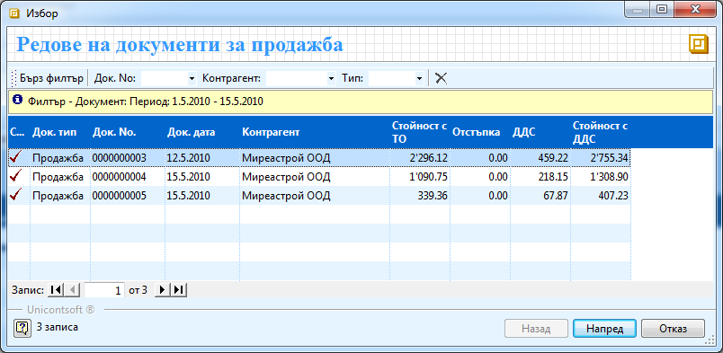
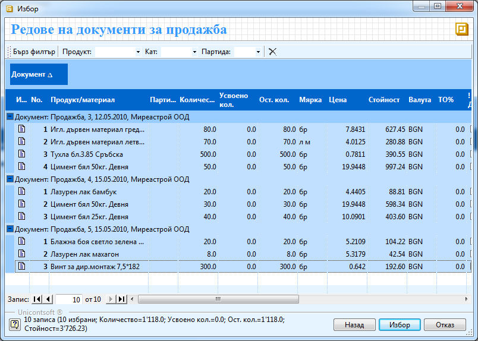
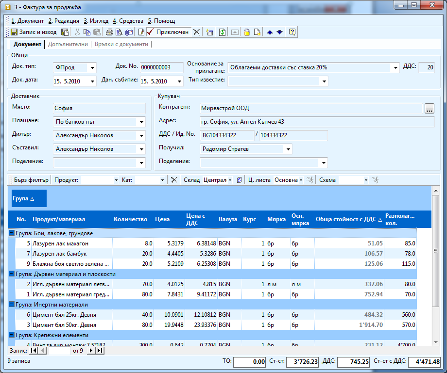
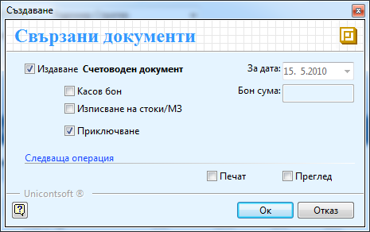

```{only} html
[Нагоре](000-index)
```

# Създаване на фактура от множество продажби

Създаване на фактура от множество продажби се използва в случаите,
когато имате няколко нефактурирани продажби към един контрагент и
трябва да му издадете обща фактура.

За да създадете фактура, свързана към няколко фактури трябва да спазвате
следната процедура:

1. От **Търговска система \>\> Документи за продажба** с натискане на десен бутон на мишката върху списъка с документи, изберете **Нов документ**. Отваря се празна форма за въвеждане на данни **Документ за продажба**.

1. От меню **Средства** избирате опция **Генериране** **фактура от продажби**. Отваря се форма за **Избор – Редове на документи за продажба**. От списъка трябва да маркирате желаните продажби и да натиснете след това бутон **Напред**. Ако документите, които търсите ги няма в списъка, трябва да направите корекция във филтъра. 

В следващия пример ще генерираме фактура с дата 15.5.2010 по три
продажби на Миреастрой ООД с номер 0000000003, 0000000004 и
0000000005.

{ align=center w=15cm }

1. След натискане на бутона, в същата форма системата показва всички редове от избраните документи за продажба. От тук трябва да посочите кои продукти да бъдат включени във фактурата. След като маркирате желаните редове, натиснете бутон **Избор**.

{ align=center w=15cm }

1. Като резултат от предходните действия, системата генерира Фактура на базата на посочените от вас критерии и попълва автоматично всички полета. При наличие на еднакви продукти в различните продажби, системата ги обединява в един с общо количество (само в случай, че цените съвпадат).

{ align=center w=15cm }

Забележете че имахме 50 броя Цимент бял 50 кг. Девня по продажба
0000000003 и 30 по продажба 0000000004 и цената им е еднаква и в двата
документа. Във фактурата обаче са обединени и има само един ред с тази
номенклатура с 80 бройки.

1. След като попълните и данните в заглавната част на фактурата, натиснете бутон **Приключен** от лентата с инструменти, за да валидирате документа. Форма **Свързани документи** ви дава възможност да генериране и свързан счетоводен документ със следните опции:

 - **Генериране на счетоводен документ и приключване** – поставяте отметка тук, ако искате да направите счетоводен запис на фактурата. 

 - **Касов бон** – ако изберете тази опция системата ще направи счетоводно записване на плащането на фактурата, ако то е по касов път.

 - **Изписване на стоки/МЗ** – тази опция ви дава възможност системата автоматично да изпише счетоводно на стоки и материали по фактурата.

{ align=center }

След като сте избрали необходимите опции, трябва да натиснете бутон
**ОК** за изпълнението им. Веднага можете да забележите, че в секция
Свързани документи са се появили свързаните продажби.
