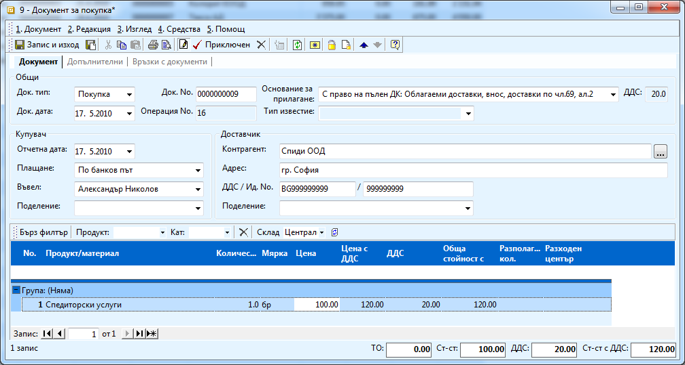
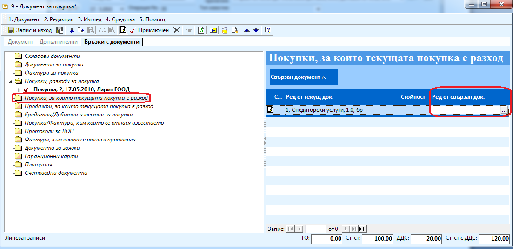
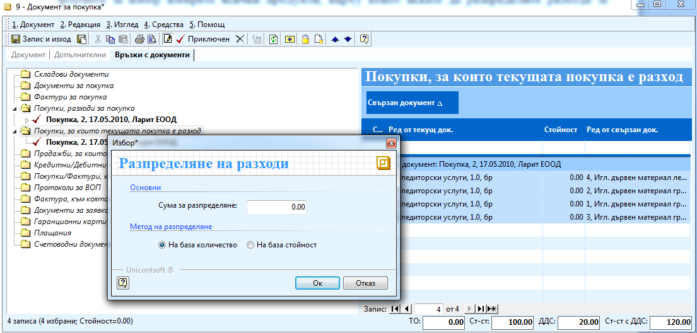

```{only} html
[Нагоре](000-index)
```

# Разпределяне на разходи по транспорт при покупка

В случаите в които освен фактурата за покупка с доставката пристига и
фактура за транспорт – например платили сте на спедиторска фирма за
доставката и искате да разпределите този разход върху стойността на
материалите трябва:

1. Създавате документ за покупка, с който вкарвате фактурата за материалите и го приключвате.

1. Създавате нов документ, с който вкарвате в системата фактурата за транспорта. 

С пристигането на иглен дървен материал получаваме и фактура за
транспорт, тъй като сме ползвали услугите на спедиторска фирма.
Искаме да разпределим този разход върху закупените материали.

{ align=center w=15cm }

1. Отивате в секция **Връзки** с документи и маркирате връзка **Покупки, за които текущата покупка е разход.** От колона **Ред от свързан документ** избирате чрез натискане на бутона с трите точки покупката за стоки, която създадохте преди това. Чрез натискане на бутон **Напред** от формата за избор изберете всички продукти, върху които искате да разпределите разхода за транспорт. 

{ align=center w=15cm }

1. В списъка влизат всички избрани редове от покупката, а срещу всеки един от тях стои номенклатурата на транспорта. Маркирате всички редове и от меню **Средства** от лентата с инструменти, избирате **Разпределение на разходи** (можете и да натиснете десен бутон на мишката и да изберете същата опция). В прозореца за избор, който се появява трябва да въведете сумата на разхода за транспорт без ДДС. Можете да изберете как да разпределите разхода върху стоките – на база количеството или стойността и натискате **ОК**. Можете да приключите документа.

1. След преизчисляване на склада от **Контролен панел \>\> Преизчисляване на склада** стойността на стоките в склада ще се увеличат.

{ align=center w=15cm }
