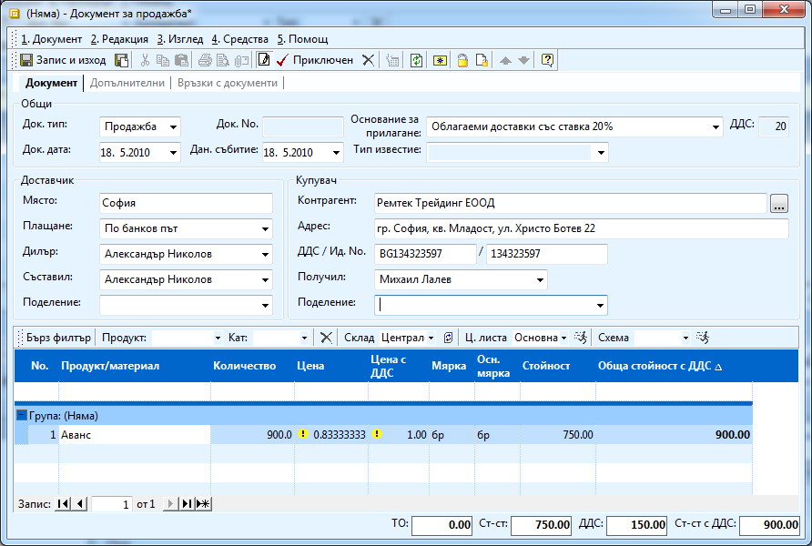
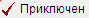
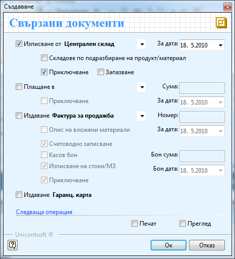
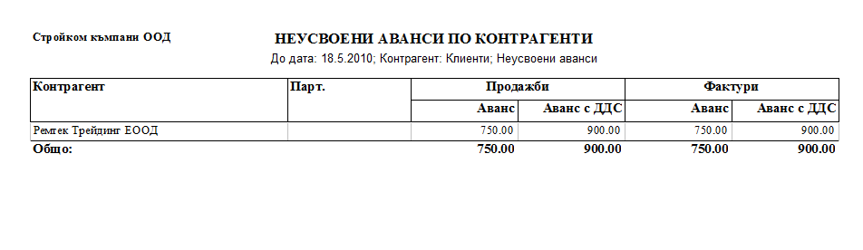
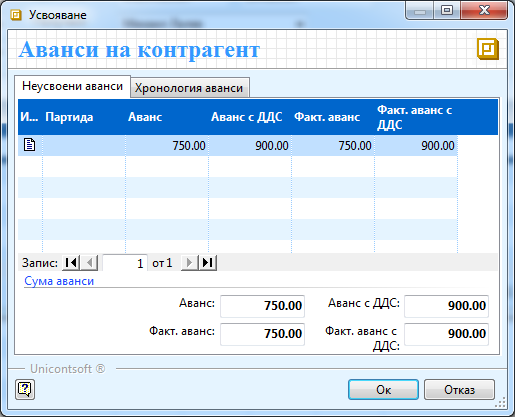
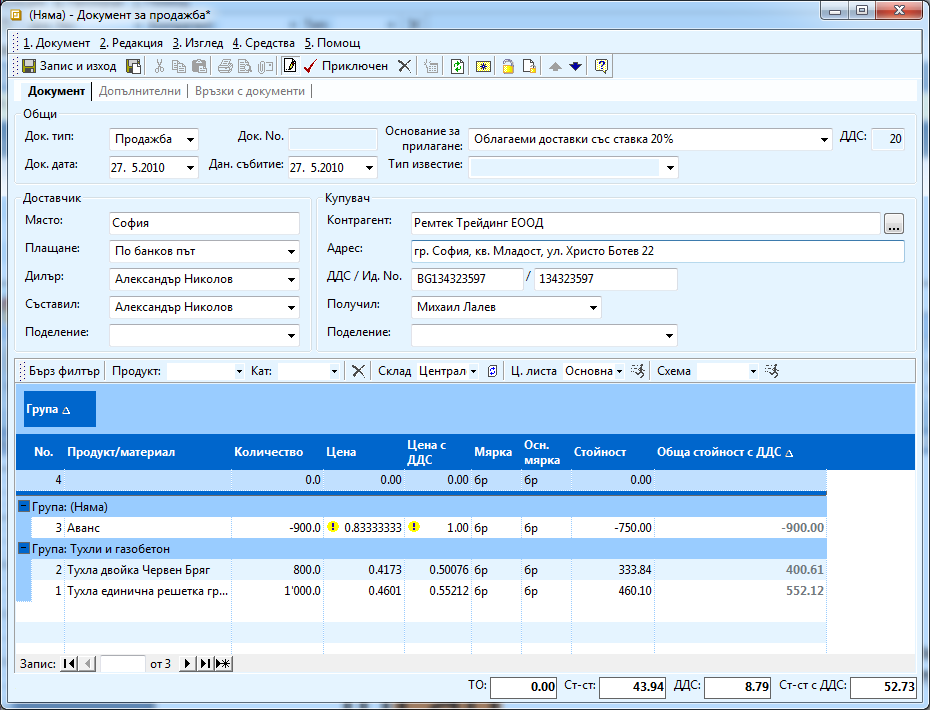

```{only} html
[Нагоре](000-index)
```

# Работа с аванси

В програмата съществува продукт *Аванс*. Този продукт е със стойност
1.00 лв с ДДС. Продуктът има специфични настройки, затова не трябва да
се трие.

Схемата при издаване на фактура за аванс е идентична с издаване на
обикновена фактура с разликата, че използвате този продукт.

Процесът е следният:

1. Когато получите аванс от даден клиент, пускате документ за продажба, в който попълвате:

 - **Контрагент -** попълвате името на клиента (ръчно или го избирате от списък чрез натискане на бутон ). 

 - **Дата** – датата, на която са ви платили аванса

 - В редовете на документа попълвате:

 - **Продукт/материал -** избирате продукт *Аванс*.

 - **Количество -** попълвате сумата на аванса с ДДС.

 - **Мярка** - оставяте *брой*.

 - **Цена** - оставяте я да е 0,8333.

 - **Партида** - желателно е авансите да се водят с партиди, в противен случай системата ги обединява

Рамтек Трейдинг ЕООД са ни платили 900 лв с ДДС аванс за тухли, които ще
купуват, но не знаят все още какъв вид. Трябва да се издаде фактура от
аванса и по – късно той да бъде приспаднат от сумата, която ще дължат
по издадената фактура.

{ align=center w=15cm }

1. Приключвате документа като натискате бутон . 

В следния прозорец избирате:

{ align=center  }

 - Не слагате отметка за **Генериране на складови документи,** ако освен аванса нямате да фактурирате и стоки и материали (но и да сложим, такъв няма да се генерира).

 - Слагаме отметка в **Документ за плащане**, ако плащането е по каса и посочвате сумата.

 - Поставяте отметка за **Генериране на Фактура**, **Счетоводно записване**, „**Плащане през каса за сума от** (ако плащането е през каса) и на **Приключване**.

 - Не поставяте отметка за **Генериране на гаранц. карта**.

 - Ако искате да разпечатаме или да прегледате генерираните документи поставяте съответно отметки на **Печат** и **Преглед**.

При тази схема системата разбира, че това е аванс и няма продадена
стока.

1. Неусвоените аванси, с които разполагате, можете да видите от справка **Аванси по контрагенти** (в модул **Справки**).

{ align=center w=15cm }

В колона **Продажба** показва сумата на аванса фигурираща в документа за
продажба, а във колона **Фактури** сумата на аванса, ако сте издали
фактура по него.

От тази справка виждате, че фирма Ремтек Трейдинг ЕООД са ви платили
аванс за 750лв (900 лв с ДДС), който сте отбелязали в системата с
документ за продажба и фактура.

1. При последвала Продажба на стока, в документ за продажба избирате същият контрагент и попълвате продуктите и материалите по поръчката. За да приспаднете аванса избирате бутон **Неусвоени аванси на контрагент**  от лентата с инструменти най – отгоре на формата (или от меню Средства). Появява се следната форма:

{ align=center }

В секция **Неусвоени аванси** са всички аванси, които е платил
контрагента и са все още неусвоени като се разделят по
партида, а в **Хронология аванси** се пази информация за всички
аванси, които е плащал клиента. Избирате запис от неусвоените аванси и
натискате бутон **ОК**.

 - Ако сумата на авансът е по – голяма от сумата в документа, системата автоматично променя в сумата на аванса като тази на продажбата, като отделен ред със знак (-). По този начин стойността на документа става (0,00).

 - Можете да изберете няколко аванса по един и същи документ.

 - При избор на аванс в поле **Количество** можете да промените сумата на аванса, ако искате да приспаднете само част от него. Другата част от аванса ще остане по сметката на клиента и можем да я приспаднете от някоя друга продажба.

{ align=center w=15cm }
