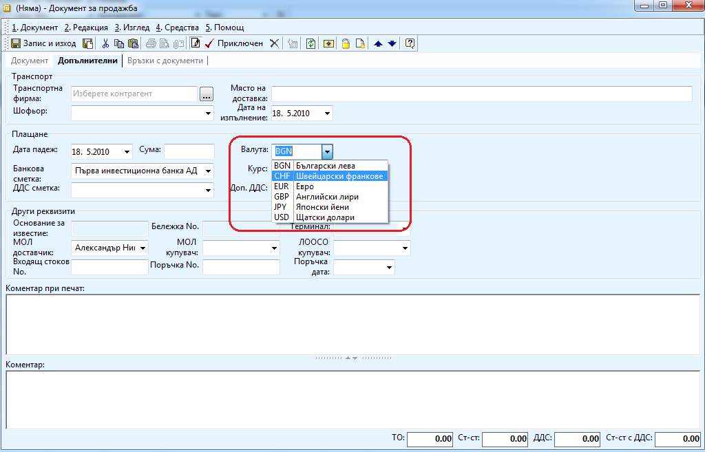
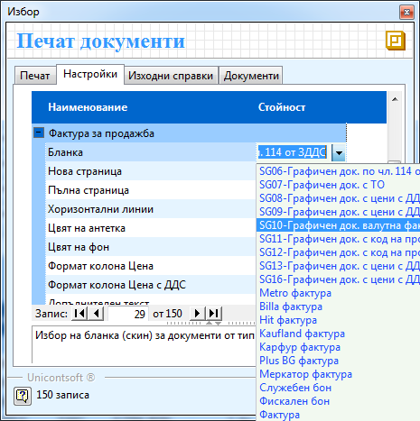

```{only} html
[Нагоре](000-index)
```

# Създаване на валутни фактури за покупка и продажба

При внос, износ или други сделки с чуждестранни лица, се налага да се
издават документи, които пораждат вземания или задължения във валута.
За да се посочи, че сделката е във валута, тя трябва да се укаже при
въвеждането на документа (покупка, продажба). Избора на валута в
която да бъде вземането или задължението става на в секция
**Допълнителни** на документа. Освен валутата се посочва и курса
на който възниква задължението.

Валутите избрани в редовете нямат нищо общо с валутата, в която е
указано вземането или задължението.

Например: Продавате продукти от група А и група B, съответно по техните
ценови листи в EUR и USD. Контрагентът ви е чуждестранно лице от
Швейцария и е уговорено валутата на сделката да е CHF. В този
случай, на втория панел на продажбата, за валута в която ще се
породи вземането избирате CHF и курс BGN/CHF.

{ align=center w=15cm }

При осчетоводяването на валутни документи, вземането или задължението ще
се отрази като валутна и левова стойност едновременно, по указания курс,
а закупените или продадени стоки и услуги, съдържащи се в документа, ще
се осчетоводят само със техните количествени и левови стойности.

Ако искате да разпечатате документа, трябва да изберете подходящ шаблон
с изглед за валутна фактура от бутон **Печат \>\> Настройки \>\>
Бланка.**

{ align=center }
