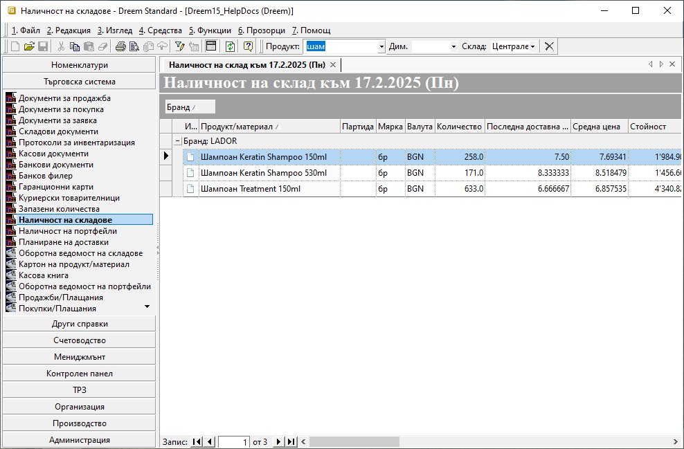

```{only} html
[Нагоре](000-index)
```

# Наличност на склад

Тази справка се намира в **Търговска система**. Използва се за проверка на наличните количества на продукти и материали към текущия момент.  
Системата дава възможност за прилагане на бърз филтър по *Продукт*, *Дименсия* и *Склад*. Ако полетата във филтъра останат празни, справката представя информация за всички налични продукти общо за всички складове.  

В списъка на справката могат да бъдат прилагани общовалидните правилата за сортиране и групиране в системата. Това оптимизира вида на справката и дава възможност за скриване и извеждане на допълнителни колони.  

{ class=align-center }

Колона **Количество** показва текуща наличност на съответния продукт в избрания склад.  
В колони **Последна доставна цена** и **Средна цена** се визуализират съответно единичната цена (без ДДС) от последната покупка и текущата среднопретеглена цена в избрания склад. 