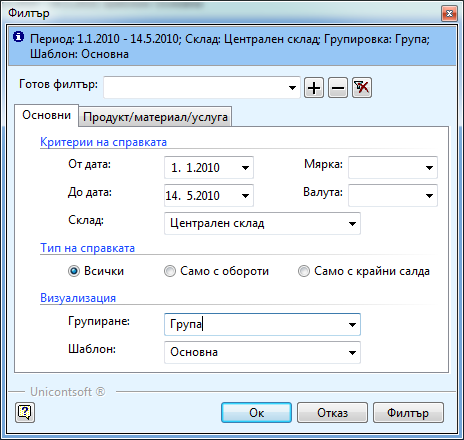

```{only} html
[Нагоре](000-index)
```

# Оборотна ведомост на складове

Справката **Оборотна ведомост на складове** се използва, за да получите подробна информация за наличността на някои или всички складове за определен период от време. Справката е подобна на **Наличност на склад**, но за разлика от нея тази не показва наличността към текущата дата, а оборотите за посочения във филтъра интервал от време и салдата преди и след това.

Тази справка се намира в **Търговска система || Оборотна ведомост на складове**.
Във филтъра на справката можете да посочите:

{ class=align-center }

 - **От дата и До дата** - посочвате периода, за който искате да видите данни

 - **Склад** - можете да изберете един или няколко склада, в зависимост от информацията, която искате да получите. Ако го оставите празно, справката ще покаже данни за всички складове.

 - **Мярка** - оставяте го празно, освен ако не искате да видите продукти само с тази мярка

 - **Валута** - оставяте я на *BGN*

 - **Тип на справката** - ако посочите *Всички* ще покажат всички продукти, ако изберете *Само с обороти*, в справката ще присъстват само продукти, които имат обороти през периода, независимо дали имат крайно салдо и ако филтрирате по *Само с крайни салда*, данните в справката ще са само за продукти, които имат салдо към края на посочения период.

 - **Групиране** - задължително трябва да групирате информацията в справка по някоя от предварително дефинираните групи. 

 - **Шаблон** - от шаблона, който ще приложите, зависи колко подробна информация ще получите. В *Основен* можете да видите салдата на продуктите в началото и в края на периода и приходите и разходите за периода. В *Детайлна* е добавена и информация за бракуваните и намерени количества за тези продукти. В *Ценова листа* показва само количествата в началото и края на периода, а в крайното салдо цени по основната ценова листа както и търговските отстъпки. В *Само с крайно салдо* се визуализира информация само за салдата в края на периода. В *Стойност по групи* и *Стойност по складове* се представя само общите стойности за всяка една от групите или съответно складовете. 

 - **Продукт/материал/услуга** - в тази секция можете да изберете само един или няколко продукта, за които искате да получите информация или само за дадена категория или тип продукти.
