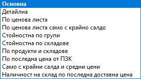

```{only} html
[Нагоре](000-index)
```

# Оборотна ведомост на складове

Тази справка се намира в **Търговска система || Оборотна ведомост на складове**.  
Дава подробна информация за движението на продукти и за наличностите им в началото и в края на избран период.  
Справката може да се филтрира за един, множество или всички продукти в избрани складове.  

{ class=align-center }

 - **От дата** и **До дата** - полета за избор на период, за който се филтрират данни;  
 Ако От дата/До дата остане празно, системата приема, че няма начална/крайна дата.  

 - **Склад** - поле за избор на един/множество складове;    
 Ако полето остане празно, справката ще покаже данни за всички складове.  

 - **Групиране** - поле за избор на категория продукти от предварително дефинираните потребителски дименсии, по която системата да групира данните;   

 - **Шаблон** - поле за прилагане на шаблон, от който зависи колко подробна информация ще представи справката.  
 С *Основна* справка може да се видят приходите, разходите, салдата на продуктите в началото и в края на периода.  
 При *Детайлна* справка е добавена и информация за брак, липси и излишък на продуктите през периода.  
 С избирането на шаблони *По ценова листа* и *По ценова листа само с крайно салдо* системата извежда нов раздел с реквизити във филтър формата - **Ценова листа**.  
 В шаблон *Стойностна по групи* се представят само стойности на салдата и оборотите по групи продукти, а в *Стойностна по складове* - обща стойност на салда и обороти по складове. 

    { class=align-center }

 - **Тип на справката** - от полето опционално се избира какъв тип данни да се визуализират - списък с данни за всички продукти, единствено продуктите с обороти, единствено продуктите с крайни салда и т.н.  

    { class=align-center }

 - **Продукт/материал/услуга** - от този раздел на филтър формата справката може да се ограничи за един или няколко продукта, дименсии или типове продукти;  

- **Ценова листа** - системата показва този раздел след избор на шаблон *По ценова листа* и *По ценова листа само с крайно салдо*.  