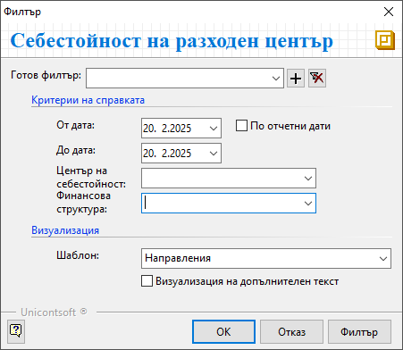
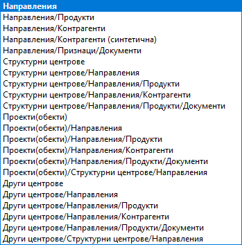

```{only} html
[Нагоре](../000-index)
```

# Справки върху центрове на себестойност

 Справката върху центрове на себестойност дава информация за приходите и разходите по обекти (проекти) за определен период от време. В нея също могат да се проверят наличности и движения на материали в склада, настроен за обекта.

В справката участват единствено документите (покупки, продажби и складови документи), в които са обзаведени реквизитите за финансова структура и центрове на себестойност от раздел **Списъци || Направления**.  

Тази справка се намира в **Мениджмънт || Справки върху центрове на себестойност**.  

{ class=align-center }


 - **От дата** и **До дата** – полета за избор на период на справката;  

 - **Център на себестойност** - поле с падащо меню за избор на обект/проект;  
 Центровете на себестойност трябва да бъдат настроени предварително от модул **Номенклатури**.  

 - **Финансова структура** - поле за избор на едно или няколко направления;  
 Направленията трябва да бъдат предварително настроени от **Номенклатури || Финансова структура**.  

 - **Шаблон** – поле с опционално меню за избор на шаблон за справката;  
 Всяка от опциите представлява различна конфигурация между направления, структурни центрове, обекти и разпределените им продукти, контрагенти и документи. 

{ class=align-center }

- **Визуализация на допълнителен текст** - при активиране на опцията в справката се показва информацията, въведена от **Списъци || Направления**, колона **Допълнителен текст**.    