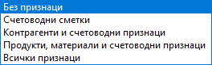
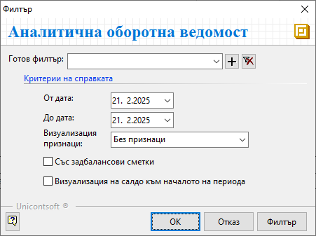

```{only} html
[Нагоре](../000-index)
```

# Оборотна ведомост

Двете справки - Синтетична и Аналитична оборотна ведомост, са с еднакво оформени шаблони. Единствената разлика помежду им е в начина на представяне на данните.  
Докато в **Синтетична оборотна ведомост** информацията е обобщена по сметки, в **Аналитична оборотна ведомост** данните са детайлно представени с настроените подсметки и признаци.  

##  Синтетична оборотна ведомост

Справката показва данни по синтетични счетоводни сметки - начално салдо за годината, обороти и салдо в края на избран период от време.  

- **От дата** и **До дата** - полета за избор на период за справката; 

- **Със задбалансови сметки** - при активиране на тази опция справката показва и данните по задбалансови сметки;  

- **Визуализация на салдо към началото на периода** : 
    - без отметка - при този вариант на филтър в справката се визуализира колона **Оборот до началото на периода**;  
    Това е оборотът по сметка от 01. януари до началната дата на избрания за справката период.  
    - с поставена отметка - при този вариант се визуализира колона **Салдо към началото на периода**;  

{ class=align-center }   

 ## Аналитична оборотна ведомост  

Този вид справка показва детайлна информация за начално салдо за годината, обороти и салдо в края на избрания период, представени по подсметки. 

- **От дата** и **До дата** - полета за избор на период за справката;   

- **Визуализация признаци** - поле за избор на различен вид допълнителна информация, която се визуализира за сметки;  

{ class=align-center }   

- **Със задбалансови сметки** - при активиране на тази опция справката показва и данните по задбалансови сметки;  

- **Визуализация на салдо към началото на периода** : 
    - без отметка - при този вариант на филтър в справката се визуализира колона **Оборот до началото на периода**;  
    Това е оборотът по сметка от 01. януари до началната дата на избрания за справката период.  
    - с поставена отметка - при този вариант се визуализира колона **Салдо към началото на периода**;  
    
 { class=align-center } 