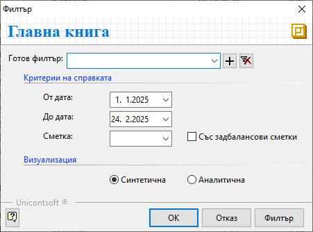

```{only} html
[Нагоре](../000-index)
```

# Главна книга

Справката показва салда и обороти по счетоводни сметки заедно с кореспондиращите им сметки от операциите през периода.

Тази справка се намира в **Счетоводство || Главна книга**.  

- **От дата** и **До дата** - полета за избор на период за справката;  

- **Сметка** - в полето може да се избере счетоводната сметка, за която да се извърш справка;  
Ако полето остане празно, справката се генерира за всички счетоводни сметки.  

- **Със задбалансови сметки** - при активиране на тази опция справката показва и данните по задбалансови сметки;  

- **Визуализация**:  
    - **Синтетична** - справката се визуализира по основни сметки (без подсметки);  
    - **Аналитична** - при този вариант на справката се визуализират и настроените подсметки;  

{ class=align-center } 
