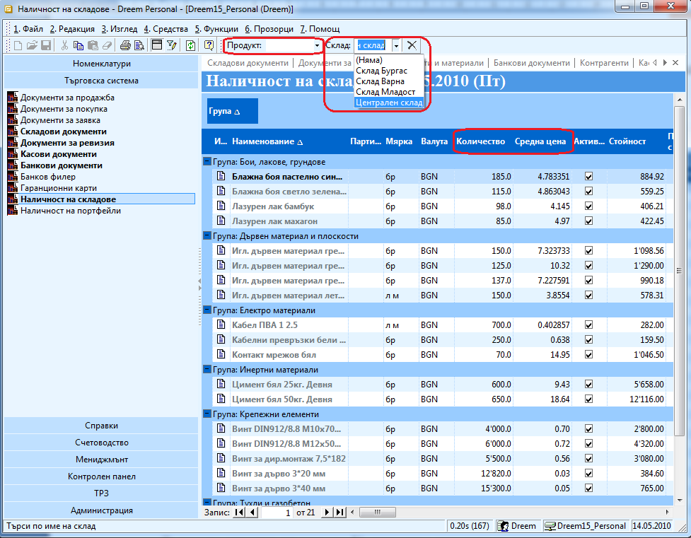

```{only} html
[Нагоре](000-index)
```

# Справка "Наличност на склад"

Справка **Наличност на склад** се използва за проверка на наличното
количество на стоки и материали в определен склад или за всички
общо и както и на тяхната среднопретеглена цена към днешна дата.

Тази справка се намира в **Търговска система \>\> Наличност на
складове**. След отварянето на справката от менюто с инструменти
може да се избере определен склад, за който искате да проверите
наличността или да се изберат всички (избирате го от падащия
списък в поле **Склад**). В поле **Продукт** може да се напише името
на определен продукт, който търсите или само част от неговото име, ако
не сте сигурни как е наименуван в програмата, за да филтрирате само по
продукти, започващи по същия начин.

{ class=align-center w=15cm }

В самата справка от колона **Количество** виждате наличното количество
за съответния продукт в посочения склад, а в колона **Средна цена** –
среднопретеглената цена.
