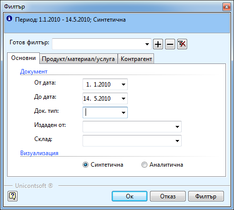

```{only} html
[Нагоре](000-index)
```

# Справка "Движение на стоките в складове"

Справката **Движение на стоките в складове** дава информация за
оборотите на продукти за определен период от време групирана по
складове. От тази справка най – лесно можете да получите информация за
наличностите на даден продукт във всеки един от складовете (ако
филтрираме само по продукта).

Справката се намира в **Справки \>\> Движение на стоките в складове**.
Във филтъра и можете да изберете:



 - **От дата** и **До дата** – периода, за който желаете да получите информация

 - **Док. тип** – можете да филтрирате информацията само по някои тип от складовите документи – само по ПСД и РСД например или ако искате да видите само началните салда.

 - **Издаден от** - ако искате да филтрирате по документи издадени само от определен служител. За да проверите например каква част от оборота през периода се дължи на този потребител.

 - **Склад** – можете да изберете един или няколко склада, в зависимост от информацията, която искате да получите. Ако го оставите празно, справката ще покаже данни за всички складове.

 - **Визуализация** – ако изберете *Синтетична справката* показва информация за приходите и разходите за продуктите групирана по складове. Ако изберете *Аналитична* показва приходите и разходите по документи и дата. 

 - **Продукт/материал/услуга –** в тази секция можете да изберете само един или няколко продукта, за които искате да получите информация или само за дадена категория или тип продукти.

 - **Контрагент** – в тази секция можете да филтрирате по контрагент, категория или тип контрагенти