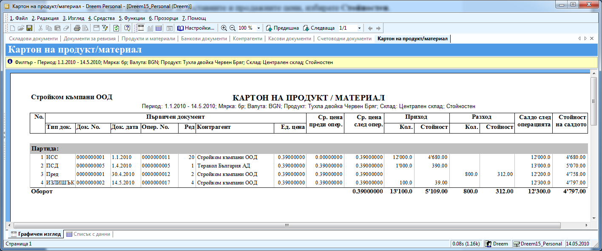

```{only} html
[Нагоре](000-index)
```

# Справка „Картон на продукт/материал”

Справка **Картон на продукт/материал** се използва за проследяване на
движенията на даден продукт – ако искате да получите подробна
информация за доставените количества, документите, датите и
цените, на които е купуван и аналогично за продадените количества и
продажните цени.

Тази справка се намира в **Справки \>\> Картон на продукт/материал**.
След отварянето на справката, се появява следния прозорец, в който
можете да филтрирате по:


В него попълвате:

 - **От дата и До дата** – периода, в който искате да проследите движението на материала.

 - **Продукт** – от бутона с трите точки  отваряте нова форма със списък на продуктите. В поле **Име** пишете името на продукта или част от него. Избирате го и натискате бутон **Избор**. Ако сте сигурни в наименованието на материала, можем и директно в поле **Продукт**.

 { align=center }

 - **Склад** – от падащия списък избирате склада, за който искате да направите справката.

 - **Визуализация** – ако ви интересува само количеството, избирате **Количествен**. За да получите информация за доставните и продажните цени, избирате **Стойностен**.

Избираме **ОК** и стартираме справката.

 { align=center }

В примера показва, че от този вид тухли сме имали към 1.1.2010 12 000
броя в централен склад, които сме заприходили с документ за начално
салдо на склад. След това сме закупили 1 000 бройки от Теракол
България ООД и наличността е станала 13 000 бр. на 30.4.2010 сме
трансферирали 800 броя от този склад в друг и на 14.5.2010 след
инвентаризация вместо 12 200 броя, колкото е трябвало да има,
са открити със сто бройки повече.

 - **Тип док**. – ПСД (приходен складов документ) - документ, с който вкарвате материалите в склада при покупка и РСД (разходен складов документ) – документ, с който изкарвате материали от склада при продажба.

 - **Док. дата** – датата на документа, с който е заприходен/ изписан материала.

 - **Контрагент** – името на контрагента, от който е закупен/ продаден материала.

 - **Ед. цена** – доставната/ продажната цена

 - **Приход –** количество – колко броя сте вкарали в склада

 - **Разход –** количество – колко броя сте изкарали от склада