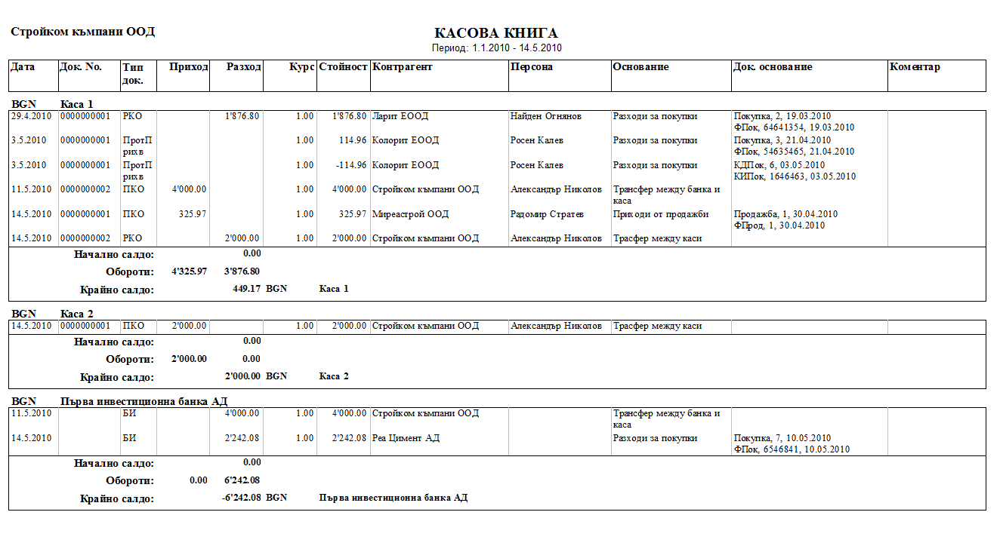

```{only} html
[Нагоре](000-index)
```

# Справка „Касова книга”

Тази справка показва всички операции свързани с плащания по каса и банка
за определен период от време. Справката се намира в модул **Справки \>\>
Касова книга**.

Във филтъра трябва да изберете периода, за който се отнася справката.
Можете да посочите и точно определена каса или банкова сметка в поле
**Портфейл**. Ако го оставите празно, ще се визуализират данни за всички
сметки и каси.

{ align=center, w=15cm }