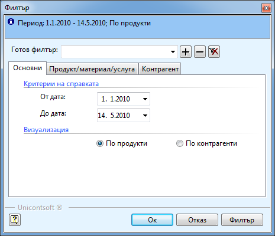
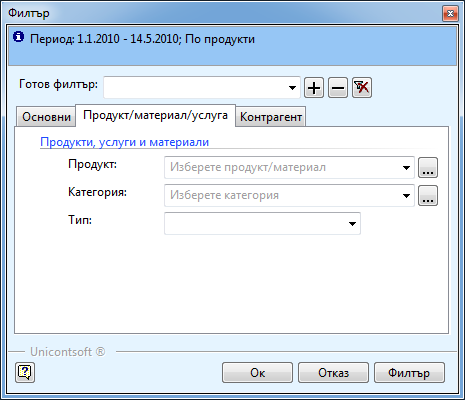
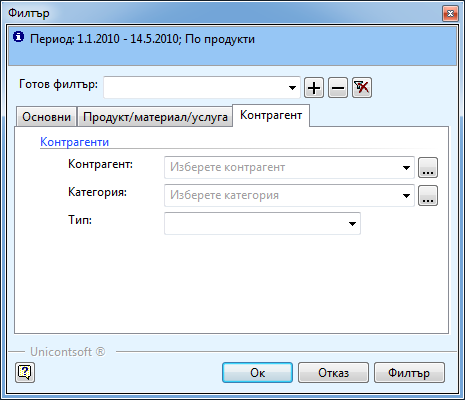
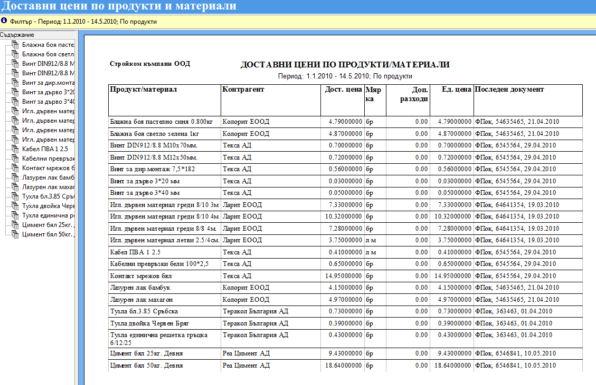

```{only} html
[Нагоре](../000-index)
```

# Справка „Доставни цени по продукти и материали”

Целта на тази справка е да показва цените, на които сте закупили стоки и
материали по съответния документ за определен период от време. Можете да
филтрирате по продукти и контрагенти. Използва се най – често, за да
проверите на какви цени сте доставяли материали от различните
контрагенти или каква е последната доставна цена на даден
материал.

Тази справка се намира в **Мениджмънт \>\> Доставни цени по продукти/
материали**. След отварянето на справката, се появява следния
прозорец, в който можем да филтрираме данните по:

{ align=center }

В него попълвате:

В секция **Общи**:

 - **От дата и До дата** – периода, за който искате да направите справката.

 - **Визуализация** – избирате *по продукти* или *по контрагенти*, в зависимост от начина, по който искате да ви се представят данните. Ако искате данните да се обединяват по продукти избирате първата опция, и обратното – ако ни интересува различните контрагенти на какви цени са доставяли продукти, избирате *по контрагенти*.

В секция **Продукт/материал/услуга –** попълват се полетата, ако искате
да проверим за точно определен/и продукт/и, категория или тип.

{ align=center }

 - **Продукт** – от бутона с трите точки  отваряте нова форма със списък на продуктите. В поле **Име** пишете името на продукта или част от него. Избирате го и натискате бутон **Избор**. Ако сте сигурни в наименованието на материала, можете и директно в поле **Продукт**.

 - **Категория** – по аналогичен начин на продукта чрез бутон  избирате категория.

 - **Тип** – избира се от падащия списък.

Не е необходимо и трите полета да са попълнени. Ако искате да видите
информация за точно определен артикул, избирате само него и не
попълвате категория и тип. Аналогично и ако търсите данни само за
определена категория или тип.

В секция **Контрагент** – полетата в тази секция се попълват, ако искате
да получите информация за точно определен контрагент.

{ align=center }

 - **Контрагент** – от бутона с трите точки  отваряте нова форма със списък на контрагентите. В поле **Име** пишете името на контрагента или част от него. Избираме го и натискате бутон **Избор**. Ако сме сигурни в наименованието на контрагента, можем и директно в поле **Контрагент**.

 - **Категория** – по аналогичен начин на контрагента чрез бутон  избирате категория.

 - **Тип** – избира се от падащия списък.

Избираме **ОК** и стартираме справката.

{ align=center w=15cm }

От справката може да се види:

 - **Продукт/материал –** наименованието на продукта

 - **Контрагент** – от кой контрагент е закупен

 - **Дост. цена** – доставната цена на продукта от съответния контрагент и документ

 - **Ед. цена** - различава се от доставна цена, ако имате допълнителни разходи

 - **Последен документ –** типа, номера и датата на последният документ, с който сте доставили този продукт от този контрагент

 - От **Съдържание**, в лявата вертикална лента, може лесно да се навигира между продуктите и контрагентите. Когато кликнете с мишката върху даден продукт или контрагент, ще се покажат данните за него.