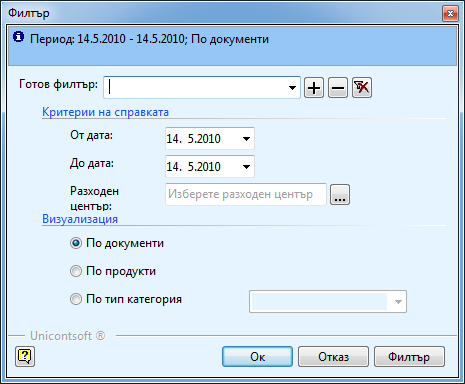

```{only} html
[Нагоре](../000-index)
```

# Справка „Себестойност на разходен център”

Справка **Себестойност на разходен център** показва приходите и
разходите, свързани с даден обект и наличността на съответния
му склад за определен период от време. Чрез тази справка могат да се
проверят вложените и оставащите в склада материали, както и свързаните
с обекта приходи.

За да използвате справката, трябва предварително да сте посочили
**Разходен център** в документите за покупка, продажба и
складовите документи. Разходен център се посочва за всеки
отделен продукт и услуга.

Тази справка се намира в **Мениджмънт \>\> Себестойност на разходен
център**. След отварянето на справката, се появява следния
прозорец:

{ class=align-center }

В него попълвате:

 - **От дата** и **До дата** – периода, в който искате да проследите движенията в разходния център.

 - **Разходен център -** от бутона с трите точки  отваряте нова форма със списък на разходните центрове. В поле **Име** пишете съответно името или част от него. Избирате го и натискате бутон **Избор**. Ако сте сигурни в наименованието на разходния, можете директно да го напишете в полето.

 - **Визуализация** – избира се *по документи*, ако искате да получите информация за точните документи за доставка, *по продукти –* ако ви интересува от кой продукт, колко и на каква стойност имате и *по група* – за да получите обща информация за определена група материали. Най – добре е да се посочи по продукти.

Избираме **ОК** и стартирате справката.

От справката може да се види:

 - **Материали** и **Услуги –** материалите, които са вложени вече в обекта с техните количества и цени и външни услуги, които са извършвани за този обект.

 - **Приходи** – приходите, реализирани от обекта (обикновено аванси).

 - **Остатъчна наличност в склада** – материалите, които са закупени за този обект, но все още не са вложени и стоят налични в склада.