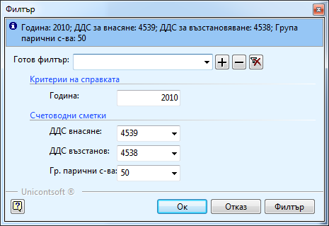

```{only} html
[Нагоре](../000-index)
```

# Справка „ДДС за година”

Справка **ДДС за година** показва начисленото ДДС по фактури за покупки
и продажби като общи суми за всеки месец и ДДС резултатът (колко е
трябвало да се възстанови или внесе, дали е прихващано, плащано и
имали и колко е остатъка). Целта на тази справка е в края на всеки
месец бързо да получавате информация дали трябва да внесете ДДС и
ако да - каква сума.

Справката се намира в **Мениджмънт \>\> ДДС за година**. Във филтъра и
задължително трябва да посочите годината, за която искате да направите
справка. В секция **Счетоводни сметки** посочвате сметките от
сметкоплана, които са за внасяне и възстановяване на ДДС –
обикновено това са 4539 и 4538 и групата парични средства – 50та. Ако
не изберете правилните сметки, справката няма да показва коректни данни.

{ align=center }

