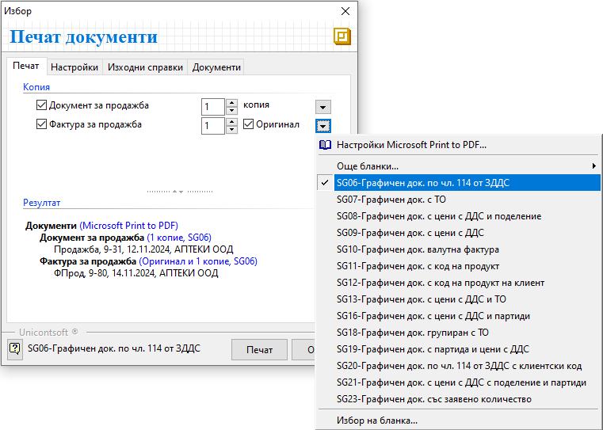

```{only} html
[Нагоре](000-index)
```

# Настройки при печат на документи

Системата позволява персонализиране на настройките при печат на документи. Това осигурява възможност за прилагане на различен шаблон за печат по типове документи. 

{ class=align-center }

В **Изходни справки** можете да се избере **тип** на справката –
графичен или текстови и **настройки принтер** – тук посочвате на
кой принтер ще извършите печата.

В **Типове документи** избираме типа на **Бланката**. Ако искате да
отпечатате фактура на английски, избирате тип на бланката – SG10 –
Графичен док. валута фактура.

___
Свързани статии:  

[Как да извършим настройки за печат на документи?](https://www.unicontsoft.com/cms/node/157)  
[Как да отпечатаме Документ за продажба?](https://www.unicontsoft.com/cms/node/27)  
[Как да отпечатаме външнотърговска фактура?](https://www.unicontsoft.com/cms/node/135)  
[Как да отпечатаме Документ за покупка?](https://www.unicontsoft.com/cms/node/25)  