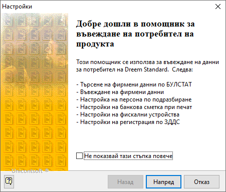
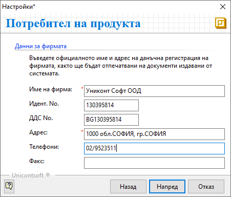
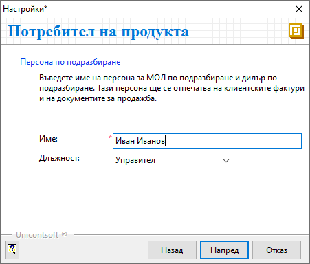
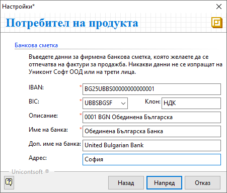
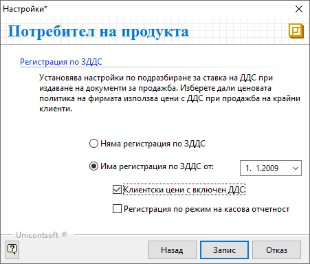
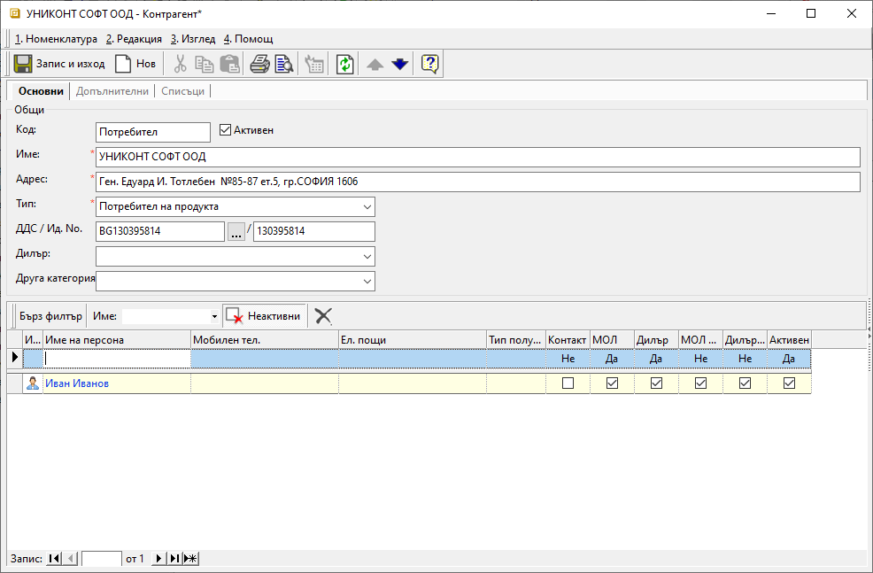

```{only} html
[Нагоре](000-index)
```
 
# Потребител на продукта

> Потребителят на продукта е физическото или юридическото лице, използващо системата Dreem. Това е контрагент от специфичен тип, който системата третира като титуляр на всеки документ.  

При първоначално стартиране на системата се показва помощник за въвеждане на **Потребител на продукта**. Помощникът включва няколко стъпки, при които да бъдат въведени основните данни за потребителя на продукта. Това включва определени задължителни реквизити, необходими за генерирането на данъчни документи за продажба в системата.  
Всички допълнителни данни и корекции на съществуващите се добавят в **Номенклатури || Контрагенти** от форма за редакция на **Потребител на продукта**.  

Помощникът стартира с информация за стъпките, които включва.  
За връщане към предходна стъпка се използва бутон [**Назад**], за преминаване към следваща стъпка - [**Напред**], а за излизане от помощника – [**Отказ**].  

{ class=align-center }

- **Данни за фирмата** — На тази стъпка се въвеждат основни данни за фирмата, включващи **Име**, **Идент. No**, **ДДС No**, **Адрес**, **Телефони** и **Факс**. Полетата, посочени със звездичка, са задължителни.   

{ class=align-center }

- **Персона по подразбиране** — При тази стъпка се добавят име и длъжност на МОЛ по подразбиране за фирмата.  
Падащият прозорец с *Длъжности* е допълнителна референтна номенклатура, автоматично попълнена от Dreem.  

{ class=align-center }

- **Банкова сметка** — в полетата IBAN, BIC, Клон, Описание, Име на банка, Допълнително име на банка и Адрес въвеждаме банковата сметка на фирмата, като само полетата маркирани със звездичка са задължителни.  

{ class=align-center }

- **Фискални устройства** — Тази стъпка е задължителна единствено при вариант СУПТО за Dreem Enterprise и Dreem Express.  
В полета *Устройство* и *Каса* се дефинира фискалното устройство за касата по подрабиране в системата. Списък с фискални устройства се появява, когато има инсталирани локално или мрежово.  
Падащият прозорец с *Каси* е допълнителна референтна номенклатура, автоматично попълнена от Dreem.    

- **Регистрация по ЗДДС** — Посочва се дали фирмата е регистрирана по ЗДДС и датата на регистрация. Тази настройка определя ставката на ДДС по подразбиране при издаване на документи за продажба.  

Опцията *Клиентски цени с включен ДДС* се използва за дефиниция по подразбиране на тип за ценовите листи. При маркирана опцията системата активира ритейл ценови листи - калкулации по цени с ДДС при продажба.  
Когато опцията не е маркирана, системата използва ценови листи, при които калкулациите са по цени без ДДС.  

Опцията *Регистрация по режим на касова отчетност* се използва, когато фирмата е регистрирана в НАП за използване на касова отчетност. С това се активира използването на специфични типовете документи.  

След като всички данни са успешно въведени, промените се записват с бутон [**Запис**].  

{ class=align-center }

Допълнителни данни или корекции за потребителя на продукта могат да се въведат от **Номенклатури || Контрагенти**, като се отвори формата за редакция.  

{ class=align-center }

Примерни допълнителни настройки, които могат да бъдат направени:  
    - Списък със служители - Добавянето на персони позволява потребителите в системата да бъдат обвързани с техните имена, които да се обзавеждат автоматично при въведеждане на документи.    
    - Допълнителни банкови сметки - Банковите сметки се използват при печат на фактури, при въвеждане на извлечения, в *Счетоводство*.  
    - Обекти на организацията - Различните обекти (офиси, магазини, складове и др.) дават възможност за дефиниране на отделни поделения със собствени номератори на документи.    
    
Такива настройки са важна част от системата, т.к автоматично обзавеждат множество данни при въвеждане на документи.  

