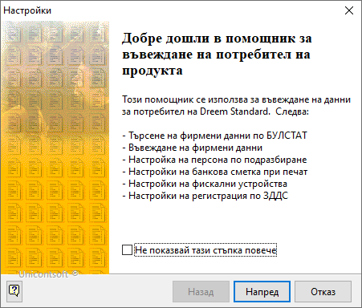
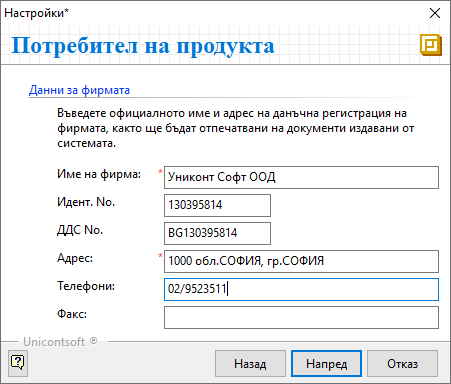
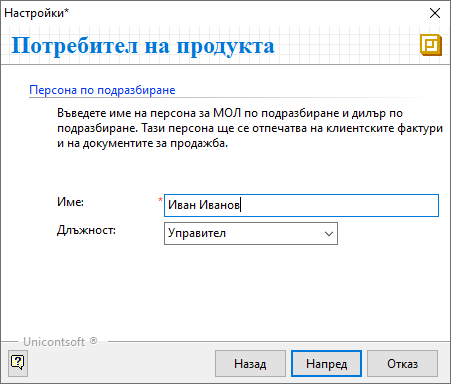
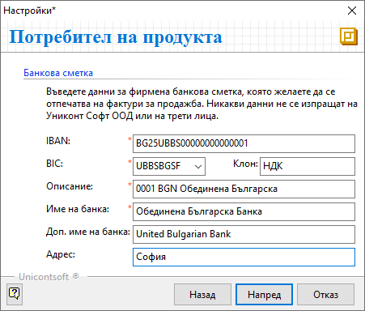
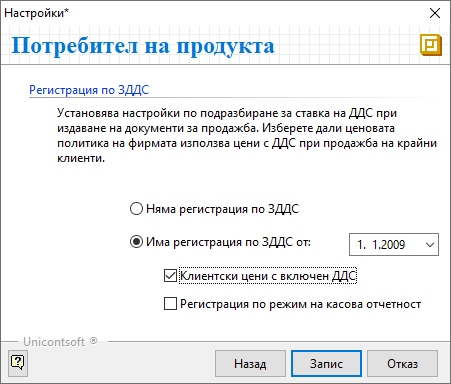
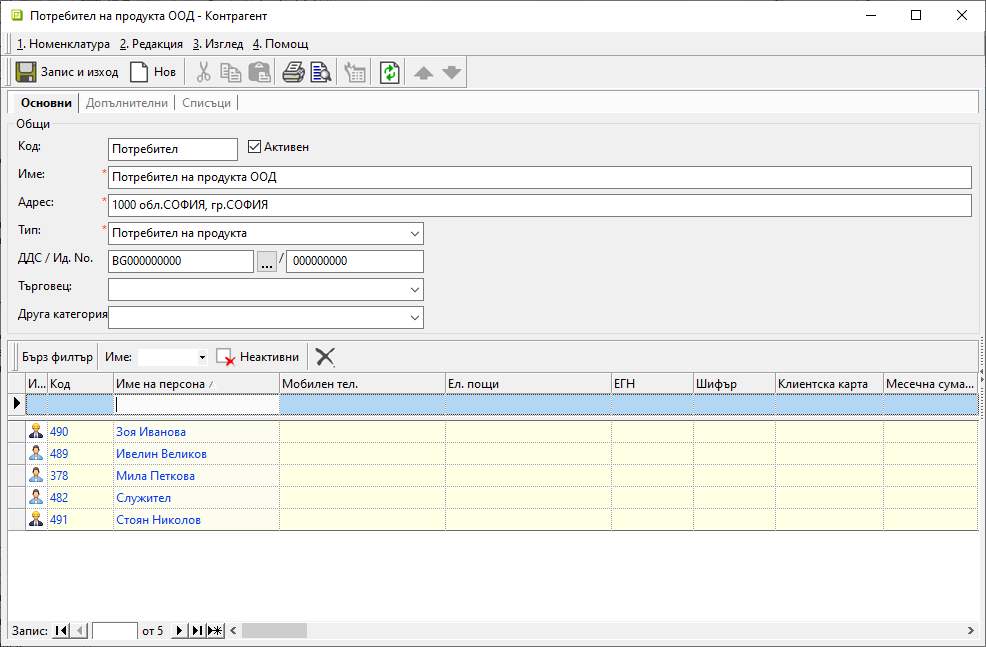

```{only} html
[Нагоре](000-index)
```
 
# **Потребител на продукта**

> **Потребител на продукта** е контрагент от специфичен тип, който системата третира като титуляр. Това е субектът (физическото или юридическото лице), който ще оперира с **Dreem ERP**.  

Първоначалното стартиране на системата активира помощник за настройка на **Потребител на продукта**. На всяка от стъпките се въвеждат основни данни за организацията и задължителни реквизити, които имат отношение към данъчни документи за продажба.  

Помощникът за настройка **Потребител на продукта** може да бъде стартиран повтрно от **Администрация » Потребител на продукта**.  

## Настройки чрез помощник за въвеждане

Помощникът стартира с информация за предстоящите стъпки.  
На всяка една от тях за навигиране към предходна или следваща стъпка се използват бутони [**Назад**] и [**Напред**]. Излизане от помощника може да бъде избрано чрез [**Отказ**].  

> Означените със звезда полета са задължителни.   

{ class=align-center }

- **Данни за фирмата**  

На тази стъпка се въвеждат основните данни за организацията.  
Това включва наименование на организацията, идентификационен код - Булстат или номер по ДДС , адрес, телефони и факс.  

{ class=align-center }

- **Персона по подразбиране**  

При следващата стъпка се добавят име и длъжност на МОЛ по подразбиране за организацията.  
Падащият списък в поле **Длъжност** е [референтна номенклатура](../guide/erp/001-ref/001-nomenclatures/001-ref-nomenclatures.md), която трябва да бъде настроена предварително.  

 { class=align-center }

- **Банкова сметка**  

Полетата от тази стъпка включват реквизити за основна банкова сметка на организацията. Данните се използват за попълване и отпечатване на документи за продажба.  

{ class=align-center }

- **Фискални устройства**  

Тази стъпка е задължителна единствено при вариант СУПТО за Dreem Enterprise и Dreem Express. При нея се дефинира фискално устройство за касата по подрабиране в системата.  

Списък с фискални устройства се показва, когато системата разпознава инсталираните такива (локално или мрежово). В противен случай съобщава, че не са намерени свързани фискални устройства.   

{ class=align-center }

- **Регистрация по ЗДДС**  

На тази стъпка се указва дали фирмата е регистрирана по ЗДДС и от коя дата. Настройката определя ставка на ДДС по подразбиране при издаване на документи за продажба.  

Опция *Клиентски цени с включен ДДС* се използва за дефиниция по подразбиране за тип на ценовите листи.  
С маркиране на опцията системата активира ритейл ценови листи - калкулации по цени с ДДС при продажба. Когато опцията не е маркирана, системата използва ценови листи, при които калкулациите са по цени без ДДС.  

Опцията *Регистрация по режим на касова отчетност* се използва, когато фирмата е регистрирана в НАП за използване на касова отчетност. С това се активира използването на специфични типовете документи.  

След успешно въвеждане на данните, настройките се записват с бутон [**Запис**].  

{ class=align-center }

Нови детайли или промени за **Потребител на продукта** могат да бъдат нанесени във [формата за редакция](../guide/erp/001-ref/001-nomenclatures/002-contragents.md) от списък **Контрагенти**.  

{ class=align-center w=15cm }

Примерни допълнителни настройки, които могат да бъдат направени:  

  - Списък със служители - Добавянето на персони позволява потребителите в системата да бъдат обвързани с техните имена, които да се обзавеждат автоматично при въведеждане на документи.    
  - Допълнителни банкови сметки - Банковите сметки се използват при печат на фактури, при въвеждане на извлечения, в **Счетоводство**.  
  - Обекти на организацията - Различните обекти (офиси, магазини, звена и др.) дават възможност за дефиниране на подразделения със собствени номератори на документи.   
    
> Тези настройки са съществена част от системата и автоматично обзавеждат множество данни при въвеждането на документи.  

