```{only} html
[Нагоре](000-index)
```

# Описание и функционалности на контейнера

- [Лента с основно меню](https://docs.unicontsoft.com/start/002-container.html#id2)  
- [Лента с инструменти](https://docs.unicontsoft.com/start/002-container.html#id3)  
- [Лента с бутони по групи функции](https://docs.unicontsoft.com/start/002-container.html#id4)  
- [Динамичен списък](https://docs.unicontsoft.com/start/002-container.html#id5)  
- [Статус лента](https://docs.unicontsoft.com/start/002-container.html#id6)  
- [Меню на контейнера](https://docs.unicontsoft.com/start/002-container.html#id7)  

Контейнерът представлява основната форма на системата **Dreem ERP**. Отваря се при нейното стартиране и всички основни функционалности се изпълняват от него.

Съдържанието на контейнера включва: Лента с основно меню, Лента с инструменти, Лента с бутони по групи функции, Динамичен списък за визуализация на документи и Статус лента.  

## **Лента с основно меню**

Основното меню се намира най-горе в контейнера, като обединява множество менюта за задаване на различни функции на форми и списъци.

Менютата от лентата с Основно меню са изнесени и разпределени между Лента с инструменти и Контекстно меню, което улеснява бързия достъп до тях.  

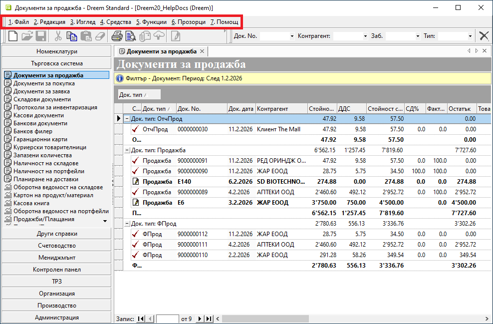{ class=align-center w=15cm }

1. **Файл** - Системата активира единствено подменютата с достъпни опции. Възможните действия са различни и зависят както от текущо отворения списък, така и от маркираните записи/редове.  

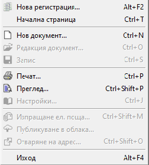{ class=align-center }

 - **Нова регистрация** - Затваря текущо стартираната база данни, след което предлага избор на нова база с въвеждане на входни данни  - потребител и парола.  
 - **Начална страница** - Отваря страницата, която системата зарежда по подразбиране при стартирането ѝ.  
 - **Нов...** - Отваря форма за редакция на номенклатура или документ за добавяне на нов запис.  
 - **Редакция...** - Отваря форма за редакция на маркираната номенклатура или документ в текущ списък.  
 - **Запис** - Записва направените до момента промени.  
 - **Печат** - Изпраща за печат списък или текущо маркираните записи.  
 - **Преглед** - Показва на екран преглед за печат на списък или текущо маркираните записи.  
 - **Настройки** - Отваря форма с настройки на принтер. Обикновено опцията е активна в справки.  
 - **Изпращане на ел. поща** - Добавя един или множество документи в прикачен файл към нов имейл. За целта трябва да има настроен мейл клиент.  
 - **Публикуване в облака** - Извършва електронен обмен на документи в отделна система.   Необходими са допълнителни настройки.  
 - **Изход** - Изход от системата   

2. **Редакция** - Менюто предлага основни действия, свързани с маркирани текстове и записи. 

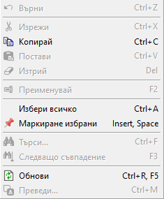{ class=align-center }

 - **Върни** - Връща стъпка назад.  
 - **Изрежи** - Изрязва маркиран текст или редове.  
 - **Копирай** - Копира маркиран текст или редове.  
 - **Постави** - Поставя последно копирани/изрязани данни.  
 - **Изтрий** - Изтрива маркираните данни.  
 - **Преименувай** - Дава възможност за промяна на името.  
 - **Избери всичко** - маркира всички възможни записи.  
 - **Маркиране на избрани** - Поставя "пин" върху предварително маркирани записи.  
 - **Търси** - Търси съвпадение по текст.  
 - **Следващо съвпадение** - Предлага следваш резултат от търсенето.  
 - **Обнови** - Опреснява текущия списък.  
 - **Преведи** - Предлага добавяне на чуждоезични настройки за някои номенклатури.  

3. **Изглед** - Менюто предлага бързи настройки за промяна в изгледа на списъците.  

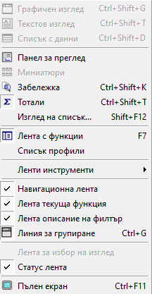{ class=align-center }

 - **Графичен изглед** - Изглед в справките, съответстващ на преглед при печат.  
 - **Текстови изглед** -  
 - **Списък с данни** - Визуализиране на списъка с данни в табличен вид, позволяващ разместване, групиране, сортиране на колони и др.  
 - **Панел за преглед** - Активира допълнително информационно поле вдясно, показващо избрани данни за текущо маркиран запис.  
 - **Миниатюри** - Възможност за активиране на изглед Миниатюри, при който се визуализират настроени в записите изображения.  
 - **Забележка** - Визуализира въведените забележки в списък.  
 - **Тотали** - Включва/изключва показването на тотали за групировка в списък.  
 - **Изглед на списък** - Отваря форма с настройки Изглед на списък за показване/скриване на колони, подредба и групиране на редове.  
 - **Лента с функции** - Скрива/показва лентата с функции, разположена вляво в контейнера.  
 - **Списък профили** - Скрива/показва полето, даващо възможност за навигация между профили (при работа в няколко бази данни едновременно).  
 - **Лента с инструменти** - Настройки, касаещи лентата с инструменти, като активиране/деактивиране на стандартна лента, бърз филтър и други.  
 - **Навигационна лента** - Скрива/показва лентата за навигация между отворени множество списъци.  
 - **Лента текуща функция** - Скриване/показване на лентата, представяща наименование на текущо отворен списък.  
 - **Лента описание на филтър** - Скриване/показване на филтър полето в жълт цвят от началото на текущия списък.  
 - **Линия за групиране** - Скриване/показване на полето за извеждане на колона/и при активиране на групировка по тях. Появява се непосредствено под жълтото филтър поле.  
 - **Лента за избор на изглед** - Скрива/показва поле за навигиране между Графичен изглед и Списък с данни в справки. Намира се непосредствено над статус лентата.  
 - **Статус лента** - Скрива/показва статус лентата, намираща се най-долу в контейнера.  
 - **Пълен екран** - Опция за едновременно скриване/показване на основното меню и на лентата с функционалности отляво. По този начин текущо стартираните списъци заемат целия екран.  

4. **Средства** - Менюто включва различни средства, касаещи потребителските настройки на системата, импорт/експорт на данни, генерация на свързани документи и други.  

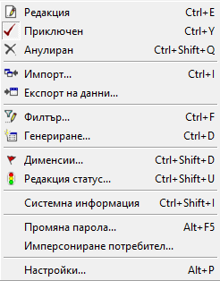{ class=align-center }

 - **Редакция / Приключен / Анулира** - Опциите се активират в списъци с документи. Използват се за промяна на състоянието за маркиран документ.  
 - **Импорт** - Опция за импорт на данни от външен файл. Активна е за избрани номенклатури и документи.  
 - **Експорт на данни** - Опция за експорт на данни във файл с различен формат.  
 - **Филтър** - Отваря форма Филтър за основно търсене.  
 - **Генериране** - Отваря форма за създаване на свързани документи.  
 - **Дименсии** - Отваря форма за редакция с предварително настроените в системата Дименсии.   Опцията е активна за избрани номенклатури.  
 - **Редакция статус** - Отваря форма за добавяне/промяна на документ статус. Активно е в списъци с документи.  
 - **Системна информация** - Отваря информационна форма с дата, час и потребител, който е създал и редактирал последно избрания  запис.  
 - **Промяна на парола** - Отваря форма за смяна на потребителска парола.  
 - **Имперсониране на потребител** - Възможност за имперсониране с настройки на друг потребител.  
 - **Настройки** - Дава достъп до настройки, касаещи контейнера и списъците като цяло, регионални настройки и други.  

5. **Функции** - подменютата на Функции дават достъп до всички функционалности на системата от лентата с бутони по групи функции: Номенклатури, Търговска система, Други справки, Счетоводство, Мениджмънт, Контролен панел, ТРЗ, Организация, Производство, Администрация.  

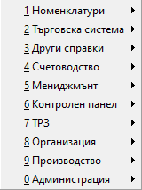{ class=align-center }

6. **Прозорци** - Действията, които системата предлага, са свързани с текущо отворените списъци като отделни прозорци.  

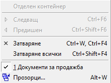{ class=align-center }

 - **Отделен контейнер** - Отваря избрани списъци в отделен контейнер.  
 - **Следващ** - Преминава към следващия отворен списък/прозорец.  
 - **Предишен** - Преминава към предходен списък (отворен прозорец).  
 - **Затваряне** - Затваря текущия списък.  
 - **Затваряне всички** - Затваря всички отворени прозорци.  
 - **Прозорци** - Отваря форма със списък активни прозорци.  

7. **Помощ** - Менюто дава достъп до търсене на допълнителна информация и инструкции за работа със системата.  

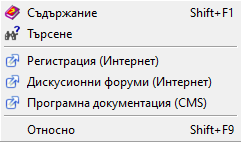{ class=align-center }

 - **Съдържание** - Отваря помощна информация за работа с програмата.  
 - **Търсене** - Предлага търсене на текст.  
 - **Регистрация** - Отваря форма за регистрация при лицензионно споразумение за изтегляне на **Dreem PERSONAL**.  
 - **Дискусионни форуми** - Достъп до поддържан от Униконт софт дискусионен форум, където може да получите информация и по индивидуални казуси.  
 - **Програмна документация** - Препратка към инструкции за работа със системата.  
 - **Относно** - Системна информаци за текуща версия на базата данни и др.  

## **Лента с инструменти и бърз филтър**

Лентата се намира в горната част на контейнера,непосредствено под Лента с основно меню. В нея са изнесени от основното меню някои инструменти за въвеждане на функционалности на форми, списъци и документи.  

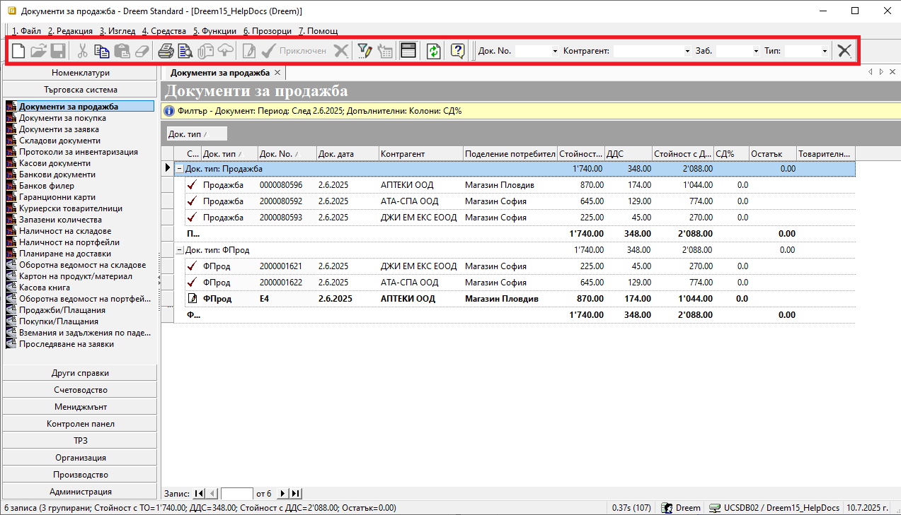{ class=align-center w=15cm }

## **Лента с бутони по групи функции**

Намира се в лявата част на контейнера. Функционалностите на системата са обединени в групи функции, управляващи стопанската дейност на организацията: Номенклатури, Търговска система, Други справки, Счетоводство, Мениджмънт, Контролен панел, ТРЗ, Организация, Производство, Администрация.  

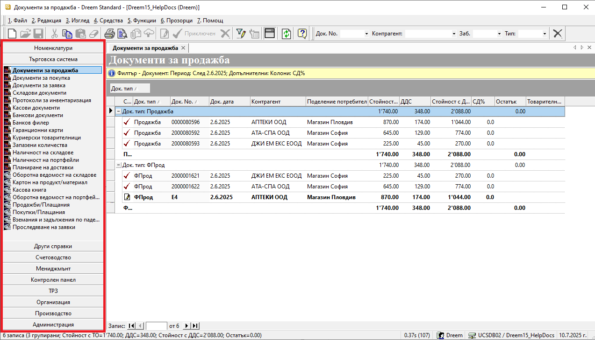{ class=align-center w=15cm }

## **Динамичен списък за визуализация на документи**

Динамичният списък се намира в дясната част на контейнера. При избор на функционалност, списъкът се попълва с документи, като всеки ред от него представлява отделен документ.  

За улеснение на потребителя те могат да се отварят чрез двоен щрак с мишката върху избран документ, а при десен щрак с мишката върху списъка се отваря контекстно меню с опции.  

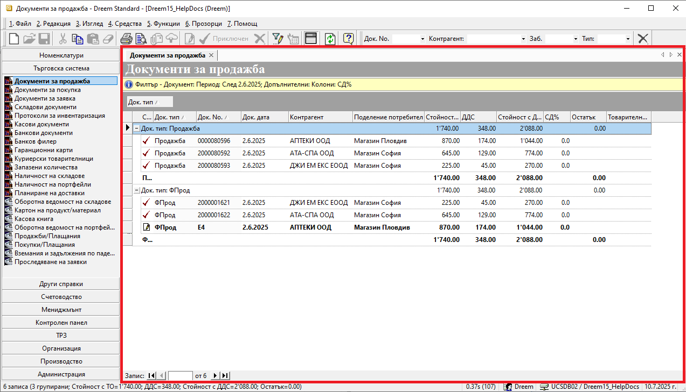{ class=align-center w=15cm }

## **Статус лента**

Статус лентата се намира най-долу в контейнера и изпълнява ролята на информационно поле. Съдържа информация за брой записи в текущия списък, времето, за което системата е заредила списъка, потребител на системата, текущата база с данни и дата.  

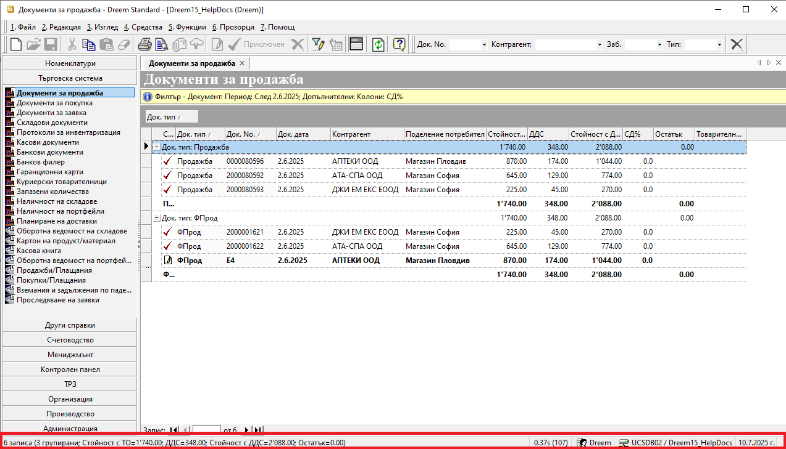{ class=align-center w=15cm }

## **Функции в менюто на контейнера**

Менюто на контейнера се отваря чрез десен щрак с мишката върху **Лента с функционалности** вляво на контейнера.  

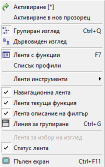{ class=align-center }

 - **Активиране** — активиране на нова функционалност. Опция по подразбиране, при щрак с мишката (Настройки). Активира новата функционалност, като затваря старата.  

 - **Активиране в нов прозорец** — активиране на нова функционалност в нов прозорец. Активира новата функционалност, като отваря нов прозорец за функцията. Така на практика има две или повече отворени функции на системата. Визуализацията на тези функции, както и навигацията между тях се осъществява през навигационната лента.  

 - **Групиран изглед** — изглед на лентата с бутони. Активна опция по подразбиране. Визуализира лентата с бутони по групи функции.  
 Клавишна комбинация: Ctrl+Shift+Q  

 - **Дървовиден изглед** — изглед на лентата с бутони. Визуализира лентата с бутони в дървовидна структура.  
 Клавишна комбинация: Ctrl+Shift+W  

 - **Лента с функции** — показва/скрива лентата с бутони.  
 Клавишна комбинация:F7  

 - **Списък с профили** — показва/скрива списъка с профили. Системата позволява настройка на различни профили за работа (най-вече при използване на повече от една база данни). Чрез активиране на опцията списък профили, системата визуализира падащ прозорец с различни профили за смяна.  

 - **Лента инструменти** — показва/скрива различните ленти с инструменти. При различни функционалности съществуват различни ленти с инструменти. Чрез опцията те се визуализират в допълнително меню, откъдето могат да бъдат показвани и скривани.  

 - **Навигационна лента** — показва/скрива лентата за навигация. Лентата за навигация се използва при отваряне на функционалности в системата в нови прозорци (виж точка 2). Чрез нея можете да се навигирате бързо и удобно във всяка отворена функция.  

 - **Лента текуща функция** — показва/скрива наименованието на текущата функция.  

 - **Лента описание на филтър** — показва/скрива жълтата лента на активния филтър. Визуализира съдържанието на активния филтър.  

 - **Линия за групиране** — показва/скрива линията за групиране на списък.  
Клавишна комбинация: Ctrl+G  

 - **Лента за избор на изглед** — показва/скрива лентата за избор на изглед в справките.  

 - **Статус лента** — показва/скрива статус лентата.  

 - **Пълен екран** — показва/скрива бутон за визуализация на пълен екран.  
Клавишна комбинация: Ctrl+F11  
