```{only} html
[Нагоре](000-index)
```

# Работа със списъци

- [Структура и функционалности на контейнера]()
- [Използване на основни и бързи филтри]()
- [Работа с редактируеми списъци]()
- [Работа с нередактируеми списъци]()
- [Използване на Списък с данни в справките]()

Списъците в системата представляват набор от записи (редове) в множество колони, които могат да бъдат конфигурирани различно според нуждите на потребителите. Системата дава възможност за добавяне, скриване, разместване, оразмеряване, сортиране и групиране на колони.  

 Ще разгледаме особеностите на списъците, като ги разделим условно на два типа:
- редактируеми - позволяват обработка на данни, като изтриване, добавяне, коригиране на редове и други;  
- нередактируеми - такива, които са резултативни и не допускат промяна на данни;   

Обединяваща характеристика е прилагането на филтри и при двата вида списъци.  

## Структура и функционалности на контейнера

При стартиране на Dreem ERP, като част от структурата на системата, се отваря т.нар. *контейнер*. Той съдържа лента с основно меню, лента с инструменти, лента с бутони по групи функции, динамичен списък за визуализация на документи и статус лента.

### Лента с бутони и Mеню на контейнера

В лявата част на контейнера е разположена лента с бутони по групи, даващи достъп до функционалностите в системата. 
С десен бутон на мишката върху тази лента ще отворите менюто на контейнера. По този начин имате достъп до активиране / деактивиране на различни функции, променящи облика на контейнера.  

Всяка от опциите за настройка е представена в статия [Описание и функционалности на контейнера](https://www.unicontsoft.com/cms/node/253).   

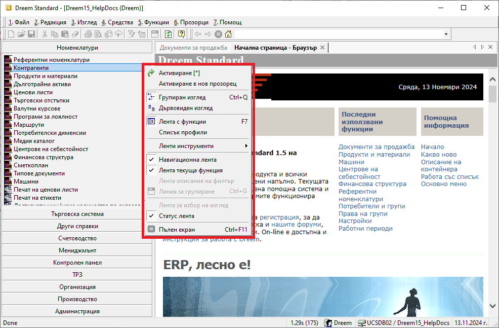{ class=align-center }

```{tip}
Използвайте *Активиране в нов прозорец*, за да стартирате едновременно няколко функционалности в отделни прозорци. Удобна възможност е, когато трябва да работите в няколко справки или документи в системата.  
```

Активираните функционалности са достъпни през навигационната лента. Това позволява бързо превключване между тях.    

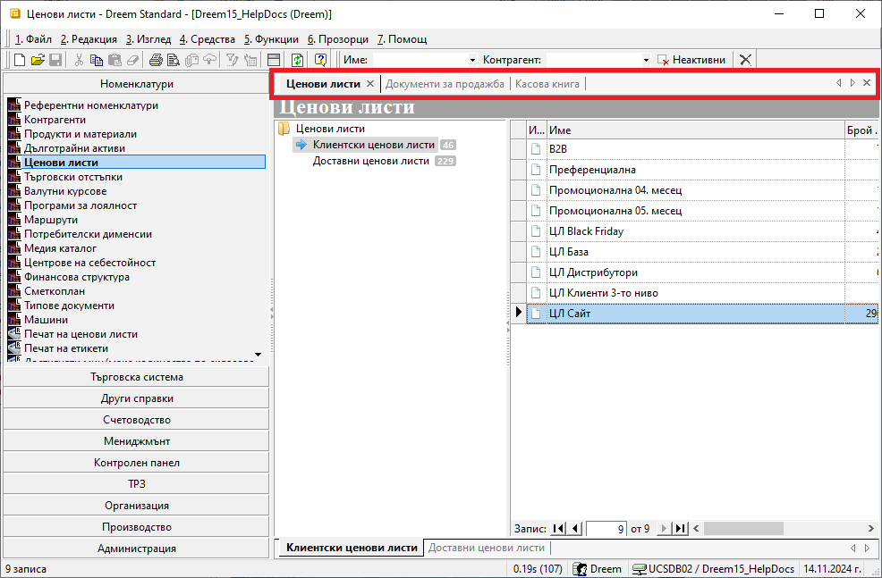{ class=align-center }

> Прозорците могат да бъдат пренареждани чрез пренасяне с влачене - drag&drop функцията. 

### Основно меню

Лента *Основно меню* се използва за прилагане на различни функции на форми, списъци и документи. Намира се най-горе на контейнера и съдържа следните менюта: [*Файл*, *Редакция*, *Изглед*, *Средства*, *Функции*, *Прозорци* и *Помощ*](https://www.unicontsoft.com/cms/node/253).


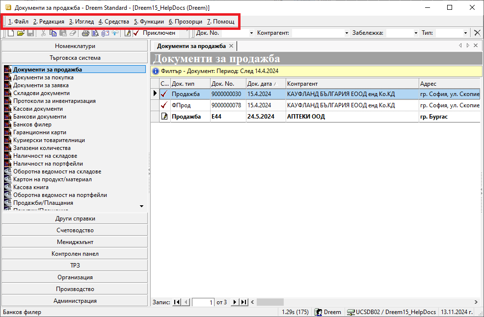{ class=align-center }

### Лента с инструменти

Лентата с инструменти се намира непосредствено под *Основно меню*.  
Съдържа бутони, даващи бърз достъп до някои инструменти за въвеждане на функции на форми, списъци и документи, изнесени от *Основно меню* .  

> В *Лента с инструменти* са активни различни бутони - тези, чиито функции системата може да приложи в текущия списък.   

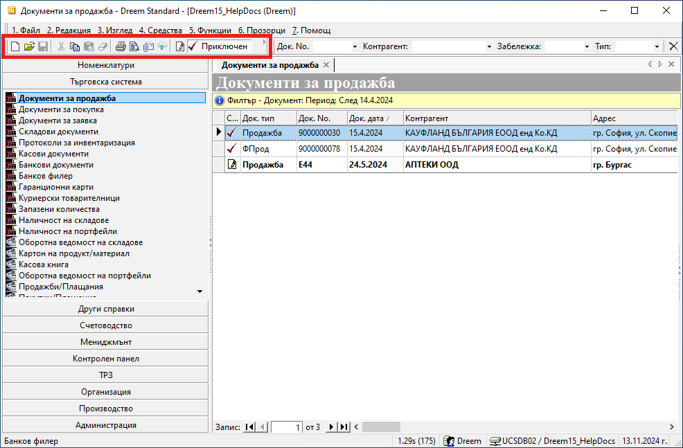{ class=align-center }

От тук, например, може да създадете нов запис (документ, номенклатура) и да редактирате запис. Достъпни са бутони с основни действия като запис, изрязване, копиране, поставяне и изтриване. 

За да посочите на системата за кой запис ще се отнасят действията, трябва преди това да се позиционирате на реда с номенклатура или да маркирате желания ред с документ. И, както казахме, активират се само бутони, за които системата може да приложи техните функции.  

### Контекстно меню  

В *Контекстно меню* се съчетават функции от *Основно меню* и от *Лента с инструменти*. Отваря се с десен бутон на мишката върху списъците с документи или номенклатури.  

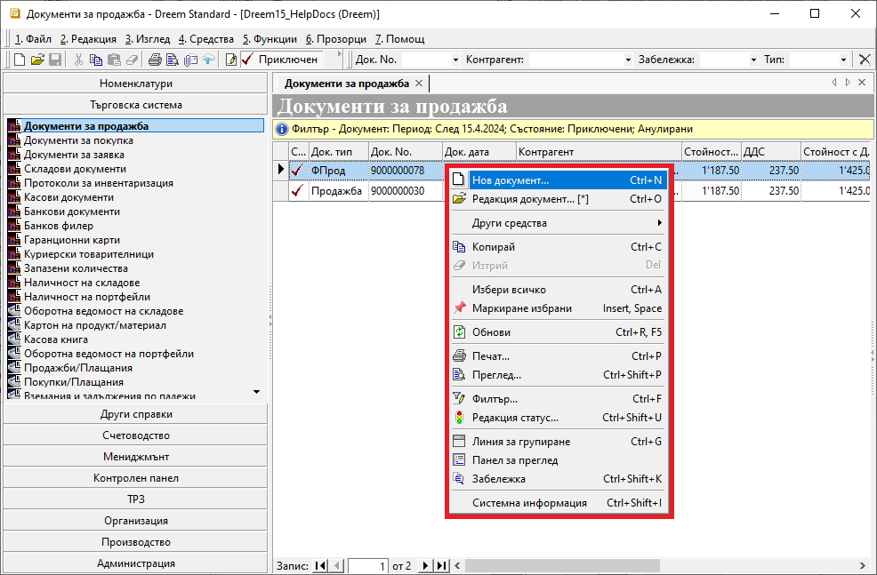{ class=align-center }

Това меню съдържа както общи, така и променливи опции, адаптирайки се към различните списъците с функционалности.  

Например, ако сравним контекстното меню за номенклатура *Продукти и материали* и *Документи за продажба*, се вижда, че при продуктите менюто дава бърз достъп до настройване на *Дименсии*, както и активиране на изглед *Миниатюри*. Тези опции не са възможни при продажбите. При продажбите, обаче, чрез контекстното меню е възможна промяна в статуса на документите.

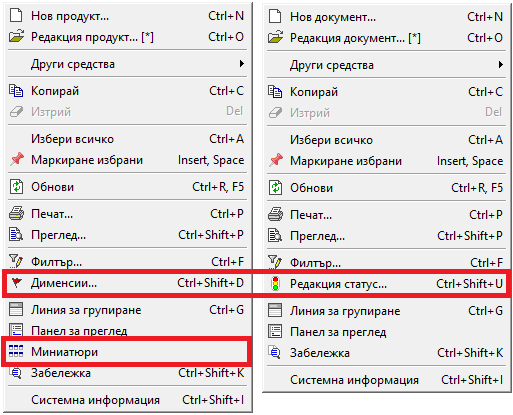{ class=align-center }

> В подменю *Други средства* се съдържат различни за отделните функционалности опции за генерация на свързани документи, прилагане на корекции, свързване с банкови плащания, бързи справки и други.  

### Меню на списък

За всеки списък е достъпно меню с функционалности на колоните като сортиране, групиране, скриване, извеждане на колони и други.  
*Меню на списък* се отваря чрез десен бутон на мишката върху реда със заглавия на колони.  
В статията [Работа с колони на списъци](https://www.unicontsoft.com/cms/node/254) подробно са описани всички възможности, които това меню дава при работа с колони.  

Напред в темата ще разгледаме как работят най-често прилаганите функции от това меню при работа с нередактируеми списъци.  

## Използване на основни и бързи филтри

Съдържанието на всички списъци може да се променя чрез прилагане на филтри.  

> Правилното филтриране е първата и най-важна стъпка, за да се обзаведе списъкът с верните данни. Едва тогава е оправдано да се продължи с настройването на списъка.  

### Основен филтър
  
Основен *Филтър* ще откриете в някои номенклатури, като *Контрагенти*, *Продукти и материали* и др., във всички списъци с документи и в справките.  

*Филтър* за текущо отворен списък е достъпен чрез:  

- меню 4. Средства  
- жълтото поле в началото на списъка  
- десен бутон върху списъка      
- клавишна комбинация Ctrl + F   

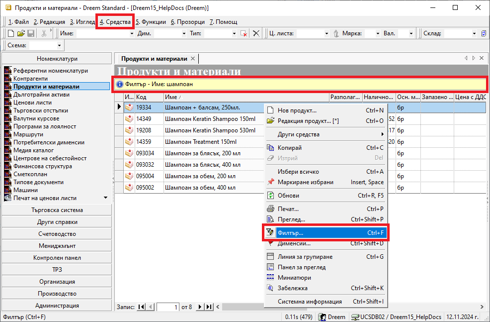{ class=align-center }

Спрямо заложените в основния филтър критерии системата ще обзаведе списъка с данните, отговарящи на тях. Избраните критерии се визуализират в жълтото поле.  

> Системата запазва последно настроения филтър и го прилага автоматично при следващо отваряне на списъка.  

Филтър формата за основно търсене съдържа променливи реквизити, различни за отделните списъци. Така например ще забележите и различен брой панели във филтрите на *Документи за продажба* и на справка *Продажби (реализация)* 

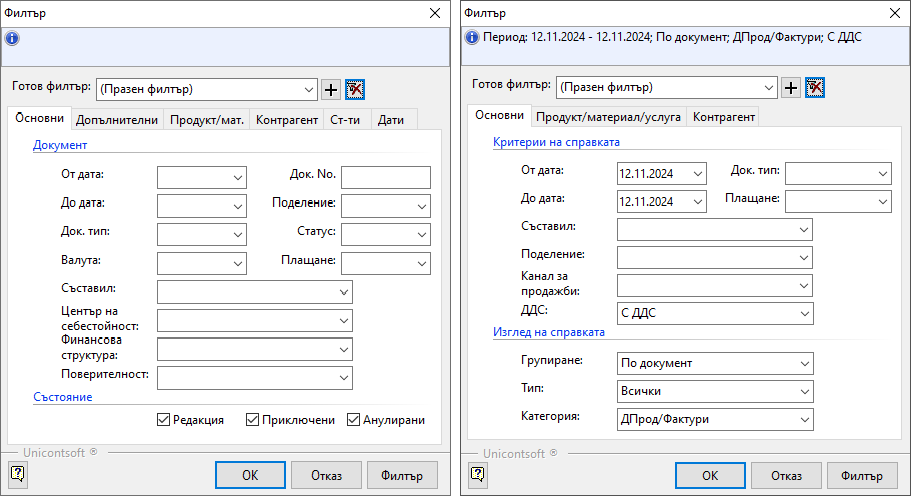{ class=align-center }


> Във форма *Филтър* има опция *Изчистване текущ филтър*, която автоматично почиства всички полета.  
Това е полезно при ново търсене, защото гарантира, че настройвате филтъра "на чисто".   

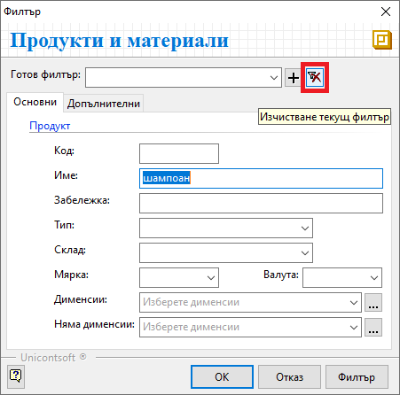{ class=align-center }

### Бърз филтър

Ще откриете *Бърз филтър* над почти всеки списък в системата. Съдържанието му в различните форми и списъци варира. Може да съдържа полета за свободно търсене по текст (част от текст) и полета с падащи прозорци. От статията [Бърз филтър и настройки на начина на търсене](https://www.unicontsoft.com/cms/node/129) може да разберете как да използвате бързия филтър още по-ефективно.   

> Чрез *Бърз филтър* редуцирате единствено съществуващите данни в списъка.   

За голяма част от функционалностите в системата бързият филтър е достъпен от лентата с инструменти в контейнера.

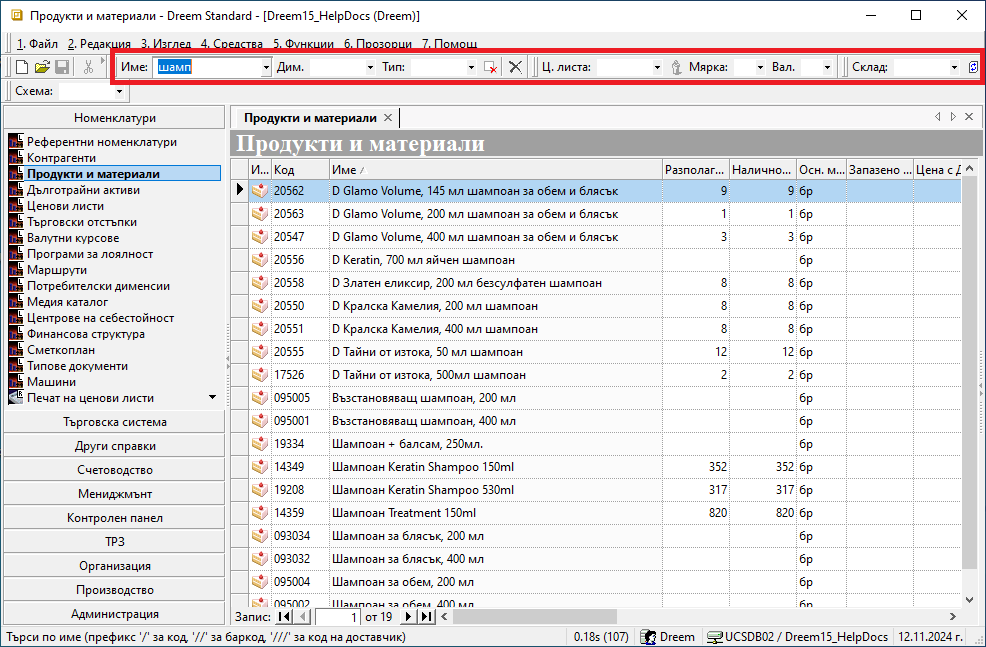{ class=align-center }

Освен това, ще може да използвате бързи филтри също в панел *Списък данни* на справки, форма за редакция на документи, номенклатури и др.  

## Работа с редактируеми списъци

Списъците, позволяващи добавяне и редактиране на данни, съдържат т.нар. *ред за добавяне на нов запис* и/или множество оцветени в жълт цвят полета (цели редове). 

На следващото изображение може да разгледате и двата от споменатите елементи.  

Редът за добавяне на нов запис е статичен и винаги остава като първи ред в списъка. Данните в голяма част от полетата се обзавеждат чрез падащи списъци. Когато всички желани полета от реда са попълнени, се потвърждават с клавиш **Enter**. Това добавя въведените данните като отделен ред в списъка, а редът за добавяне на нов запис автоматично се "изчиства" за следващо попълване.  

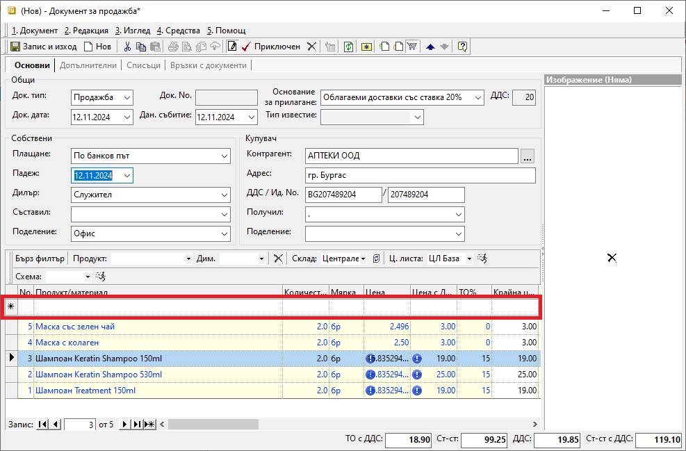{ class=align-center }

Другата характерна особеност на редактируемите списъци - полетата/ редовете в жълто, са знак, че се допускат корекции на данните в списъка. В един списък е възможна и комбинация от "заключени" и "отключени" за редакция полета.  

> В жълтите полета системата винаги позволява промяна на данните.  

В тези списъци може да се прилагат филтри. При тях системата също поддържа [сортиране, групиране и пренареждане](https://www.unicontsoft.com/cms/node/254) на колоните.

## Работа с нередактируеми списъци

Характерното за нередактируемите списъци, както подсеща името им, е, че записите в тях са "заключени" за корекции.  
Промяна на данните е възможна единствено, ако за записите е достъпна форма за редакция. 

Разбира се, с пълна сила се прилагат функциите на *Контекстно меню*, *Меню на списък*, бързи и основни филтри.  

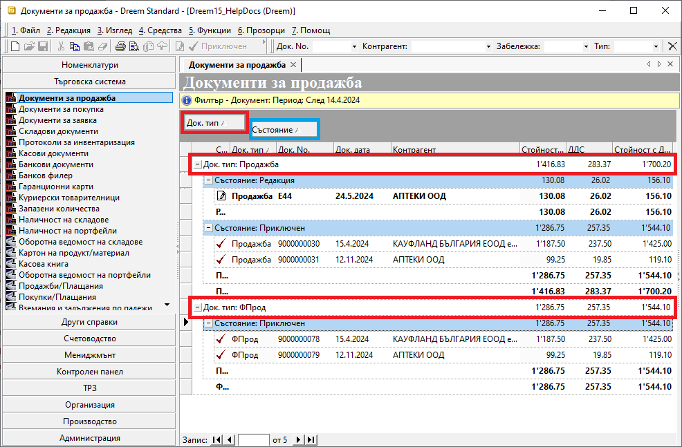{ class=align-center }

Управлявайте времето си за оперативни задачи ефективно, като прилагате добре подбрани филтри.  
За да работят максимално бързо списъците с документи, избягвайте филтриране с ненужно дълги времеви интервали.  

> В поле *Готов филтър* на форма *Филтър* може да настройвате готови шаблони с различни комбинации от критерии.  

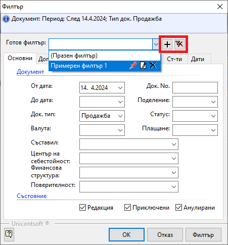{ class=align-center }

Шаблон с филтър се добавя или изтрива съответно от бутоните **[+]** и **[x]** след полето вдясно.  
Списъкът със записани готови филтри се отваря в падащ списък с бутони за контрол - закачане, редакция, изтриване.  

## Използване на Списък с данни в справките

По подразбиране справките в системата се визуализират в *Графичен изглед* с вид на преглед при печат. Филтрираните данни се подреждат в системно заложен шаблон. За някои справки шаблонът може се променя, което става автоматично при промяна на избрани реквизити във филтъра.   
Този изглед не позволява ръчна промяна в конфигурацията на справката.     

Съществува и алтернативен изглед - *Списък с данни*. При него данните са оформени в табличен вид и може да прилагате правилата за работа с нередактируеми списъци.  
При този изглед конфигурацията на справката **може да се променя**.

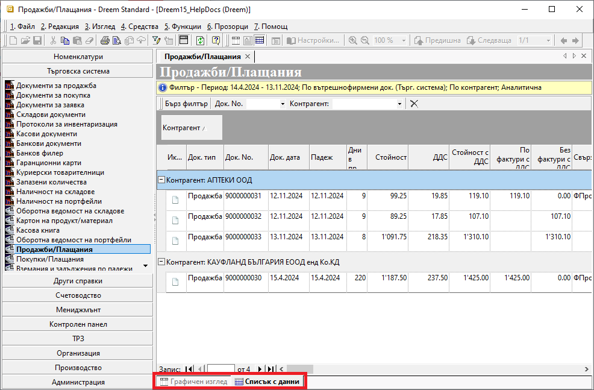{ class=align-center }

Размествайте, скривайте и показвайте от наличните допълнителни колони, за да създадете собствен удобен дизайн.  
Активирането на *Тотали* за избрана групировка може да добави нова и полезна иформация.  

> В тази си форма справките, или части от тях, могат да бъдат копирани във външен файл, където списъкът подлежи на пълна редакция и преформатиране.  
> Пълните данни на текуща справка може да експортирате и в CSV или XLSB файлове. Функцията е достъпна от меню **Средства || Експорт на данни**.  

