```{only} html
[Нагоре](000-index)
```

# **Работа със списъци**

- [Структура и функционалности на контейнера](#структура-и-функционалности-на-контейнера)
- [Използване на основни и бързи филтри](#използване-на-основни-и-бързи-филтри)
- [Работа с редактируеми списъци](#работа-с-редактируеми-списъци)
- [Работа с нередактируеми списъци](#работа-с-нередактируеми-списъци)
- [Използване на Списък с данни в справките](#използване-на-списък-с-данни-в-справките)

Списъците в системата представляват набор от записи (редове) в множество колони, които могат да бъдат конфигурирани различно според нуждите на потребителите. Системата дава възможност за добавяне, скриване, разместване, оразмеряване, сортиране и групиране на колони.  

Списъците имат общи, но и някои различни особеностите според типа им:  
- *Редактируеми списъци* - позволяват обработка на данни: изтриване, добавяне, коригиране на редове и други;  
- *Нередактируеми списъци* - резултативни и недопускащи промяна на данни;   

> За всички списъци е валидна възможността за прилагане на филтри.  

## **Структура и функционалности на контейнера**

При стартиране на **Dreem ERP** се отваря т.нар. *контейнер*. Той е основна част от структурата на системата и съдържа:  

- лента с основно меню  
- лента с инструменти  
- лента с бутони по групи функции  
- динамичен списък за визуализация на документи  
- статус лента  

### Лента с бутони и Mеню на контейнера

В лявата част на контейнера е разположена лента с бутони за достъп до функционалностите в системата. Те са разпределени по групи.   

С десен клик върху тази лента ще отворите менюто на контейнера. По този начин имате достъп до активиране / деактивиране на различни функции, променящи облика на контейнера.  

Всяка от опциите за настройка е представена в темата  [Характеристики на контейнера](002-container.md#характеристики-на-контейнера).   

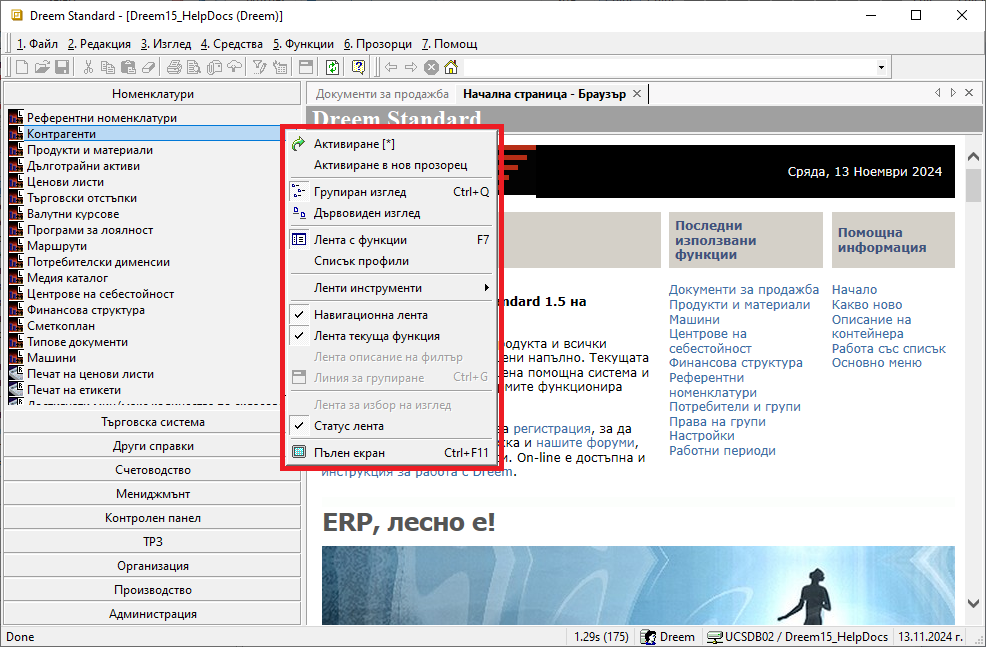{ class=align-center w=15cm }

```{tip}
Използвайте *Активиране в нов прозорец*, за да стартирате едновременно няколко функционалности в отделни прозорци. Това е удобна възможност, когато работите в няколко справки и/или списъци с документи.  
```

Активираните функции са достъпни през навигационната лента. Това позволява бързо преминаване от една към друга функционалност.    

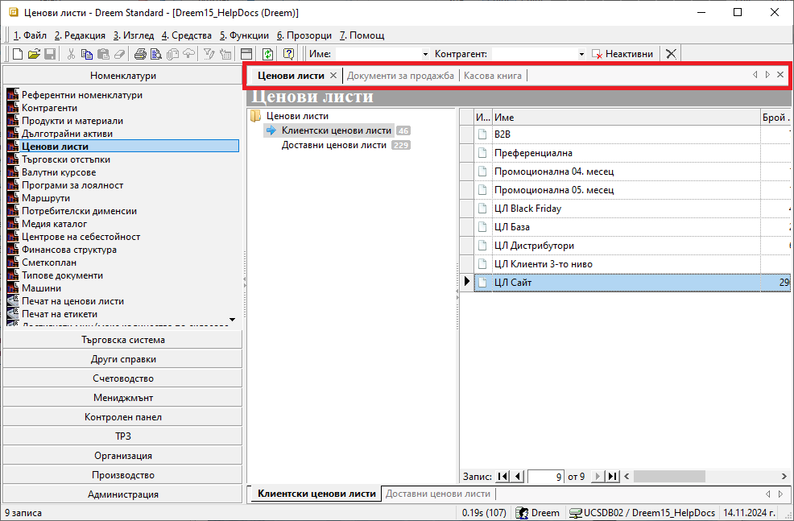{ class=align-center w=15cm }

> Прозорците могат да бъдат пренареждани чрез пренасяне с влачене (drag&drop функция).  

### Основно меню

Лента **Основно меню** се използва за прилагане на различни функции на форми, списъци и документи. Намира се най-горе на контейнера и съдържа следните менюта: *Файл*, *Редакция*, *Изглед*, *Средства*, *Функции*, *Прозорци* и *Помощ*.

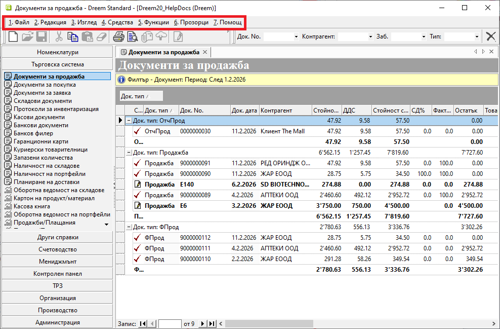{ class=align-center w=15cm }

### Лента с инструменти

Лентата с инструменти е разположена непосредствено под **Основно меню**.  
Съдържа бутони за бърз достъп до някои инструменти за въвеждане на функции на форми, списъци и документи, изнесени от основното меню.  

> Активните бутони в **Лента с инструменти** се променят.  
Системата активира единствено тези, чиито функции са приложими в текущия списък.   

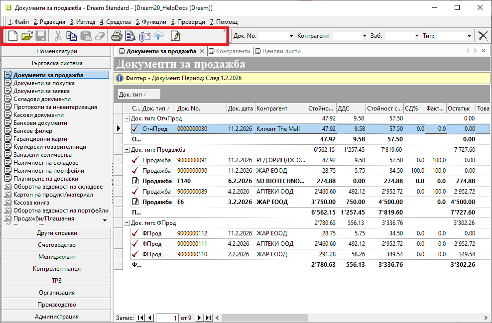{ class=align-center w=15cm }

От лентата могат да бъдат създавани нови записи (документ, номенклатура) и редактирани стари. Достъпни са бутони с основни действия като запис, изрязване, копиране, поставяне и изтриване.  

За да укажете за кой запис се отнасят действията, трябва предварително да се позиционирате на реда с номенклатура или да маркирате желания ред с документ. С това ще се активират само бутони, чието действие системата може да приложи.  

### Контекстно меню  

Това меню се отваря с десен клик върху списъците с документи и номенклатури. В него се съчетават функции от **Основно меню** и от **Лента с инструменти**.  

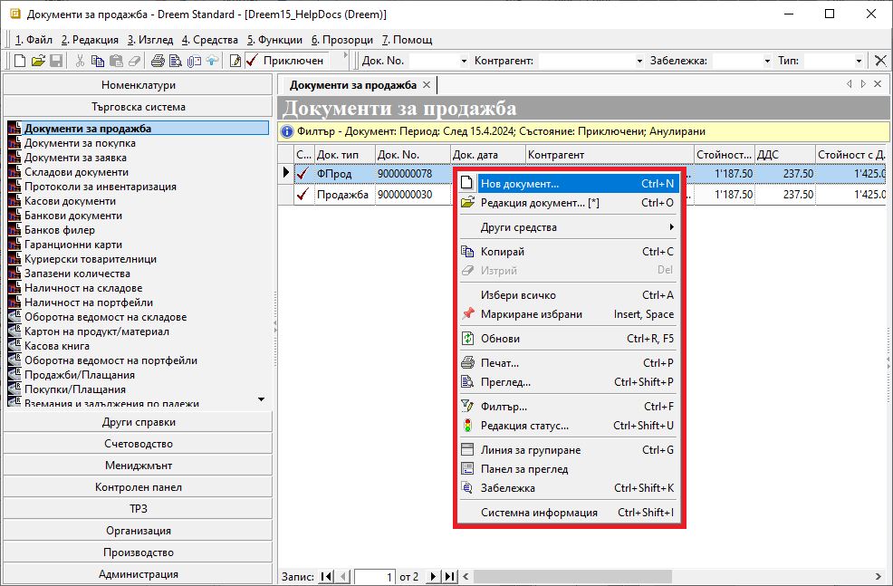{ class=align-center w=15cm }

> **Контекстно меню** съдържа общи и променливи опции, адаптирайки се към различните списъци с функционалности.  

Пример:  
Ако сравним контекстното меню за номенклатура **Продукти и материали** и за **Документи за продажба**, се виждат някои различия.  

При продуктите менюто дава бърз достъп до настройване на *Дименсии*, както и активиране на изглед *Миниатюри*. Тези опции не са възможни при продажбите.  
При продажбите чрез контекстното меню е възможна промяна в статуса на документите, което липсва за списъка с продукти.

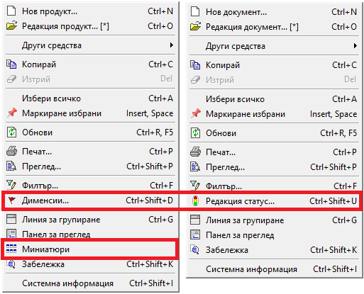{ class=align-center w=15cm }

> Подменю *Други средства* съдържа различни опции при отделните функционалности.  
Това може да включва генерация на свързани документи, прилагане на корекции, свързване с банкови плащания, бързи справки и други.  

### Меню на списък

За всеки списък е достъпно меню с функционалности на колоните като сортиране, групиране, скриване, извеждане на колони и други.  

> **Меню на списък** се отваря с десен клик върху реда със заглавия на колони.  

В статията [Работа с колони на списъци](004-column-operations.md) са разгледани детайлно възможностите, които предоставя това меню.   

## **Използване на основни и бързи филтри**

Съдържанието на всички списъци може да се променя чрез прилагане на филтри.  

> Правилното филтриране е първата и най-важна стъпка, за да се обзаведе списъкът с верните данни. Едва тогава е оправдано да се продължи с настройване на списъка.  

### Основен филтър

> Основният филтър е инструмент за отсяване на данни по зададени критерии на търсене.  

Такъв филтър ще откриете в някои номенклатури (напр. **Контрагенти**, **Продукти и материали**), във всички списъци с документи и в справките. Реализира се чрез форма *Филтър*.  
Тя е достъпна в текущо отворен списък чрез:  

- меню **Средства**  
- жълтото поле в началото на списъка  
- десен клик върху списъка      
- клавишна комбинация [**Ctrl + F**]   

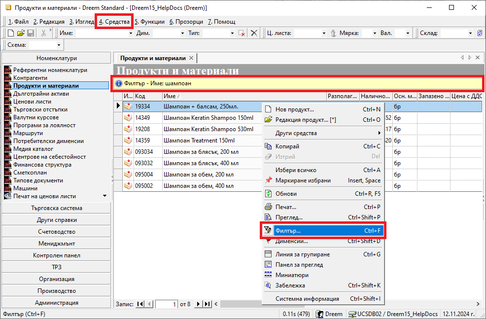{ class=align-center w=15cm }

Спрямо заложените критерии системата ще обзаведе списъка с отговарящите на тях записи.  
Избраните критерии се визуализират в жълтото поле.  

> Системата запазва последно настроения филтър и го прилага автоматично при следващо отваряне на списъка.  

В различните списъци филтър формата за основно търсене съдържа променливи реквизити, респ. различен брой раздели.  

Примерни разлики във филтрите на **Документи за продажба** и справка **Продажби (реализация)**:  

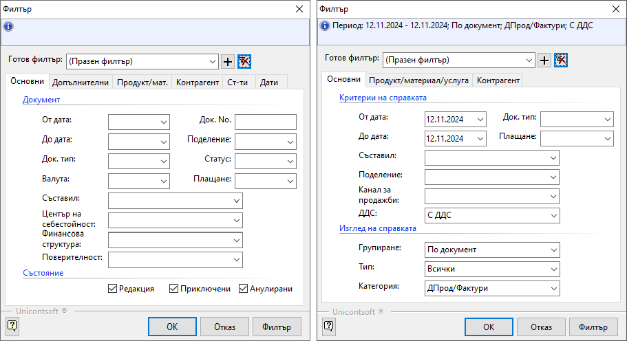{ class=align-center w=15cm }


> Във филтър формата има бутон *Изчистване текущ филтър* за автоматично почистване на всички полета.  
Това е полезно при стартиране на ново търсене, защото гарантира, че ще настроите филтъра "от нулата".   

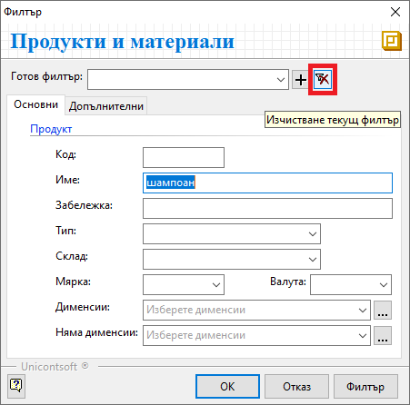{ class=align-center }

### Бърз филтър

Ще откриете *Бърз филтър* над почти всеки списък в системата. Съдържанието му варира в различните форми и списъци. Може да съдържа полета за свободно търсене по текст (част от текст) и полета с падащи прозорци.    

> Чрез *Бърз филтър* редуцирате единствено вече съществуващите данни в списъка.   

При голяма част от функционалностите бързият филтър е разположен в лентата с инструменти на контейнера.  
Различни бързи филтри са достъпни също от раздел *Списък данни* на справки, форма за редакция на документи, номенклатури и др.  

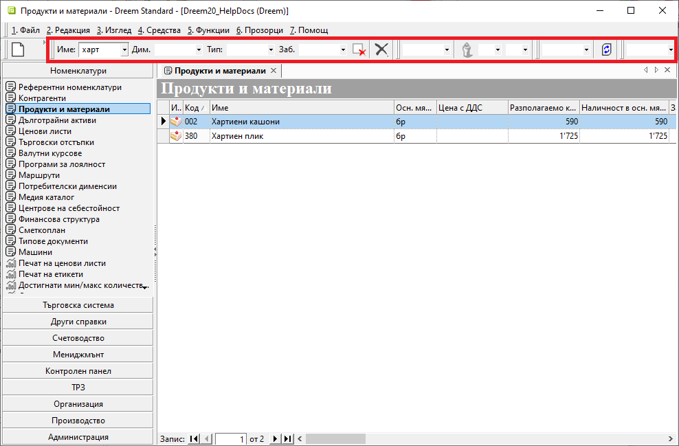{ class=align-center w=15cm }

За ефективно използване на бързия филтър е необходимо предварително да оптимизирате начина на търсене.  
Свързаните с това настройки са достъпни в основно меню **Средства » Настройки**.  
В секция **Контроли** могат да бъдат настроени:  
   -   **По *Име* търси съвпадение навсякъде** - Настройката указва на системата да търси съвпадение във всички части на името.  
   -   **По *Име* търси и в *Код*** - Указва търсене на съвпадение по зададено *Име* и в кодовете на номенклатурите. На практика активира търсене и по код.  
   -   **Попълване на падащи списъци за бързо търсене** - Алтовора попълване на падащите списъци в бързия филтър.  
   -   **Търсене по пълно име на категория** - Указва търсене по категория само при пълно изписано име на категорията.  
   -   **Търсене само по тип *Група*** - Опцията ограничава категориите в бързия филтър до такива, спадащи към тип *Група*(настроената за основна категория продукти).  

## **Работа с редактируеми списъци**

Списъците, позволяващи добавяне и редактиране на данни, съдържат т.нар. *ред за добавяне на нов запис* и/или множество оцветени в жълт цвят полета (цели редове).  

> Редът за добавяне на нов запис е статичен и винаги остава като първи ред в списъка. Не може да бъде изтрит.   

Данните в голяма част от полетата на реда се обзавеждат чрез падащи списъци. Когато всички желани полета от реда са попълнени, се потвърждават с клавиш [**Enter**]. Това добавя в списъка отделен ред с въведените данните.  
Същевременно редът за нов запис автоматично се "изчиства" за следващо попълване.  

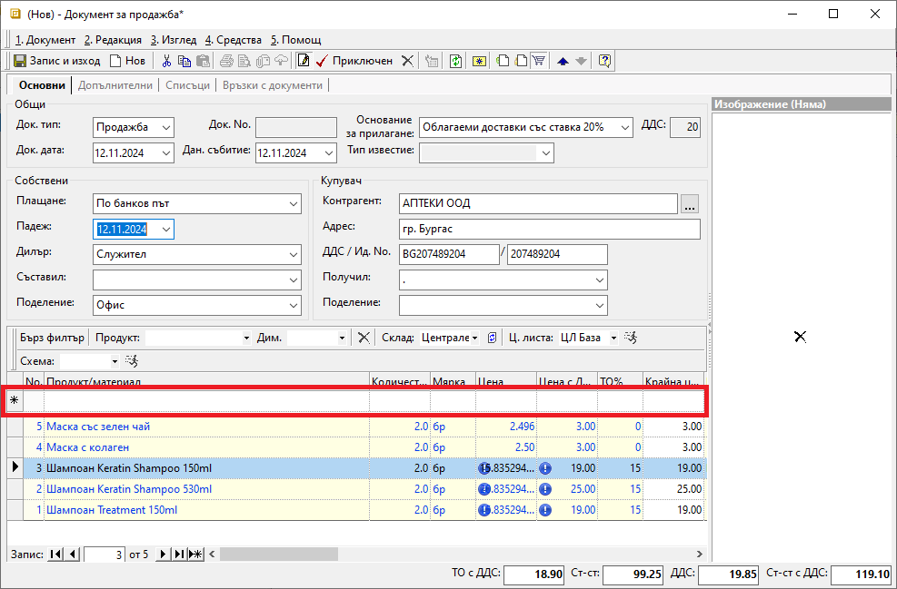{ class=align-center w=15cm }

В редактируемите списъци са разположени също полета в жълто за попълване на данни. Често списъкът съдържа комбинация от "заключени" и "отключени" за редакция полета.  

> За оцветените в жълто полета системата винаги позволява промяна на данните.  

В редактируемите списъци се прилагат филтри и системата поддържа [сортиране, групиране и пренареждане](004-column-operations.md) на колоните.  

## **Работа с нередактируеми списъци**

Записите в нередактируемите списъци са "заключени" за корекции. Промяна на данните е възможна единствено, ако за записите е достъпна форма за редакция.  

За този вид списъци продължават да се прилагат функциите на *Контекстно меню*, *Меню на списък*, бързи и основни филтри.  

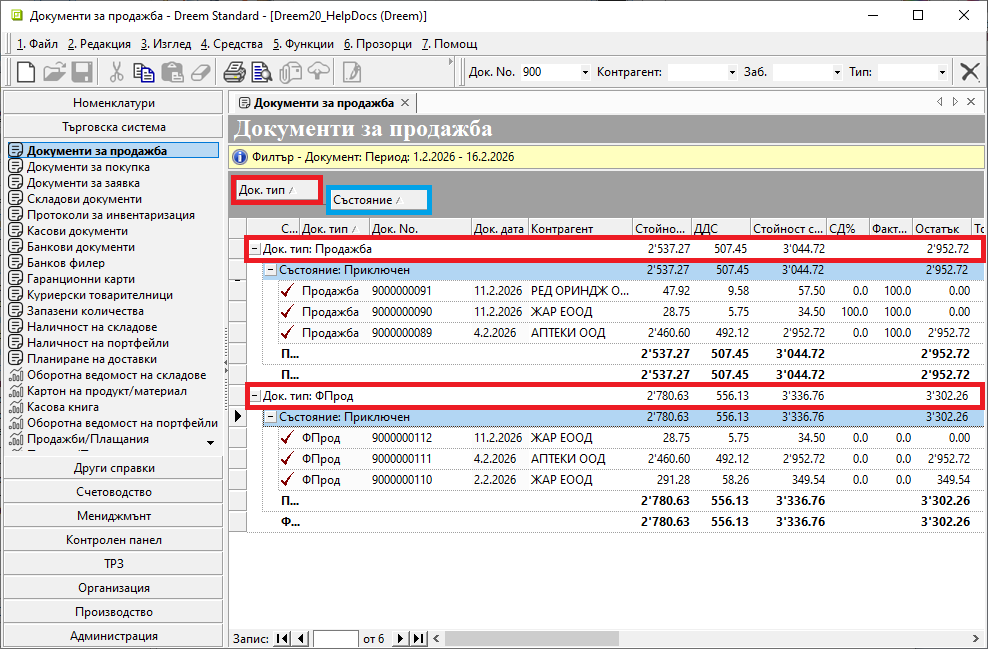{ class=align-center w=15cm }

```{tip}
Управлявайте времето си за оперативни задачи ефективно, като прилагате добре подбрани филтри.  
За да работят максимално бързо списъците с документи, избягвайте филтриране с ненужно дълги времеви периоди.  
```

> В поле *Готов филтър* на форма *Филтър* може да настройвате готови шаблони с различни комбинации от критерии.  

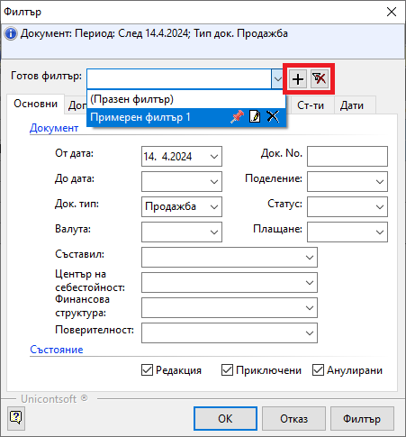{ class=align-center }

Шаблон с филтър се добавя или изтрива съответно от бутоните **[+]** и **[x]** след полето вдясно.  
Записаните готови филтри се отварят в падащ списък с бутони за контрол - закачане, редакция, изтриване.  

## **Използване на Списък с данни в справките**

По подразбиране справките в системата се визуализират в *Графичен изглед* с вид на преглед при печат. Филтрираните данни се подреждат в системно заложен шаблон. За някои справки шаблонът може да се променя. Това става автоматично при промяна на избрани реквизити във филтъра.   

> *Графичен изглед* не позволява ръчна промяна в конфигурацията на справката.   

Съществува и алтернативен изглед - *Списък с данни*.  
При него данните са оформени в табличен вид и може да прилагате правилата за работа с нередактируеми списъци.  

> При изглед *Списък с данни* конфигурацията на справката може да се променя.

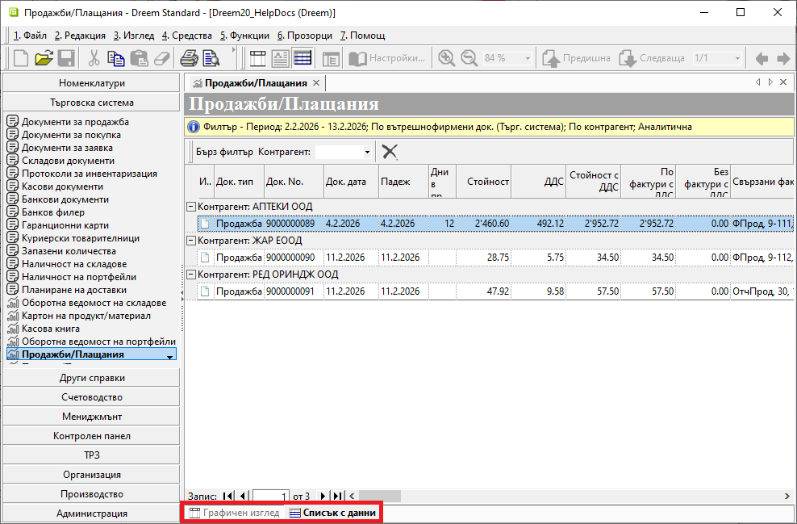{ class=align-center w=15cm }

```{tip}
Размествайте, скривайте и показвайте от наличните допълнителни колони, за да създадете собствен удобен дизайн.  
С активирането на *Тотали* за избрана групировка може да добавите нова и полезна иформация.  
```

> В тази си форма справките (или части от тях) могат да бъдат копирани във външен файл, където списъкът подлежи на пълна редакция и преформатиране.  
> Пълните данни на текуща справка може да експортирате и в CSV или XLS файлове. Функцията е достъпна от меню **Средства » Експорт на данни**.  
