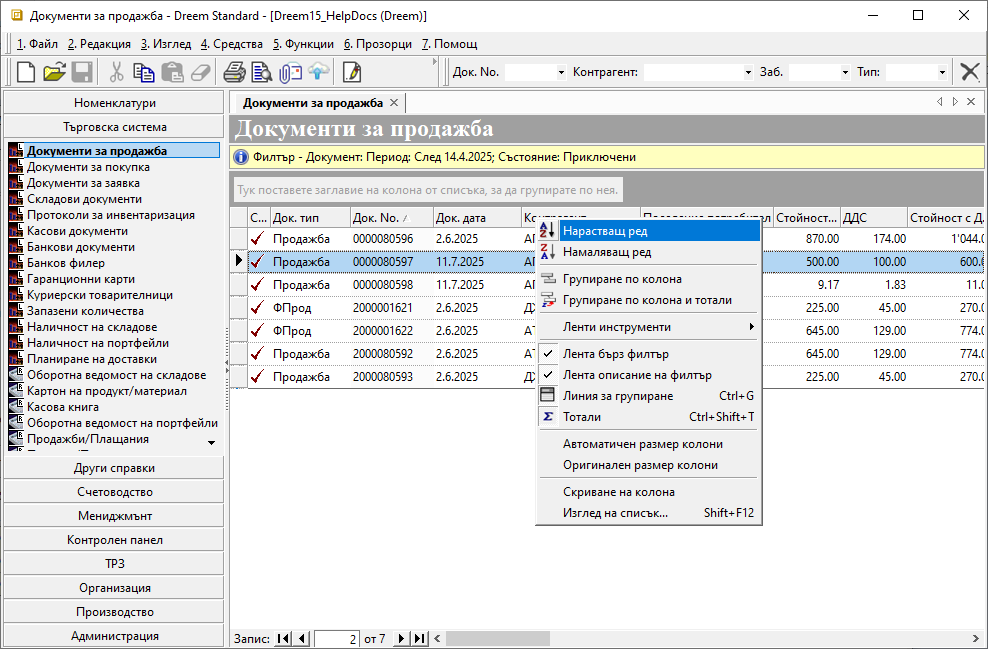
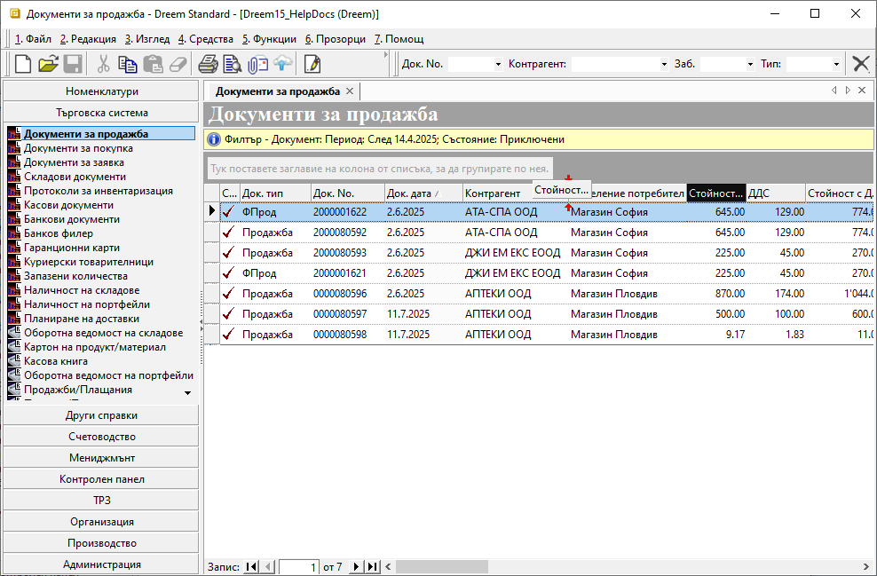
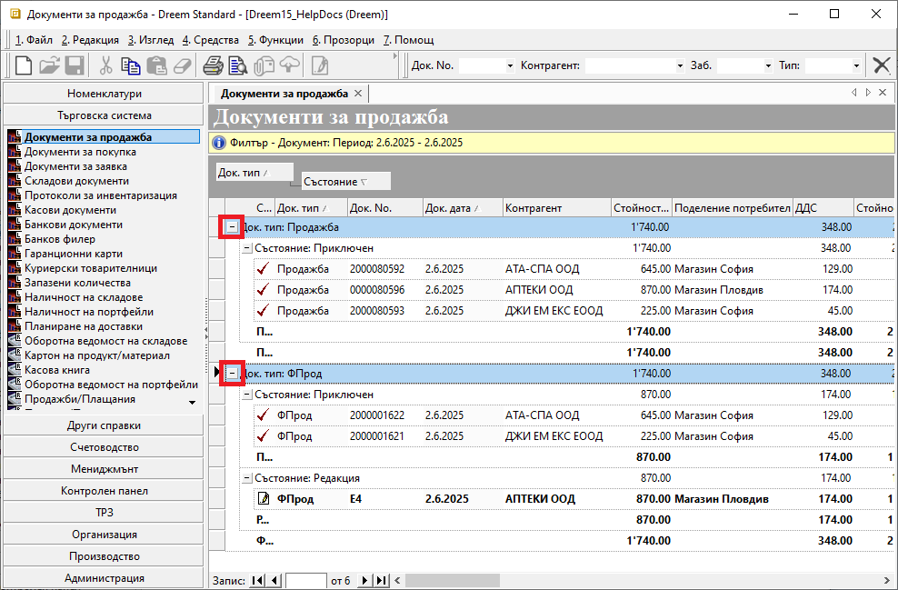
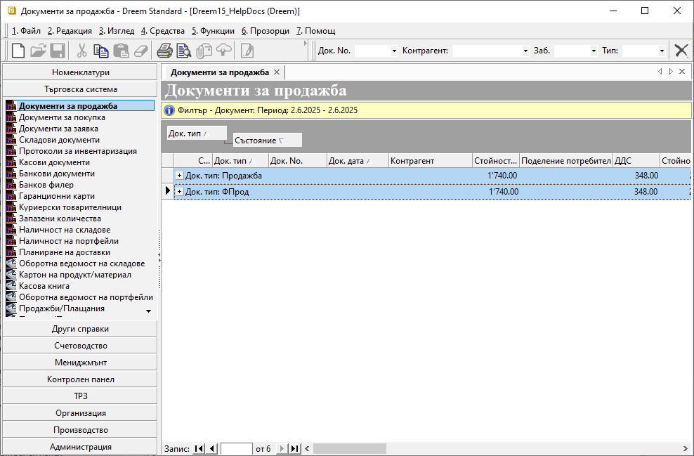
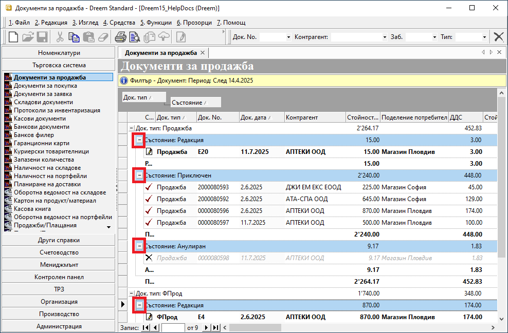
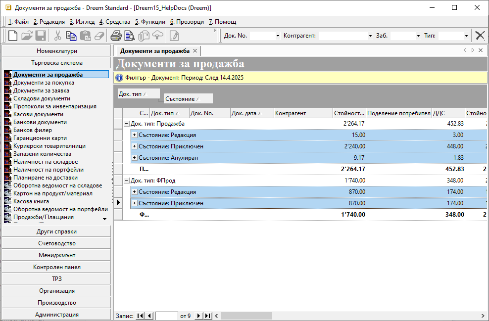

```{only} html
[Нагоре](000-index)
```

# **Работа с колони на списъци**

- [Меню на колона](#меню-на-колона)  
- [Преместване на колони](#преместване-на-колони)  
- [Сортиране и групиране на колони](#сортиране-и-групиране-на-колони)  
- [Сгъване и разгъване на списъци](#сгъване-и-разгъване-на-списъци)  

Списъкът представлява набор от записи (множество редове), който може да бъде конфигуриран. Това може да са списъци с документи, номенклатури, справки и други.  

Списъците в контейнера се обзавеждат със записи след избирането на функционалност.  

Придвижването в списъците се осъществява чрез скролиращите ленти вдясно и долу, чрез щрак с мишката върху тях или чрез стрелките от клавиатурата. Когато списъкът е кратък и се събира в полето на контейнера или формата, скролиращите ленти отсъстват.  

## **Меню на колона**

Менюто на колона се отваря чрез десен бутон на мишката върху заглавието на която и да е от колоните.  

{ class=align-center w=15cm }

Съдържа основните възможности на списъка за: сортиране в нарастващ/намаляващ ред, групиране с/без тотали и скриване и извеждане на колони и други.  

   - **Нарастващ ред** — сортировка в нарастващ ред. Ползва се от текущата колона, от която е избрано менюто. В скоби се визуализира коя по ред сортировка от общо колко е съответната.  
   - **Намаляващ ред** — сортировка в намаляващ ред. Ползва се от текущата колона, от която е избрано менюто. В скоби се визуализира коя по ред сортировка от общо колко е съответната.  
   - **Групиране по колона** — групира по избраната колона. Ползва се от текущата колона, като системата автоматично отваря линията за групиране и групира по избраната колона.  
   - **Групиране по колона** и тотали — групира по избраната колона и включва тотали. Ползва се от текущата колона, като системата автоматично отваря линията за групиране, групира по избраната колона и включва тоталите.  
   - **Лента с инструменти** - дава достъп по активиране/деактивиране на: *Стандартна лента*, *Пълен екран*, *Заключване на ленти* и *Настройки на ленти*.  
   - **Лента бърз филтър** - скрива или показва лентата с бърз филтър.  
   - **Лента описание на филтър** - скрива или показва жълтата лента с филтър, показваща описание на приложените за филтър критерии.  
   - **Линия за групиране** — използва се за скриване/ показване на линията за групиране. Списък се групира по всяка една колона от него. Групира се с помощта на мишката чрез натискане и задържане върху колона от списък, като последната се премества в линията задържане върху колона от списък, като последната се премества в линията.  
   - **Тотали** — използва се за извеждане на тотали по документи, като задължително трябва да съществува групировка по списъка. Съдържа се в контекстно меню на списъци.  
   - **Автоматичен размер на колони** — автоматично оразмерява колоните от списъка. Ползва се за всички колони, независимо откъде е избрана опцията.  
   - **Оригинален размер колони** - използва се за връщане на системно заложения размер на колоните. Прилага се за всички колони, независимо откъде е избрана опцията.  
   - **Скриване на колона** — скрива текущо избрана колона.  
   - **Изглед на списък** - показва/скрива колоните на списъка. Визуализира всички колони на списъка, както и индикатор за показва/скрива. Чрез него могат да се менажира кои колони да са показани и - скрити.

## **Преместване на колони**

Преместването на колоните представлява пренареждане/подреждане на колоните от списъка по избор.  Осъществява се с натискане и задържане на левия бутон на мишката върху антетката на желаната колона, след което се придвижва до новата ѝ позиция.  

Списъкът показва възможните за поставяне места, като ги посочва с червени стрелки.  

{ class=align-center w=15cm }

Системата запазва подредбата на колоните и я прилага отново при следващо отваряне на същата функционалност.  

## **Сортиране и групиране на колони**

1) **Сортиране на списък** се осъществява по една или няколко определени колони. Всяка следваща сортировка е подчинена на предходната. Списъците могат да бъдат сортирани с до четири подсортирани колони, но най-често се ползва сортиране по една колона (напр. по *Наименование*, *Дата*, *Контрагент*). Всяка сортирана колона има стрелка в антетката й, която показва посоката на сортировката.  

Списъкът се сортира с ляв бутон на мишката върху антетката на колоната. Ако например колоната съдържа имена, тя ще се сортира по азбучен ред в следния ред: символи, цифри, латинска азбука, кирилица (опция нарастващ ред от меню на списъци). Ако повторно се направи щрак върху антетката на същата колона, сортировката се обръща в обратна посока (опция намаляващ ред от меню на списъци).  

За да се направи подсортировка, е необходимо да се натисне с мишката антетката на друга колона при задържан клавиш [Ctrl]. В този случай, на база главната сортировка, се прави подсортировка на списъка по избраната колона. Така могат да се правят до три подсортировки.  
Премахването на сортировка става със задържан [Ctrl] и ляв бутон на мишката върху антетката на колоната, която ще се изключва от сортировката. Ако сортировката е права (от А към Я), се обръща и при повторно натискане се изключва.  

2) **Групиране на списъка** се осъществява чрез опцията *Линия за групиране*. При избирането ѝ, над списъка се отваря линия за групиране. В тази линия трябва да се постави колона, по която да се групира списъка. Преместването се осъществява, като се направи щрак върху антетката на колоната, по която ще се групира списъка и без да се пуска бутона на мишката се придвижи до линията за групиране. Списъкът автоматично предлага мястото, като го посочва с червени стрелки.  

За бързо групиране на  списъка, с десен бутон на мишката върху избраната колона се избира опция **Групиране по колона**.  

Списък може да се групира с до четири колони, като всяко следващо е подгрупиране на предходното. Системата запазва последно направената групировка.  

Групирането на списъка се премахва, като съответната колона се върне обратно долу в списъка или от контекстното меню се избере **Разгрупиране по колона**.  

## **Сгъване и разгъване на списъци**

В списъци, позволяващи групиране по колони, системата предлага сгъване/разгъване на съдържанието едновременно за всички редове. 
Такива списъци са например **Референтни номенклатури**, списъците с документи, изглед *Списък с данни* на справките и подобни.    

Сгъването на списък става чрез задържан клавиш [Ctrl] и ляв клик с мишката върху/ пред знака [-] в началото на ред с групировка.  

{ class=align-center w=15cm }

В резултат, ако например свиваме списъка с **Документи за продажба** по групировката **Док. тип**, съдържанието ще се оформи по следния начин:  

{ class=align-center w=15cm }

Разгъването на списък става със задържан клавиш [Ctrl] и ляв клик на мишката върху знак [+] в началото на реда за съответната групировка.  

Освен по основна групировка, когато има и подгрупиране, списъкът може да се сгъне само по него.
Редовете се събират със задържан [Ctrl] и ляв клик с мишката върху знака [-] в началото на един от редовете с подгрупировка.  

{ class=align-center w=15cm }

Списък с примерно подгрупиране по **Състояние** на документи би имал следния изглед след сгъване на редовете:  

{ class=align-center w=15cm }

Разгъването на списък става отново със задържан [Ctrl] и ляв бутон на мишката върху знак [+] на един от редовете за съответната подгрупировка.  
