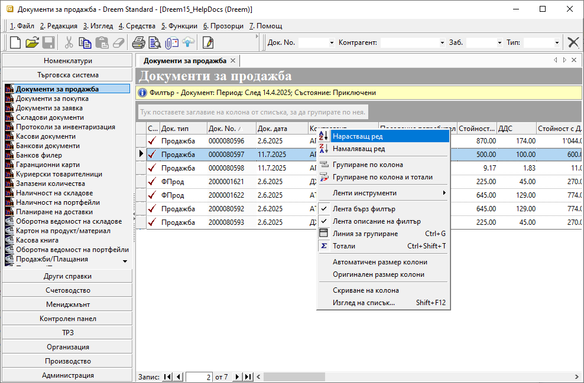
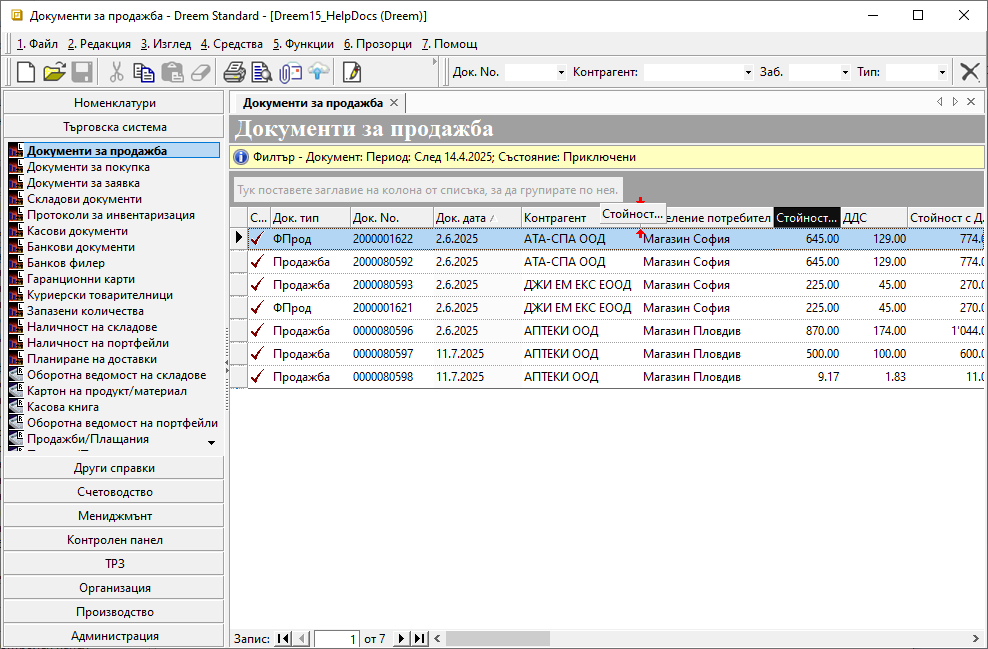
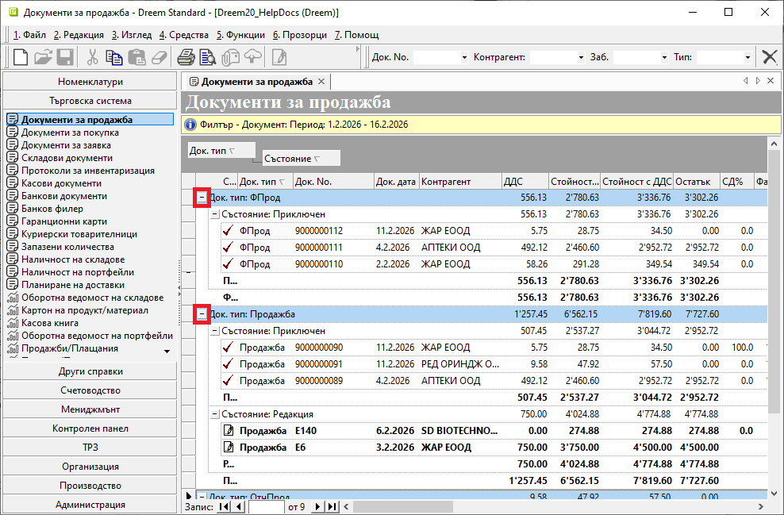
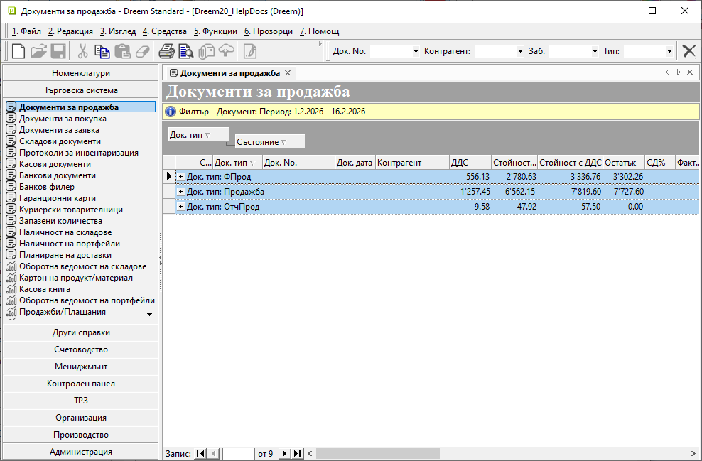
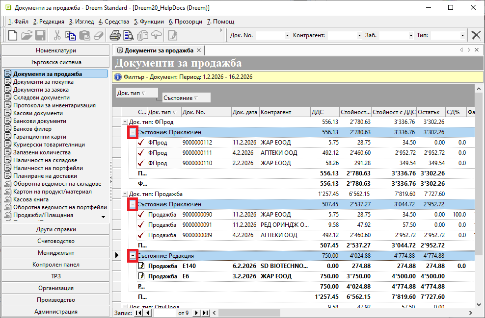
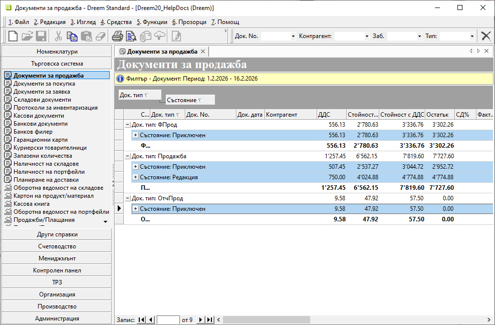

```{only} html
[Нагоре](000-index)
```

# **Работа с колони на списъци**

- [Меню на колона](#меню-на-колона)  
- [Преместване на колони](#преместване-на-колони)  
- [Сортиране и групиране на колони](#сортиране-и-групиране-на-колони)  
- [Сгъване и разгъване на списъци](#сгъване-и-разгъване-на-списъци)  

Списъкът представлява набор от записи (множество редове), който може да бъде конфигуриран. Това може да са списъци с документи, номенклатури, справки и други.  

Списъците в контейнера се обзавеждат със записи спрямо избраната функционалност.  

Придвижването в списъците се осъществява чрез скролиращите ленти вдясно и долу, чрез щрак с мишката върху тях или чрез стрелките от клавиатурата. Когато списъкът е кратък и се събира в полето на контейнера/формата, скролиращите ленти отсъстват.  

## **Меню на колона**

Менюто на колона се отваря чрез десен бутон на мишката върху заглавието на която и да е от колоните.  

{ class=align-center w=15cm }

Съдържа основните възможности на списъка за: сортиране в нарастващ/намаляващ ред, групиране с/без тотали и скриване и извеждане на колони и други.  

   - **Нарастващ ред** — сортировка в нарастващ ред;  
   Използва се от текущата колона, от която е избрано менюто. В скоби се визуализира коя по ред е сортировката и от общо колко.  
   - **Намаляващ ред** — сортировка в намаляващ ред;  
   Използва се от текущата колона, от която е избрано менюто. В скоби се визуализира коя по ред е сортировката и от общо колко.  
   - **Групиране по колона** — групира по избрана колона;  
   Системата автоматично отваря линията за групиране и групира по текущо избраната колона.  
   - **Групиране по колона и тотали** — групира по избраната колона и включва тотали;  
   Системата автоматично отваря линията за групиране, групира по избраната колона и включва тотали.  
   - **Лента с инструменти** - дава достъп до активиране/деактивиране на: *Стандартна лента*, *Пълен екран*, *Заключване на ленти* и *Настройки на ленти*.  
   - **Лента бърз филтър** - скрива или показва лентата с бърз филтър;  
   - **Лента описание на филтър** - скрива или показва жълтата лента с основен филтър;  
   Показва описание на последно приложените критерии за филтър.  
   - **Линия за групиране** — скрива/показва линията за групиране;  
   Когато линията е активирана, списъкът може да се групира и чрез влачене и пускане (drag&drop) на колона. Избранта колона се задържа с ляв бутон на мишката и се премества в линията.  
   - **Тотали** — извежда тотали за избрани колони, когато има групировка на списъка;  
   - **Автоматичен размер на колони** — автоматично оразмерява колоните от списъка;  
   Използва се за всички колони, независимо откъде е избрана опцията.  
   - **Оригинален размер колони** - връща системно заложения размер на колоните;  
   Прилага се за всички колони, независимо откъде е избрана опцията.  
   - **Скриване на колона** — скрива текущо избраната колона;  
   - **Изглед на списък** - показва/скрива колони на списъка;  
   Отваря форма, която съдържа всички колони на текущия списък. Чрез отметка се указва кои колони да са показани и скрити.  

## **Преместване на колони**

Преместването на колони представлява тяхното пренареждане в списъка. Осъществява се чрез функцията за влачене и пускане.    

> С ляв бутон на мишката върху заглавието избраната колона се задържа и придвижва до новата ѝ позиция.  
Системата посочва възможните за поставяне места, като ги маркира със стрелки в червено.  

{ class=align-center w=15cm }

Системата запазва подредбата на колоните и я прилага отново при следващо отваряне на същата функционалност.  

## **Сортиране и групиране на колони**

1) **Сортиране на списък** подрежда данните в списъка възходящо/низходящо спрямо избран показател.  

Сортирането се осъществява по една или няколко колони. Всяка следваща сортировка е подчинена на предходната. Най-често се използва сортиране по една колона - напр. по *Док. No.*, *Дата*, *Контрагент*. Всяка колона с приложена сортировка съдържа стрелка в заглавието, която показва посоката на сортиране.  

> Списъците могат да бъдат сортирани с до четири подсортирани колони.  

Списъкът се сортира с ляв бутон на мишката върху заглавието на колоната (опция **Нарастващ ред** от меню на списъци).  
Ако например колоната съдържа имена, тя ще се сортира по азбучен ред в следния ред: символи, цифри, латинска азбука, кирилица.  
Ако повторно се направи щрак върху заглавието на същата колона, сортировката се обръща в обратна посока (опция **Намаляващ ред**).  

Подсортировка се прави със задържан [**Ctrl**] и ляв бутон на мишката върху заглавието на друга колона.   

> Могат да се правят до три подсортировки.  

Премахването на сортировка става със задържан [**Ctrl**] и ляв бутон на мишката върху колоната. Ако сортировката е права (от А към Я), се обръща. При повторно натискане се изключва.  

2) **Групиране на списъка** организира данните в списъка йерархично.  
Осъществява се чрез опцията *Линия за групиране*, която активира сиво поле над списъка. В него се поставя заглавната част на избраната колона. Преместването се осъществява чрез влачене и пускане. Списъкът автоматично предлага мястото, като го посочва с червени стрелки.  

> За бързо групиране на списък служи също опцията **Групиране по колона**. Тя е достъпна с десен бутон на мишката върху името на колоната.  

Списък може да се групира с до четири колони, като всяко следващо е подгрупиране на предходното. Системата запазва последно направената групировка.  

> Групирането на списъка се премахва с връщане на колона обратно в списъка или с **Разгрупиране по колона** от контекстното меню.  

## **Сгъване и разгъване на списъци**

Системата предлага сгъване/разгъване на съдържанието едновременно за всички редове в списък. Това важи за списъците, позволяващи групиране по колони - **Референтни номенклатури**, списъци с документи, изглед *Списък с данни* на справки и подобни.    

> Сгъването на списък става чрез задържан клавиш [**Ctrl**] и ляв клик с мишката върху/пред знака [**-**] в началото на ред с групировка.  

{ class=align-center w=15cm }

В резултат съдържанието ще се оформи по сходен начин:  

{ class=align-center w=15cm }

Разгъването на списък става със задържан [**Ctrl**] и ляв клик на мишката върху знак [**+**] на реда с групировка.  

> Списъкът може да има основна групировка с подгрупиране.  
Сгъване/разгъване се прилага на същия принцип и за подгруповките.  

{ class=align-center w=15cm }

Списък с примерно подгрупиране на документи би имал следния изглед след сгъване на редовете:  

{ class=align-center w=15cm }

Разгъването на списък става отново със задържан [**Ctrl**] и [**+**] на един от редовете за избраната подгрупировка.  
