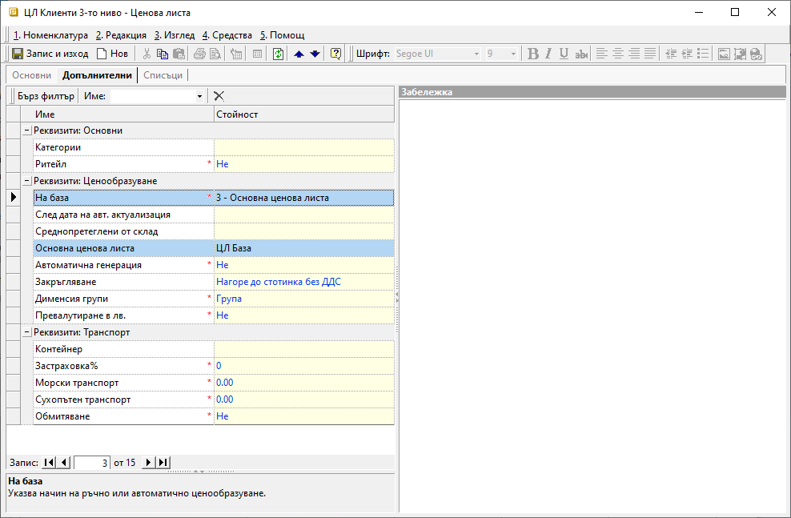
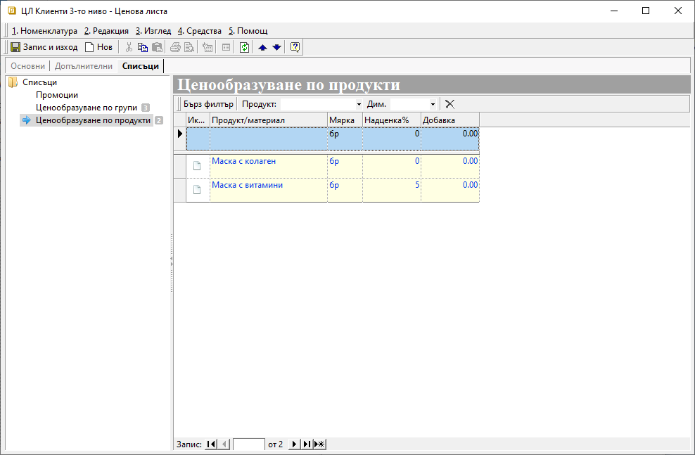
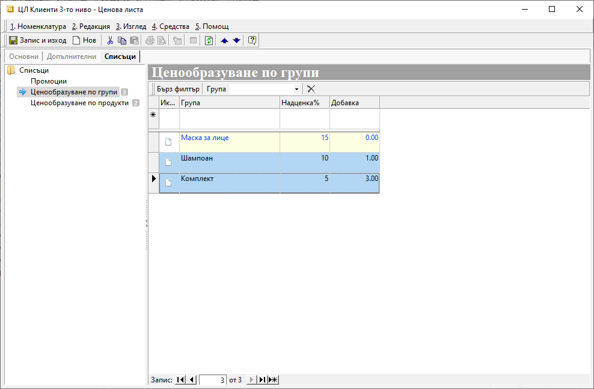
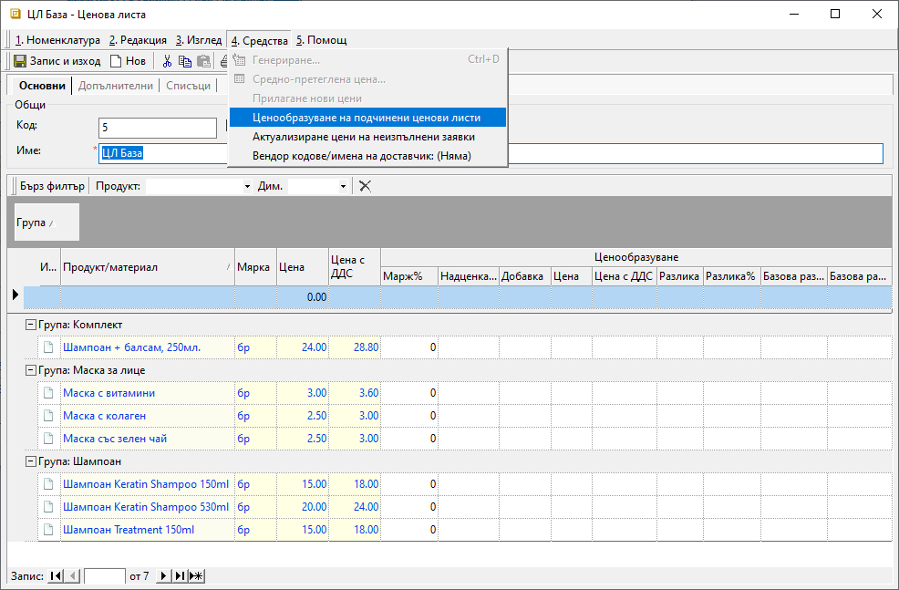
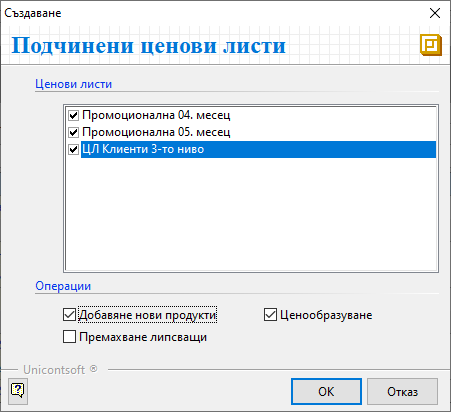
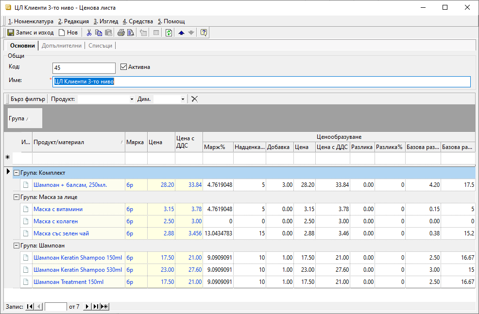
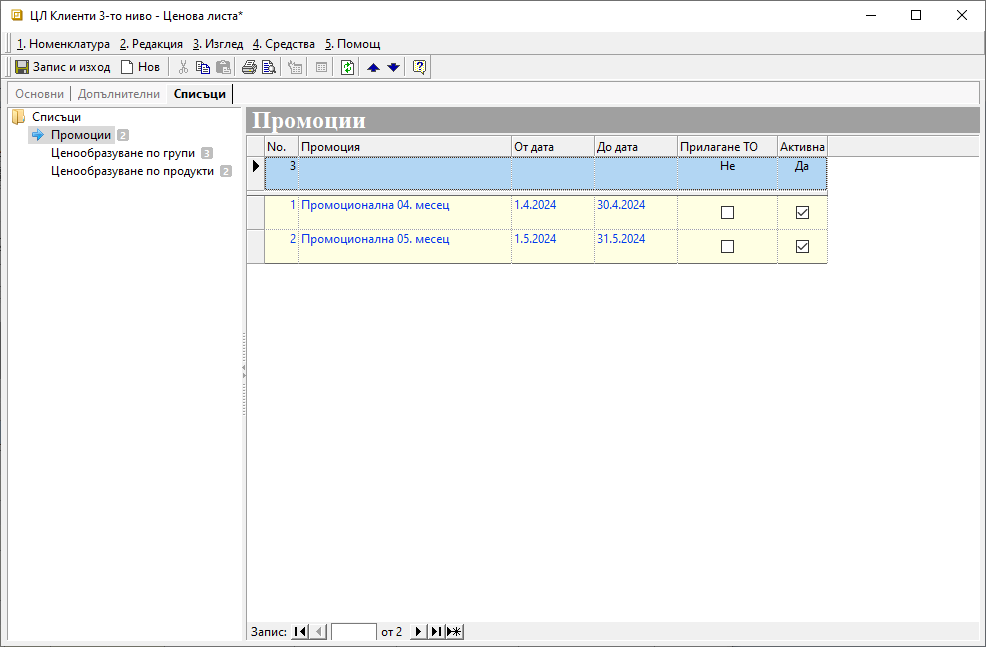
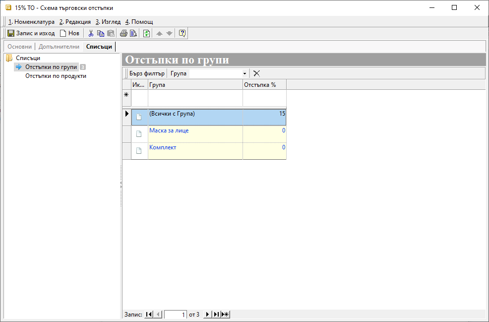
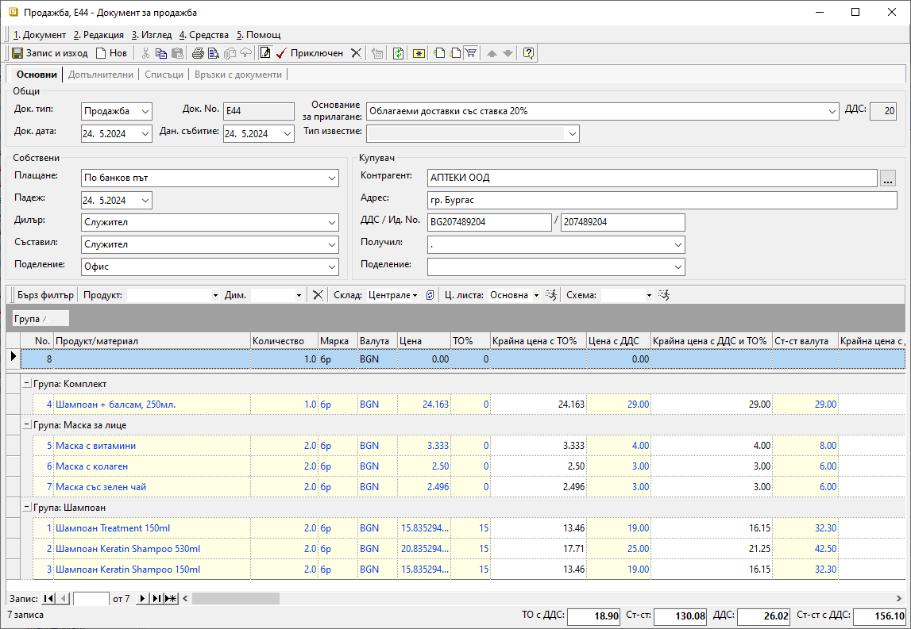

```{only} html
[Нагоре](000-index)
```

# Ценови листи и схеми с търговски отстъпки

- [Ценови листи](https://docs.unicontsoft.com/start/005-price-lists-and-discount-schemes.html#id2)   
- [Промоции](https://docs.unicontsoft.com/start/005-price-lists-and-discount-schemes.html#id3)  
- [Търговски отстъпки](https://docs.unicontsoft.com/start/005-price-lists-and-discount-schemes.html#id4)  

## **Ценови листи**

Ценовите листи представляват списъци с продукти и цени, чието прилагане в документите за покупка и продажба обзавежда цената за всеки от настроените продукти. Системата позволява създаването и поддържането на множество такива списъци. Така има възможност за настройка освен на общи ценови листи, така и на персонализирани - различни за отделни контрагенти.  

> **Ценови листи** е номенклатура, която може да бъде настроена ръчно, или да се използва автоматично ценообразуване.  

При първия вариант всяка една от цените по продукти се въвежда ръчно. Обикновено се използва, когато няма ясно установена надценка или база, върху която да се ценообразува. За системата такава база могат да бъдат: вече настроена друга основна ценова листа, последните доставни цени или среднопретеглените цени. 
Когато има избрана основа, т.е. има базова цена, към която да се прибави надценката, системата ще може автоматично да обновява цените в списъка.  

Подробно ръководство за поетапното създаване и ценообразуване в ЦЛ ще откриете в [Как да създадем Ценова листа](https://www.unicontsoft.com/cms/node/14).  
В тази тема ще разгледаме конкретно подчинените ценови листи и възможностите за добавяне на промоции.  

Ще покажем как може да създадете примерна подчинена *ЦЛ Клиенти 3-то ниво* на вече съществуващата *ЦЛ База*, при което се използва ценообразуване на база *3-Основна ценова листа*. В последствие към подчинената ценова листа ще настроим и няколко *Промоции*.  

В **Номенклатури || Ценови листи** създавате нова ценова листа, като в панел **Основни** се попълва единствено *Име: ЦЛ Клиенти 3-то ниво*.  
Същинските настройки за вида ценообразуване се правят в панел **Допълнителни**. Тук обзавеждате редовете *На база: 3-Основна ценова листа* и *Основна ценова листа: ЦЛ База*.  

Друга важна настройка, която не е желателно да пропускате, е *Ритейл*. При избор *Ритейл: Да* системата ще закръглява цените в текущата ЦЛ по *Цена с ДДС*. И обратното - при настройка *Ритейл: Не* закръгленията ще са по *Цена*.  

{ class=align-center w=15cm }

Следващата стъпка е да посочите на системата какъв процент надценка и/или добавка с точна сума ще прибавя към цените. Това може да направите от панел **Списъци**.  
Тук настройвате *Ценообразуване по групи* и *Ценообразуване по продукти*, като второто е с приоритет. Това ще рече, че <ins>системата взема предвид първо настройките за продукт. Ако липсват такива, прилага тези от *Ценообразуване по групи*</ins>.

```{tip}
Системата допуска *Надценка %* и *Добавка* да се настройват и с отрицателни числа, което на практика е отстъпка от цената. Затова има основание да се използва при ценообразуване на база *3-Основна ценова листа*.
```
Избираме да добавим нулева надценка и добавка за продукт *Маска с колаген*. Това на практика означава, че системата ще вземе цената от *ЦЛ База* без промяна. За продукт *Маска с витамини* системата ще приложи надценка 5%.

{ class=align-center w=15cm }

В *Ценообразуване по групи* ще настроим 15% надценка за групата *Маска за лице*. Тоест системата ще прилага този процент за всички продукти, участващи в групата, с изключение на двата с индивидуална настройка.  
Настройките за групите *Шампоан* и *Комплект* са аналогични. Нека при тях настроим и *Добавка* - точна сума, която ще се прибави към цената.

{ class=align-center w=15cm }

В тази ценова листа все още няма формиран списък с продукти и новите им цени. Такъв може да се обзаведе автоматично, след като направите *Ценообразуване на подчинени ценови листи* в основната ЦЛ.  
За целта записвате промените в новосъздадената *ЦЛ Клиенти 3-то ниво* и отваряне форма за редакция на *ЦЛ База*.  

{ class=align-center w=15cm }

От меню **Средства**, използвайки опция *Ценообразуване на подчинени ценови листи*, отворете форма за избор на ценови листи и операции.

{ class=align-center }

Предложеният от системата списък включва всички ценови листи, при които *ЦЛ База* е използвана за ценообразуване.  

Операциите, които може да се осъществят автоматично, са:  
- *Добавяне нови продукти* - Опция, с която от базовата ЦЛ могат автоматично да се добавят продукти в списъка на подчинената ЦЛ. Това включва единствено продукти, за които в подчинената листа има настройки в **Списъци** - *Ценообразуване по продукти* или *Ценообразуване по групи*.  
- *Премахване липсващи* -  
- *Ценообразуване* - Чрез тази операция се извършва изчисляване на новите цените във всяка от маркираните подчинени ЦЛ. Ценообразуването, разбира се, се извършва въз основа на индивидуалните настройки във всяка ценова листа.  

В нашия случай задължтелните операции са *Добавяне нови продукти* и *Ценообразуване*.  
След като потвърдите избора си от наличните опции, затворете форма за редакция с *ЦЛ База*.  

С това автоматичното ценообразуване е завършено.   
Списъкът с продукти в *ЦЛ Клиенти 3-то ниво* е формиран. При прилагане на ценовата листа системата ще предлага цените от колони *Цена* и *Цена с ДДС*. В колоните *Надценка %* и *Надбавка* ще видите какви настройки е приложила системата при ценообразуването.  

{ class=align-center w=15cm }

## **Промоции** 

Промоциите са отделни ценови листи с намалени цени, за които може да се настрои срок на валидност. 
Настройката им изисква на първо място да се [създадат нови ЦЛ](https://www.unicontsoft.com/cms/node/14) за продуктите с промоционални цени.  
След това тези промоционални ЦЛ могат да бъдат настройвани към която и да било друга ценова листа. Могат да бъдат добавяни множество промоции.   
Настройката е лесна и се прави еднократно.  

Ако първоначално са настроени коректно началната и крайната дата на валидност, не е необходимо допълнително проследяване. Системата следи валидността и прилага промоционалните цени единствено в документите, издавани през посочения период.  

Нека продължим с примера за *ЦЛ Клиенти 3-то ниво* и добавянето на промоции с определена валидност към нея. Ще настроим две месечни промоции.   
За целта отваряте формата за редакция с тази ценова листа на панел **Списъци || Промоции**. От реда за нов запис вдясно добавяте отделен ред за всяка промоционална ЦЛ. В колона *Промоция* системата предлага за избор само предварително въведените ценови листи.  
Начална и крайна дата се посочват в съответната колона за всеки ред. Именно така задавате от кога до кога е в сила дадената промоционална ЦЛ. 

{ class=align-center w=15cm }

При желание, всяка промоция може да бъде деактивирана и активирана повторно. Това е възможно във всеки един момент чрез отметката в колона *Активна*.  

> Промоционалните ЦЛ могат да се използват и самостоятелно, както всяка друга ЦЛ, и да се прилагат ръчно в документ за продажба. При това положение настроените начална и крайна дата с валидност на промоцията не се вземат предвид.  

## **Търговски отстъпки**

В общия случай схемите с търговски отстъпки се използват в комбинация с настроените ценови листи. Те се прилагат върху основната цена в покупки и продажби, формирайки по този начин крайната цена в тези документи. За разлика от ценовите листи, при създаването на схема с ТО% не се оформя списък с продукти и новите им цени. Това е така, защото всяка схема с ТО% е еднакво приложима за всяка една ЦЛ. Разбира се, условието е да има съвпадение на продуктите, т.е. продуктите да участват и в двете настройки.

> За да е в състояние системата да прилага автоматично ТО% в продажби, схемата трябва да е настроена по подразбиране в реквизитите на съответния контрагент.  

Единственото, което се изисква като настройка във всяка схема с ТО, е процент на отстъпката за продукти и/или категории. Може да се запознаете подробно с настройките при [създаването на схеми с ТО%](https://www.unicontsoft.com/cms/node/15), което ще използваме в долния пример.    

Да разгледаме пример с продажба на нов клиент, получаващ за първата си поръчка 15% отстъпка на всички продукти, с изключение на две категории.  
За целта от **Номенклатури || Търговски отстъпки** създавате нова схема, която след това ще може да прилагате в документ за продажба.  

Във форма за редакция **Схема търговски отстъпки** се навигирате до панел **Списъци || Отстъпки по групи**. Вдясно добавяте новите записи в списъка, като обзавеждате колони *Група* и *Отстъпка%*.  

{ class=align-center w=15cm }

Трябва да настроите един ред с *Група: (Всички)* и *Отстъпка%: 15*, с което системата ще приложи -15% към цените в продажбата.  
Има, обаче, две категории продукти, които са изключение за отстъпката. Следва да добавите с отделен ред всяка от групите, настройвайки ги с нулева отстъпка. 
Така всички продукти от документа за продажба, участващи в тези групи, ще бъдат с 0% ТО. Тоест, при прилагайки схемата с ТО, системата ще вземе с приоритет настройките за цитирани групи продукти. За всички останали групи ще приложи общата настройка - отстъпка от 15%.

{ class=align-center w=15cm }

Схема с ТО% се настройва по подразбиране в *Контрагент*, когато отстъпката ще е постоянна. В противен случай, ако ще ползвате схема с ТО% еднократно, може да я приложите ръчно в продажбата. 

---  
- Ценовите листи могат да се обзаведат ръчно или да се използва метод за автоматично ценообразуване - на база друга ценова листа, последни доставни или среднопретеглени цени.  
- За всяка ценова листа се прави настройка на начин на закръгляване - по цена с или без ДДС.  
- Надценка в % или добавка с точна сума могат да се настройват както по отделни продукти, така и за цели категории. Това важи и за **Ценови листи**, и за **Търговски отстъпки**.  
- Системата се съобразява с приоритет с настройка по продукт. Ако няма настройки по продукти, системата прилага настройките по групи продукти. Това важи както за **Ценови листи**, така и за **Търговски отстъпки**
- Системата дава възможност всеки контрагент да има индивидуално настроени ценова листа и/или търговска отстъпка. Те ще се обзаведат автоматично в продажба, след като е избран дадения контрагент.  
