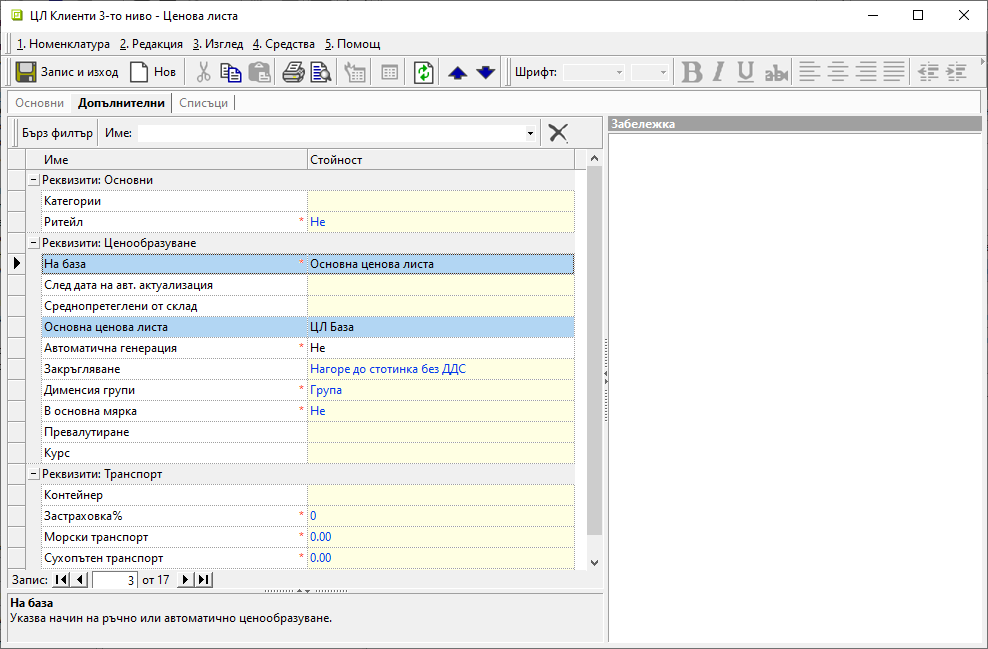
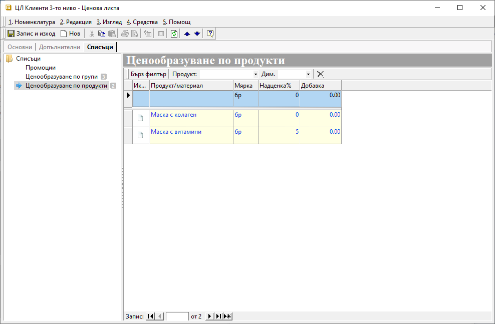
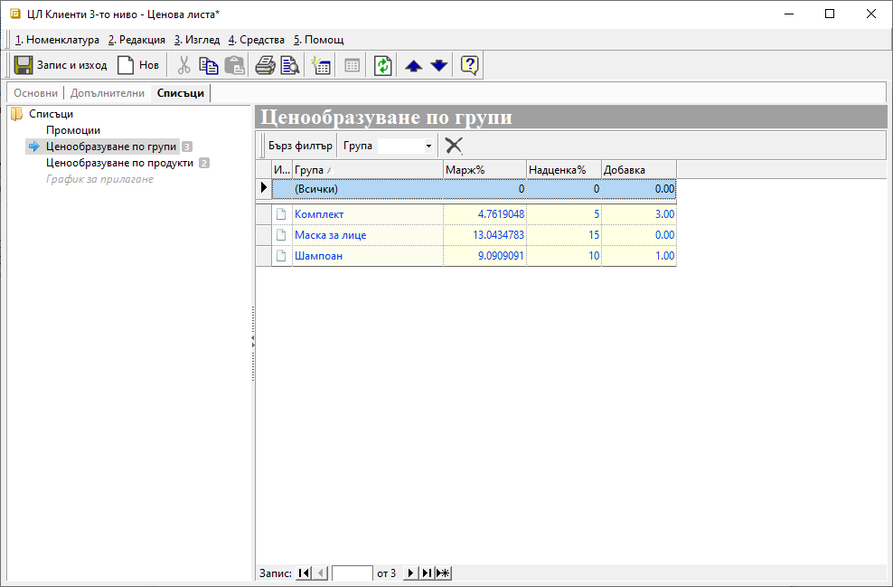
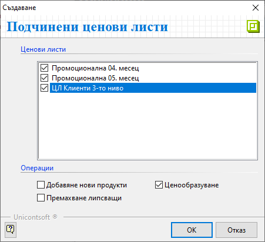
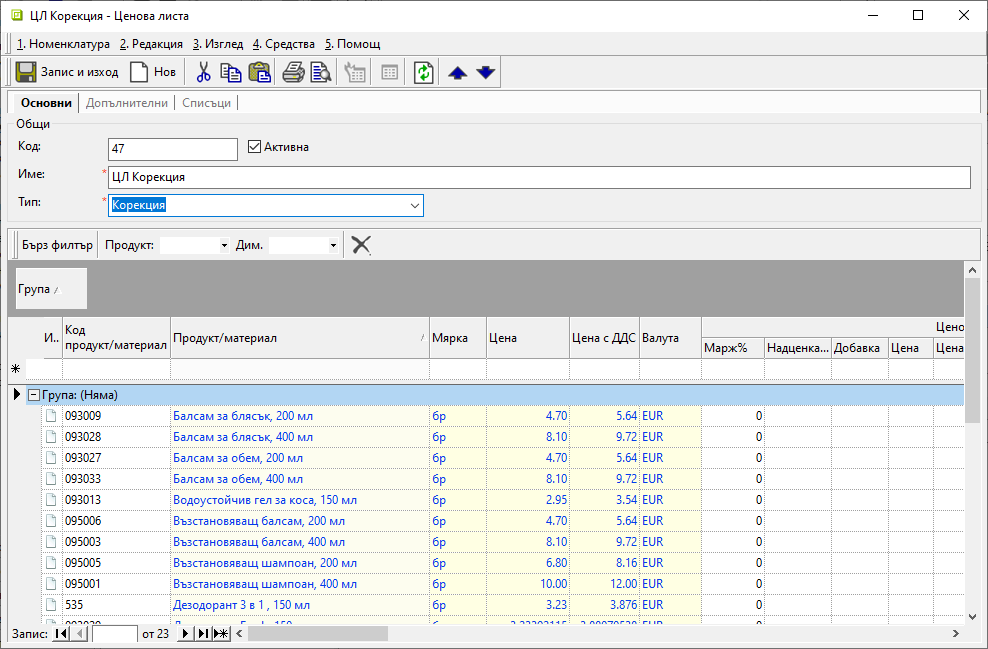
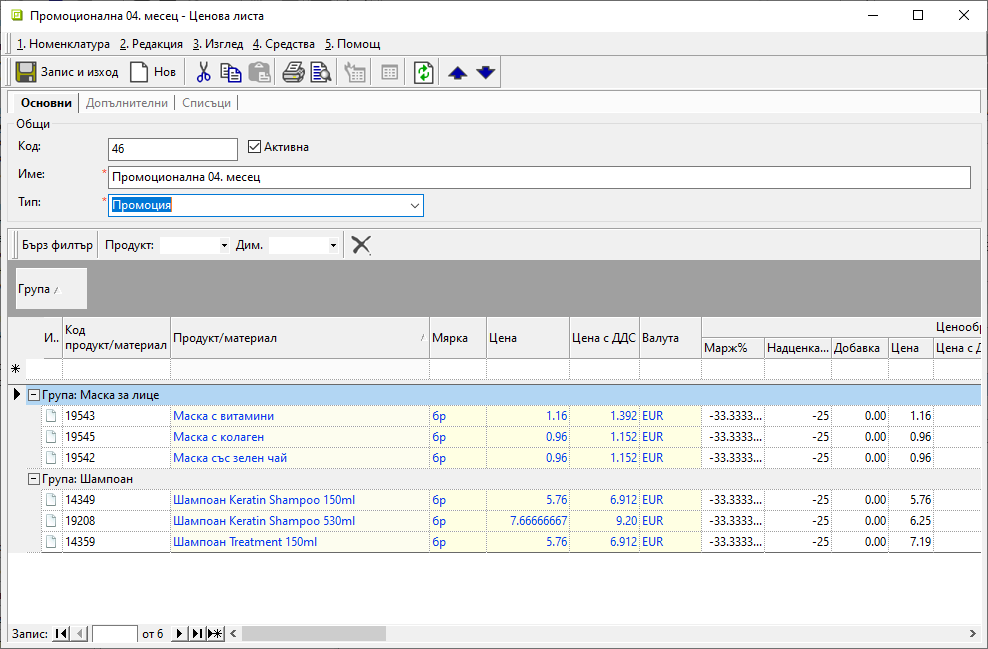
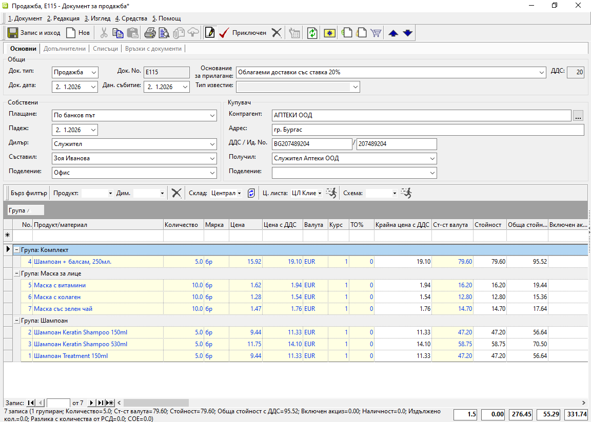

```{only} html
[Нагоре](000-index)
```

# **Ценови листи и схеми с ТО%**

- [Ценови листи](#ценови-листи)   
- [ЦЛ с изключения](#цл-с-изключения)
- [Промоции](#промоции)  
- [Търговски отстъпки](#търговски-отстъпки)  

## **Ценови листи**

Ценовите листи представляват списъци с продукти и цени, които се прилагат в документите за покупка и продажба. По този начин автоматично се обзавежда цената за всеки от настроените продукти. Системата позволява създаването и поддържането на множество такива списъци. Това дава възможност за настройка на общи ценови листи и на отделни персонализирани ценови листи по контрагенти.  

> **Ценови листи** е номенклатура, която може да бъде настроена ръчно или чрез автоматично ценообразуване.  

При първия вариант всяка една от цените по продукти се въвежда от потребителя ръчно. Обикновено се използва, когато няма ясно установена надценка или база, върху която да се ценообразува.  
В системата за такава база могат да се използват вече настроена друга основна ценова листа, последните доставни цени или среднопретеглените цени.  
Когато има избрана основа, т.е. има базова цена, системата ще може автоматично да обновява цените в списъка.  

Ръководство за поетапното създаване и ценообразуване в ЦЛ ще откриете в темата [**Ценови листи**](../guide/erp/001-ref/001-nomenclatures/005-price-lists.md).  

В тази тема се разглеждат конкретно подчинените ценови листи и възможностите за добавяне на промоции.  
Ще разберете как може да създадете примерна подчинена *ЦЛ Клиенти 3-то ниво* на вече съществуващата *ЦЛ База*, при което се използва ценообразуване на база *3-Основна ценова листа*. В последствие към подчинената ценова листа може да добавите и *Промоции*.  

В **Номенклатури » Ценови листи** създавате нова ценова листа, като в панел **Основни** се попълва единствено *Име: ЦЛ Клиенти 3-то ниво*.  
Същинските настройки за вида ценообразуване се правят в панел **Допълнителни**. Тук обзавеждате редовете *На база: 3-Основна ценова листа* и *Основна ценова листа: ЦЛ База*.  

Друга важна настройка, която не е желателно да пропускате, е *Ритейл*. При избор *Ритейл: Да* системата ще закръглява цените в текущата ЦЛ по *Цена с ДДС*. И обратното - при настройка *Ритейл: Не* закръгленията ще са по *Цена*.  

{ class=align-center w=15cm }

Следващата стъпка е да посочите на системата какъв процент надценка и/или добавка с точна сума ще прибавя към цените. Това може да направите от панел **Списъци**.  
Тук настройвате *Ценообразуване по групи* и *Ценообразуване по продукти*, като второто е с приоритет. Това ще рече, че <ins>системата взема предвид първо настройките за продукт. Ако липсват такива, прилага тези от *Ценообразуване по групи*</ins>.

```{tip}
Системата допуска *Надценка %* и *Добавка* да се настройват и с отрицателни числа, което на практика е отстъпка от цената. Затова има основание да се използва при ценообразуване на база *3-Основна ценова листа*.
```
Избираме да добавим нулева надценка и добавка за продукт *Маска с колаген*. Това на практика означава, че системата ще вземе цената от *ЦЛ База* без промяна. За продукт *Маска с витамини* системата ще приложи надценка 5%.

{ class=align-center w=15cm }

В *Ценообразуване по групи* ще настроим 15% надценка за групата *Маска за лице*. Тоест системата ще прилага този процент за всички продукти, участващи в групата, с изключение на двата с индивидуална настройка.  
Настройките за групите *Шампоан* и *Комплект* са аналогични. Нека при тях настроим и *Добавка* - точна сума, която ще се прибави към цената.

{ class=align-center w=15cm }

В тази ценова листа все още няма формиран списък с продукти и новите им цени. Такъв може да се обзаведе автоматично, след като направите *Ценообразуване на подчинени ценови листи* в основната ЦЛ.  
За целта записвате промените в новосъздадената *ЦЛ Клиенти 3-то ниво* и отваряне форма за редакция на *ЦЛ База*.  

{ class=align-center w=15cm }

От меню **Средства**, използвайки опция *Ценообразуване на подчинени ценови листи*, отворете форма за избор на ценови листи и операции.

{ class=align-center }

Предложеният от системата списък включва всички ценови листи, при които е използвана за ценообразуване *ЦЛ База*.  

Автоматичните операции, които може да изберете, са:  

- *Добавяне нови продукти* - Опция, с която от базовата ЦЛ могат автоматично да се добавят продукти в списъка на подчинената ЦЛ. Това включва единствено продукти, за които в подчинената листа има настройки в **Списъци** - *Ценообразуване по продукти* или *Ценообразуване по групи*.  
- *Премахване липсващи*    
- *Ценообразуване* - Чрез тази операция се извършва изчисляване на новите цени във всяка от маркираните подчинени ЦЛ. Ценообразуването се извършва въз основа индивидуалните настройки на всяка от ценовите листи.  

В нашия случай задължителни от наличните опции са *Добавяне нови продукти* и *Ценообразуване*.  

След като потвърдите избора си, затворете форма за редакция с *ЦЛ База*. С това автоматичното ценообразуване е завършено. Списъкът с продукти в *ЦЛ Клиенти 3-то ниво* е формиран.  

{ class=align-center w=15cm }

При прилагане на ценовата листа системата ще предлага цените от колони **Цена** и **Цена с ДДС**. В колоните **Надценка %** и **Надбавка** може да видите какви настройки е приложила системата при ценообразуването.  

## **ЦЛ с изключения**

Системата дава възможност избрани артикули да бъдат настроени като изключения с различни цени от основните по ЦЛ.  
В този случай се използват ценови листи **Корекция**.  

> Цените от тези ЦЛ се прилагат автоматично по предварително зададен график.  

За създаване на такава номенклатура е необходимо да добавите нова ценова листа. В раздел **Основни** избирате за неин тип **Корекция** и включвате единствено артикулите с разлика (корекция) в цената.  

{ class=align-center w=15cm }

**График за прилагане** се дефинира от раздел **Списъци**.  

От полето вдясно добавяте отделен ред с всяка ЦЛ, към която ще се прилагат изключителните цени. Системата позволява една корекция да бъде настроена едновременно за няколко основни ЦЛ.   

В поле **На дата** може да изберете датата за прилагане на изключенията. Тя може да бъде различна при всяка от ценовите листи.  

{ class=align-center w=15cm }

Всяка корекция може да бъде деактивирана и активирана повторно във всеки един момент чрез отметка в колона *Активен*.  

## **Промоции** 

Промоциите са отделни ценови листи с намалени цени, за които може да се дефинира срок на валидност. Системата следи валидността и прилага промоционалните цени единствено в документите, издавани през избрания период. Когато началната и крайната дата на валидност са настроени коректно, не е необходимо допълнително проследяване.  

На първо място при настройката на промоция е създаването на нова ценова листа от тип **Промоция**. Тя трябва да включва единствено артикулите с разлика в цената.  

{ class=align-center w=15cm } 

На следващ етап подготвените промоционални ЦЛ могат да бъдат настроени към всяка от останалите ценова листа. Въвеждането и активирането се извършват от раздел **Списъци » Промоции** във формата за редакция на избраната ЦЛ.  

> Системата позволява добавяне на множество промоции.  

От реда за нов запис вдясно добавяте отделен ред за всяка промоционална ЦЛ.  
В колона *Промоция* се отваря падащ списък с предварително въведените ценови листи.  
Начална и крайна дата се посочват в колони *От дата* и *До дата* за всеки ред. Именно така задавате от/до кога е в сила всяка от промоциите.  

> Системата позволява полетата с дати да останат празни. Тогава приема, че няма ограничение за начало или за край на валидността.  

Примерна настройка с две месечни промоции за *ЦЛ Клиенти 3-то ниво* би изглеждала по подобен начин:   

{ class=align-center w=15cm }

Всяка промоция може да бъде деактивирана и активирана повторно. Това е възможно във всеки един момент чрез отметка в колона *Активен*.  

> Промоционалните ЦЛ могат да се използват и самостоятелно, както всяка друга ЦЛ, като се прилагат ръчно в документ за продажба. При това положение настроените начална и крайна дата с валидност на промоцията не се вземат предвид.  

## **Търговски отстъпки**

В общия случай схемите с търговски отстъпки се използват в комбинация с настроените ценови листи. Те се прилагат върху основната цена в покупки и продажби, формирайки нова крайна цена в тези документи.  
За разлика от ценовите листи, при създаване на схема с ТО% не се оформя списък с продукти и новите им цени. Това е така, защото всяка схема с ТО% е еднакво приложима за всяка една ЦЛ. Разбира се, условието е да има съвпадение на продуктите, т.е. продуктите да участват и в двете настройки.  

> За да е в състояние системата да прилага автоматично ТО% в продажби, схемата трябва да е настроена по подразбиране в реквизитите на съответния контрагент.  

Единственото, което се изисква като настройка във всяка схема с ТО, е процент на отстъпката за продукти и/или категории. Може да се запознаете подробно с настройките при [създаването на схеми с ТО%](../guide/erp/001-ref/001-nomenclatures/006-discount-schemes.md).  

Да разгледаме пример с продажба на нов клиент, получаващ отстъпка за първата си поръчка - 15% на всички продукти, с изключение на две категории.  

За целта от **Номенклатури » Търговски отстъпки** създавате нова схема, която да приложите в продажбата. Във форма за редакция **Схема търговски отстъпки** се навигирате до панел **Списъци » Отстъпки по групи**. Вдясно добавяте нови записи в списъка, като обзавеждате колони *Група* и *Отстъпка%*.  

{ class=align-center w=15cm }

Трябва да настроите един ред с *Група: (Всички)* и *Отстъпка%: 15*. С това системата ще приложи -15% към цените в продажбата.   
Има две категории продукти, за които отстъпката не важи. Затова на отделен ред добавяте всяка от групите, настройвайки ги с 0%.  
Така в документ за продажба всички продукти, участващи в тези групи, ще бъдат без намаление. Прилагайки схемата с ТО, системата ще вземе с приоритет настройките за цитирани групи продукти. За всички останали групи ще приложи общата настройка -15%.  

{ class=align-center w=15cm }

> Схема с ТО% се настройва по подразбиране в **Контрагент**, когато отстъпката ще е постоянна за клиента.  
Ако отстъпката е еднократна, може да я прилагате избирателно в отделни документи за продажба.  

---  
- Ценовите листи могат да се обзаведат ръчно или да се използва метод за автоматично ценообразуване - на база друга ценова листа, последни доставни или среднопретеглени цени.  
- За всяка ценова листа се прави настройка на начин на закръгляване - по цена с или без ДДС.  
- Надценка в % или добавка с точна сума могат да се настройват по отделни продукти и за цели категории. Това е валидно за **Ценови листи** и за **Търговски отстъпки**.  
- С приоритет системата се съобразява с настройките по продукти. Ако няма настройки по продукти, системата прилага настройките по групи продукти. Това се отнася както за **Ценови листи**, така и за **Търговски отстъпки**.  
- Системата дава възможност всеки контрагент да има индивидуално настроени ценова листа и/или търговска отстъпка. Те ще се обзаведат автоматично в продажба, след като контрагентът бъде избран.  
