```{only} html
[Нагоре](000-index)
```

# **Ценови листи и схеми с ТО%**

- [Въведение в ценовите листи](#въведение-в-ценовите-листи)   
- [Подчинени ценови листи](#подчинени-цл)
- [Ценови листи с изключения](#цл-с-изключения)
- [Промоции](#промоции)  
- [Търговски отстъпки](#търговски-отстъпки)  

## **Въведение в ценовите листи**

Ценовите листи представляват списъци-шаблони с продукти и цени. Те се прилагат в документите за покупка и продажба. По този начин цената за всеки от настроените продукти се обзавежда автоматично.  
Ръководство за поетапното създаване и ценообразуване в ЦЛ ще откриете в темата [**Ценови листи**](../guide/erp/001-ref/001-nomenclatures/005-price-lists.md).  

Системата позволява създаването и поддържането на множество шаблони с ЦЛ. Това дава възможност за настройка на общи и на отделни персонализирани (по контрагенти) ценови листи.  

> В **Ценови листи** са предвидени възможности за ръчна настройка и за автоматично ценообразуване.  

При ръчното конфигуриране всяка една от цените по продукти се въвежда от потребителя. Обикновено се използва при множество изключения, при липса на ясно установена надценка или на база, върху която да се ценообразува.  

> В системата за база при ценообразуване могат да се използват друга съществуваща основна ценова листа, последни доставни цени или среднопретеглени цени.  

В тази тема се разглеждат конкретно подчинените ценови листи и възможностите за добавяне на промоции.   

## **Подчинени ЦЛ**

При подчинените ценови листи задължително има дефинирана база за ценообразуване.  
Когато има избрана основа (базова цена), системата ще може автоматично да обновява цените в списъка.  

В следващите редове разгледайте как се създава примерна подчинена *ЦЛ Клиенти 3-то ниво* на вече съществуващата *ЦЛ База*.  
Използва се ценообразуване на база *3-Основна ценова листа*.  
В последствие към подчинената ценова листа може да се добавят и *Промоции*.  

Нова ценова листа може да създадете от **Номенклатури » Ценови листи**.  
В панел **Основни** се попълва единствено *Име: ЦЛ Клиенти 3-то ниво*.  
Същинските настройки за вида ценообразуване се правят в панел **Допълнителни**. Тук обзавеждате редовете *На база: 3-Основна ценова листа* и *Основна ценова листа: ЦЛ База*.  

> Друга важна настройка, която не е желателно да пропускате, е *Ритейл*.  

При избор *Ритейл: Да* системата ще закръглява цените в текущата ЦЛ по *Цена с ДДС*. И обратното - при настройка *Ритейл: Не* закръгленията ще са по *Цена*.  

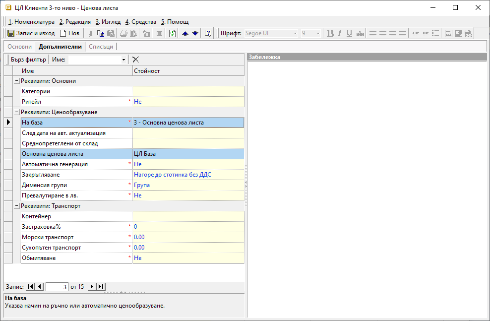{ class=align-center w=15cm }

Следващата стъпка е да укажете какъв процент надценка и/или добавка (точна сума) системата ще добавя към цените.  

Това може да направите от раздел **Списъци**.  
Тук настройвате *Ценообразуване по групи* и *Ценообразуване по продукти*, като второто е с приоритет.  

> Системата взема с предимство настройките за ценообразуване по продукт.  
Ако за продукта липсват такива, прилага ценообразуване за групи.  

```{tip}
Системата допуска надценка и добавка да се настройват и с отрицателни числа, което на практика е отстъпка от цената.  
```

Пример:  
Настройваме нулеви надценка и добавка за продукт *Маска с колаген*. Това означава, че системата ще вземе и приложи без промяна базовата цена от *ЦЛ База*.  
За продукт *Маска с витамини* системата ще приложи надценка 5%.

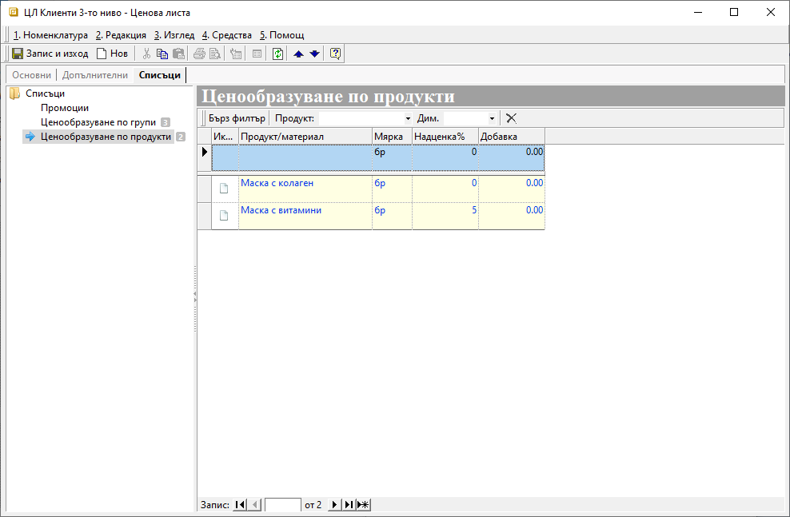{ class=align-center w=15cm }

В *Ценообразуване по групи* ще настроим 15% надценка за цялата група *Маска за лице*. Така системата ще прилага този процент за всички продукти, от групата, с изключение на двата с индивидуална настройка.  

Настройките за групите *Шампоан* и *Комплект* са аналогични.  
За тях ще настроим и *Добавка* - точна сума, която ще се прибави към цената.  

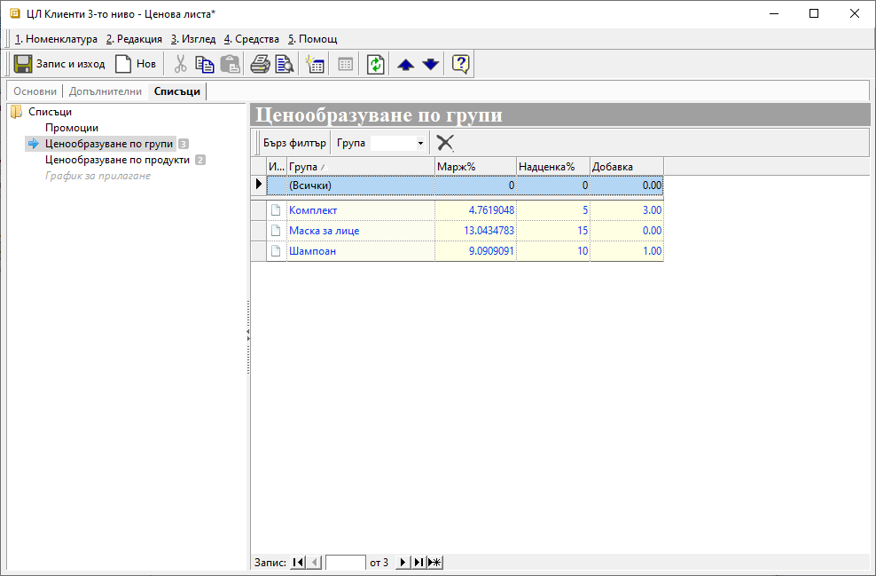{ class=align-center w=15cm }

В тази ценова листа все още няма формиран списък с продукти и новите им цени. Такъв може да се обзаведе автоматично, след като направите *Ценообразуване на подчинени ценови листи* в основната ЦЛ.  
За целта записвате промените в новосъздадената *ЦЛ Клиенти 3-то ниво* и отваряне форма за редакция на *ЦЛ База*.  

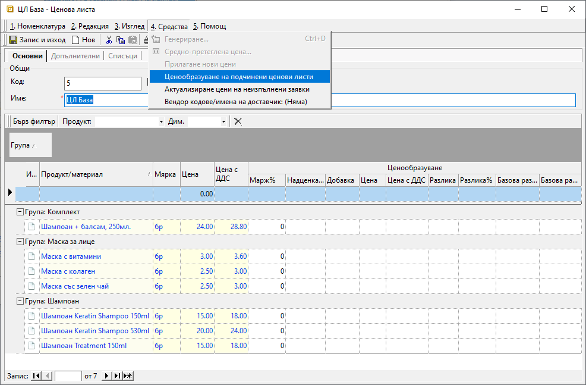{ class=align-center w=15cm }

От меню **Средства » Ценообразуване на подчинени ценови листи** отваряте формата за избор на ЦЛ и операции.  

Системата показва списък за избор на една или няколко ЦЛ.  
Той включва всички ЦЛ, при които за ценообразуване е използвана *ЦЛ База*.  

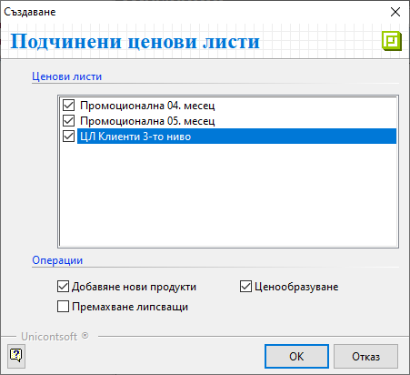{ class=align-center }

Автоматичните операции, които може да изберете, са:  

- *Добавяне нови продукти* - Автоматично добавя продукти от базовата ЦЛ в списъка на подчинената.  
Това включва единствено продуктите, за които в подчинената ЦЛ има настройки в **Списъци** (*Ценообразуване по продукти* или *Ценообразуване по групи*).  
- *Премахване липсващи*    
- *Ценообразуване* - Преизчислява новите цени във всяка от маркираните подчинени ЦЛ.  
Ценообразуването се извършва въз основа индивидуалните настройки на всяка от ценовите листи.  

За текущия пример задължителни от наличните опции са *Добавяне нови продукти* и *Ценообразуване*. Потвърдете избора С това системата затваря формата и връща в *ЦЛ База*.  
Може да излезете от нея с бутон [**Запис и изход**].  

С това автоматичното ценообразуване е завършено. Списъкът с продукти в *ЦЛ Клиенти 3-то ниво* е формиран.  

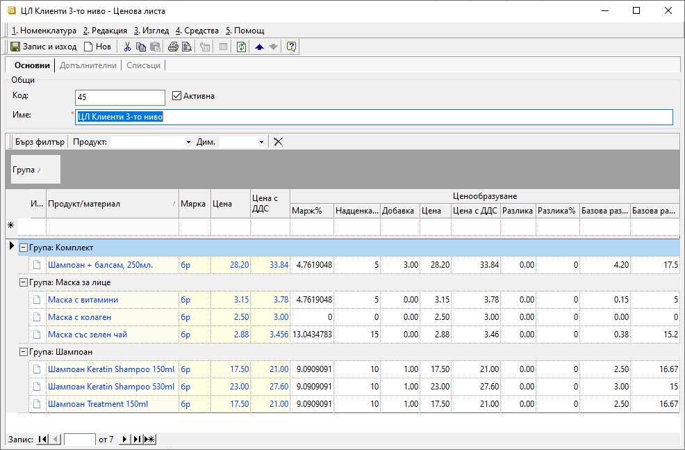{ class=align-center w=15cm }

При прилагане на ценовата листа системата ще предлага цените от колони **Цена** и **Цена с ДДС**. В колоните **Надценка %** и **Надбавка** са показани приложените настройки при ценообразуването.  

## **ЦЛ с изключения**

Системата дава възможност избрани артикули да бъдат настроени като изключения с различни цени от основните по ЦЛ.  
В този случай се използват ценови листи **Корекция**.  

> Цените от ЦЛ тип **Корекция** се прилагат автоматично по предварително зададен график.  

За създаване на такава номенклатура е необходимо да добавите нова ценова листа. В раздел **Основни** избирате за неин тип **Корекция** и включвате единствено артикулите с разлика (корекция) в цената.  

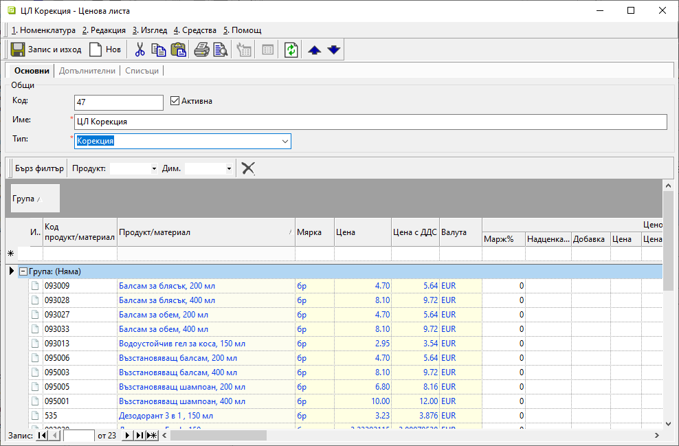{ class=align-center w=15cm }

**График за прилагане** се дефинира от раздел **Списъци**.  

От полето вдясно добавяте отделен ред с всяка ЦЛ, към която ще се прилагат изключителните цени.  

> Системата позволява една корекция да бъде настроена едновременно за няколко основни ЦЛ.   

В поле **На дата** може да изберете датата за прилагане на изключенията. Тя може да бъде различна при всяка от ценовите листи.  

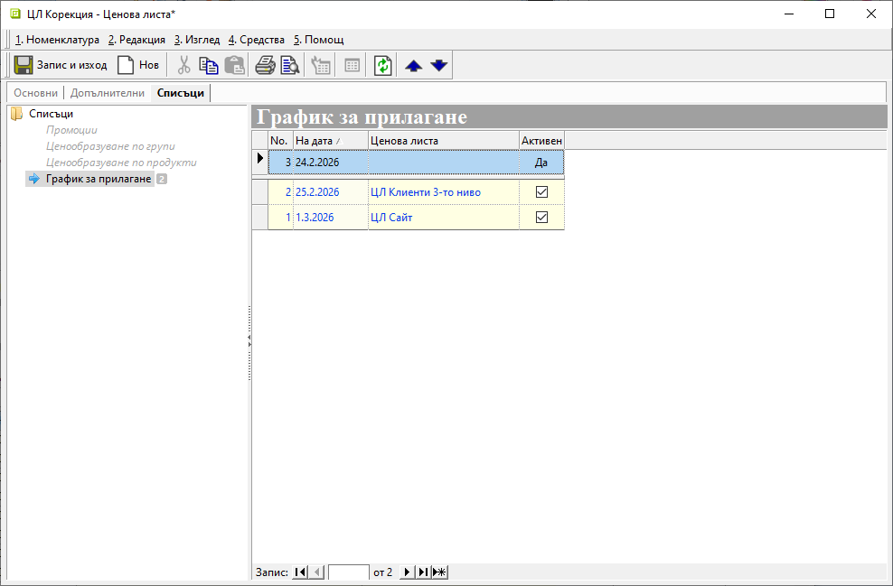{ class=align-center w=15cm }

Всяка корекция може да бъде деактивирана и активирана повторно във всеки един момент. За целта се използва полето за отметка в колона *Активен*.  

## **Промоции** 

Промоциите са отделни ценови листи с намалени цени, за които може да се дефинира срок на валидност. Системата следи валидността и прилага цените единствено в документи, издавани през указания период.  
Когато началната и крайната дата на валидност са настроени коректно, не е необходимо допълнително проследяване.  

На първо място при настройката на промоция е създаването на нова ценова листа от тип **Промоция**. Тя трябва да включва единствено артикулите с разлика в цената.  

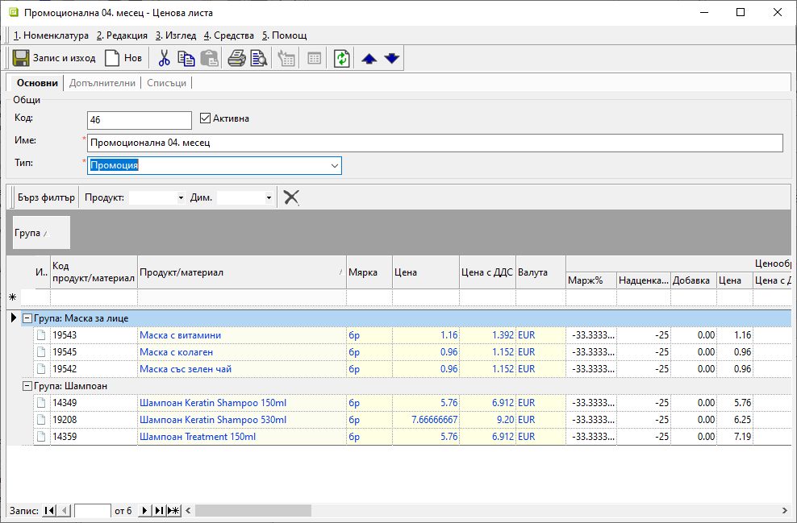{ class=align-center w=15cm } 


> Системата позволява добавяне на множество промоции.  
В последствие готовите промоционални ЦЛ могат да бъдат прикачени към всяка от останалите ЦЛ.  

Въвеждането и активирането им се извършват от раздел **Списъци » Промоции** във формата за редакция на избраната ЦЛ.  

От реда за нов запис вдясно добавяте всяка промоция на отделен ред.  
В колона *Промоция* се отваря падащ списък за избор от предварително въведените ЦЛ.  
Начална и крайна дата се посочват в колони *От дата* и *До дата* за всеки ред. Именно така задавате от/до кога е в сила всяка от промоциите.  

> Системата позволява полетата с дати да останат празни.  
Тогава приема, че няма ограничение за начало или за край на валидността.  

Примерна настройка с две месечни промоции за *ЦЛ Клиенти 3-то ниво* би изглеждала по подобен начин:   

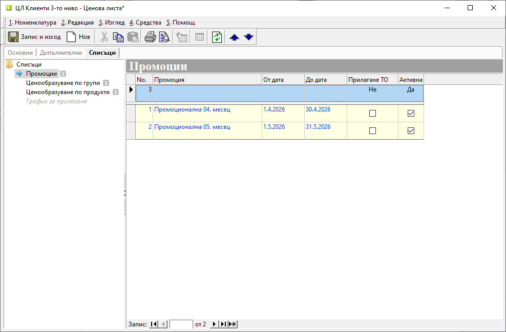{ class=align-center w=15cm }

Всяка промоция може да бъде деактивирана и активирана повторно. Това е възможно във всеки един момент чрез отметка в колона *Активен*.  

> Промоционалните ЦЛ могат да се използват и самостоятелно, както всяка друга ЦЛ, като се прилагат ръчно в документ за продажба. При това положение настроените начална и крайна дата с валидност на промоцията не се вземат предвид.  

## **Търговски отстъпки**

В общия случай схемите с търговски отстъпки се използват в комбинация с настроените ценови листи. Те се прилагат върху основната цена в покупки и продажби, формирайки нова крайна цена. Условието е да има съвпадение, т.е. продуктите да участват и в двете настройки.    

> Всяка схема с ТО% е еднакво приложима към всяка от ценовите листи.  

За разлика от ЦЛ, при създаването на схема с ТО% не се оформя списък с продукти и нови цени. Единствено се въвеждат проценти за отстъпка на продукти и/или на категории.   

> Системата прилага автоматично отстъпка при продажба, когато за контрагента има настроена схема по подразбиране.   

Пример:  
Продажба на нов клиент, получаващ отстъпка за първата си поръчка от 15% на всички продукти, с изключение на две категории.  

[Нова схема](../guide/erp/001-ref/001-nomenclatures/006-discount-schemes.md), която да приложите в продажбата, създавате от **Номенклатури » Търговски отстъпки**.  
Във формата за редакция отваряте раздел **Списъци » Отстъпки по групи**. Настройките добавяте от списъка вдясно в колони *Група* и *Отстъпка %*.  

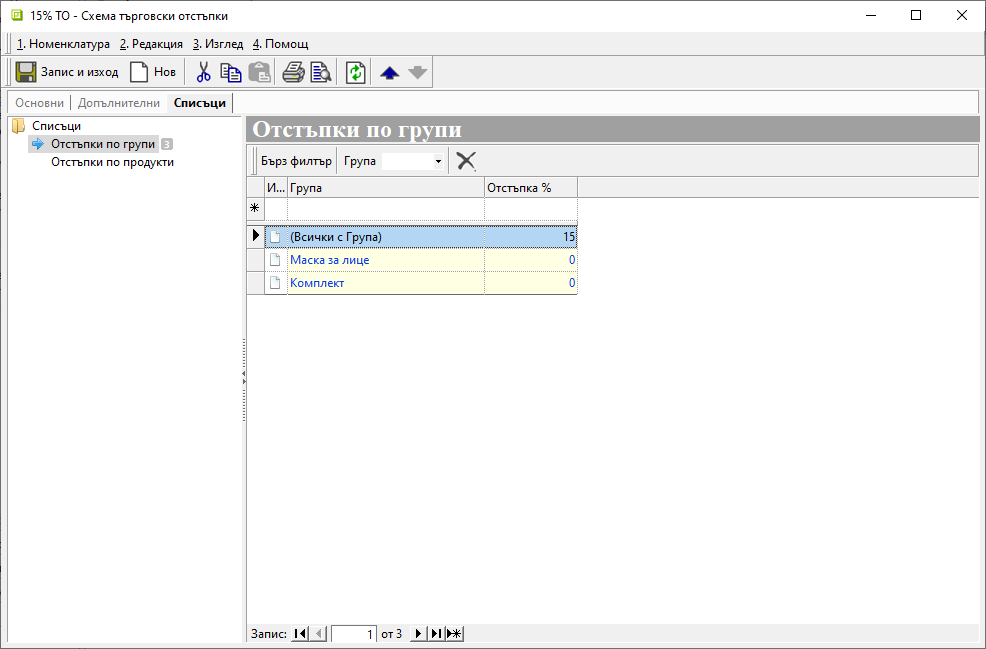{ class=align-center w=15cm }

За целите на примера се добавя ред с реквизити *Група: (Всички с Група)* и *Отстъпка %: 15*. Двете категории, за които отстъпката не важи, се добавят на отделни редове с *Отстъпка %: 0*.  
При така настроена схема системата ще вземе с приоритет процентите за групите, които са изрично цитирани. За всички останали се прилага общата настройка.  

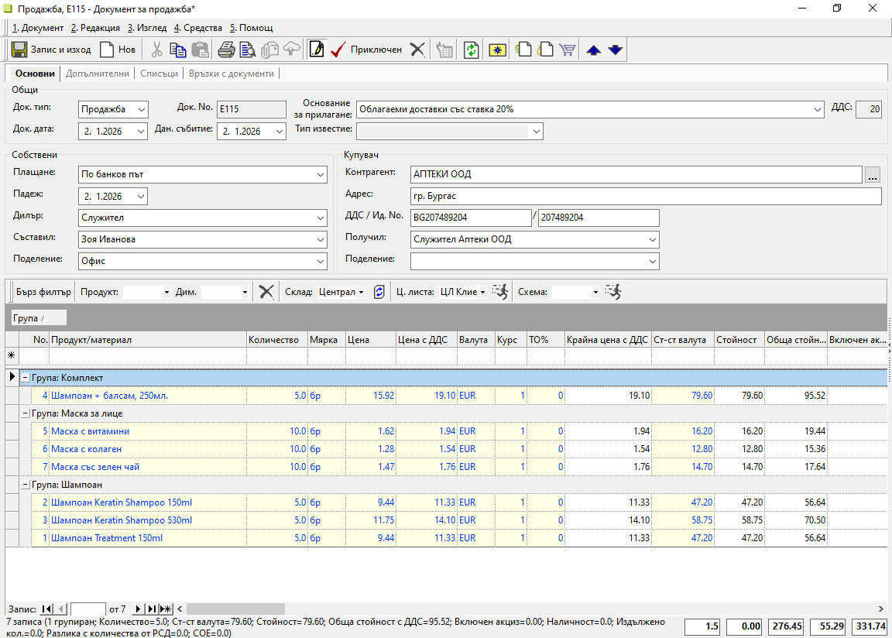{ class=align-center w=15cm }

> Схема с ТО% се настройва по подразбиране в **Контрагент**, когато отстъпката ще е постоянна за клиента.  
Ако отстъпката е еднократна, може да я прилагате избирателно в отделни документи за продажба.  

---  
- Ценовите листи могат да се обзаведат ръчно или да се използва метод за автоматично ценообразуване - на база друга ценова листа, последни доставни или среднопретеглени цени.  
- За всяка ценова листа се прави настройка на начин на закръгляване - по цена с или без ДДС.  
- Надценка в % или добавка с точна сума могат да се настройват по отделни продукти и за цели категории. Това е валидно за **Ценови листи** и за **Търговски отстъпки**.  
- С приоритет системата се съобразява с настройките по продукти. Ако няма настройки по продукти, системата прилага настройките по групи продукти. Това се отнася както за **Ценови листи**, така и за **Търговски отстъпки**.  
- Системата дава възможност всеки контрагент да има индивидуално настроени ценова листа и/или търговска отстъпка. Те ще се обзаведат автоматично в продажба, след като контрагентът бъде избран.  
