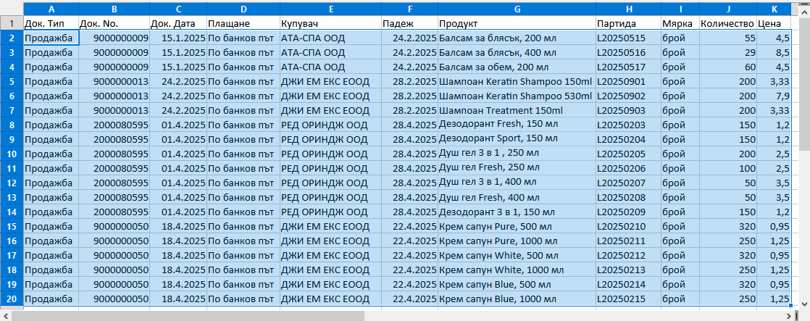

```{only} html
[Нагоре](000-index)
```

# **Импорт на продажби**

Системата разполага с инструмент за прехвърляне на вземанията от клиенти от друга система. Чрез **Импорт** става възможно добавянето на пълната информация от множество продажби наведнъж. Обикновено това се случва при стартиране на работа с **Dreem ERP** и първоначалното захранване с данни от старата система.   

За да използвате предимството на импорта, предварително трябва да форматирате данните в Excel файл. Колоните във файла трябва да следват същата подредба, както колоните от формата на импорта.   

Средството за импорт ще откриете в **Търговска система || Документи за продажба**. То е достъпно от меню **4.Средства || Импорт**.  

Използвайки помощника за импортиране, ще преминете през следните стъпки:  

- Копиране от Excel файл и поставяне на данните за импорта  
- Контрол на входните данни  
- Импорт на редовете на продажбите  

{ class=align-center }

С преминаване напред отваряте формата за въвеждане на съдържание. Именно тук ще трябва да поставите списъка от файла, който сте подготвили.  

{ class=align-center w=15cm }

> Подредбата на колоните във файла-източник на данни трябва да съвпада с тази на списъка от формата за импорт.  

{ class=align-center w=15cm }

След като сте оформили файла, копирате списъка и го поставяте в поле **Док. тип**. Системата отваря форма за преглед **Поставяне в списък**. В нея може да проверите дали сте разпределили вярно данните по колони.   

{ class=align-center w=15cm }

Ако сте съгласни с вида на предложения списък, продължете нататък с [**Ok**]. С това текущата форма се затваря автоматично.  
 
Подобен вид би имал един готов за импорт списък с данни.  

{ class=align-center w=15cm }

За преминаване на следваща стъпка се използва бутон [**Напред**]. С това системата прави нужните проверки. Ако изведе съобщение за грешка, трябва да отстраните нередностите и да направите повторен опит за импорт.  

При успешно преминаване системата извежда опис на записите, които е в готовност да създаде.   

{ class=align-center w=15cm }    

Ако сте съгласни, поставете отметка при *Запис на импортирани данни* и потвърдете с бутон [**Импорт**].  

> Веднъж потвърдени и записани, новите настройки не могат да бъдат върнати стъпка назад или изцяло отменени. 

С приключване на процеса по импортиране системата извежда информация за брой добавени продажби и други детайли.  

{ class=align-center w=15cm }

Помощникът се затвяра от бутон [**Изход**].  
Новодобавените записи са видими в списъка с **Документи за продажба**.  

|Пълен списък с реквизити на продажби, достъпни за импорт:|
|---|
|* Маркираните със звезда [*] реквизити са задължителни.|
    Док. тип
    *Док. No.
    Док. дата
    Плащане
    Място на сделката
    Доставчик
    Поделение доставчик
    Банкова сметка
    Съставил
    Дилър
    МОЛ доставчик
    Код купувач
    *Купувач
    Тип купувач
    Адрес купувач
    ДДС номер купувач
    Булстат купувач
    Получил
    МОЛ купувач
    ЛООСО купувач
    Поделение купувач
    Адрес поделение купувач
    Транспортна фирма
    Шофьор
    Втори шофьор
    Място на доставката
    Състояние на документа
    Поверителност
    Основание за известие
    Падеж
    Дата на експедиция
    Основание за прилагане
    ДДС ставка
    Дата на дан. събитие
    Сума на уговорено остатъчно плащане по продажбата
    Входящ стоков номер
    Поръчка номер
    Поръчка дата
    Тип известие
    Номер на фискална касова бележка
    Каса на POS терминала, от който е направена продажбата
    Допълнителен ДДС
    Код на транзакция
    Валута код
    Валутен курс
    Забележка при печат
    Забележка
    Приемателен протокол номер
    Приемателен протокол дата
    Вид транспорт
    Цени с ДДС
    Транспортно средство
    Дата на събиране
    Дата на доставка
    Място на товарене
    Данъчен документ, с коейто е желателно да се отчете продажбата
    Контрагент, който ще е титуляр на фактурата
    Адрес на контрагент, както ще се отпечатва на фактурата
    ДДС номер, както ще се отпечатва на фактурата
    Идентификационен номер (ИН, Булстат), както ще се отпечатва на фактурата
    Поделение на контрагент, на което ще се издаде фактурата
    Персона на контрагент, която ще е получател на фактурата
    Клиентски код на титуляра на документа за външни системи
    Товарителница
    No.
    *Продукт
    Партида
    Осн. мярка код
    *Количество
    Мярка
    *Цена
    Отношение на мерки
    Валута за реда
    Валутен курс за реда
    ДДС вкл. в цената
    ТО%
    Крайна цена в основна мярка с ТО%
    Количество в осн. мярка
    Ст-ст ДДС в нац. валута
    Стойност без ДДС в нац. валута
    Стойност с ДДС в нац. валута
    Допълнителен текст
    Забележка на реда
    Поверителност
    ДДС ставка на реда
    Продукт за трансформация
    Група за трансформация
    Бруто тегло в основна мярка
    Бруто обем в основна мярка
    Производител
    Заключване на реда
    Доставено количество
    Заявено количество
    Грешки при импорт
 