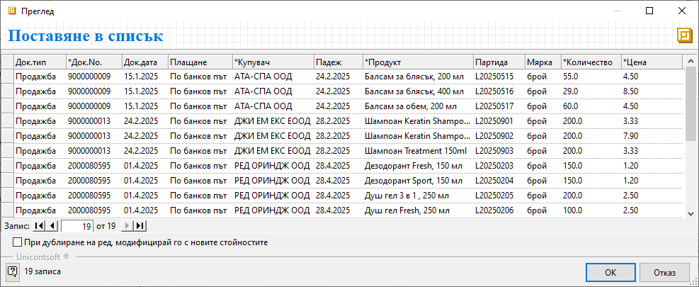
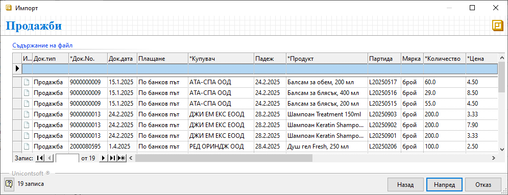
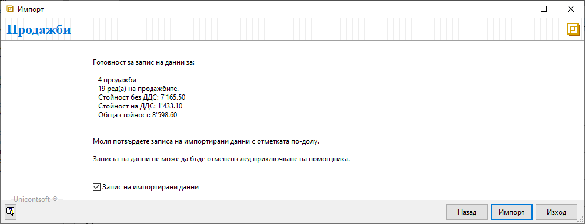
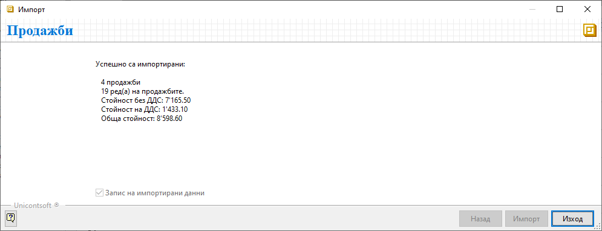

```{only} html
[Нагоре](000-index)
```

# **Импорт на продажби**

Системата разполага с инструмент за прехвърляне на вземанията от клиенти от друга система. Чрез **Импорт** става възможно добавянето на пълната информация от множество продажби наведнъж. Обикновено това се случва при стартиране на работа с **Dreem ERP** и първоначалното захранване с данни от старата система.  

За да използвате предимството на импорта, предварително трябва да форматирате данните в Excel файл. Колоните във файла трябва да следват същата подредба, както колоните от формата на импорта.   

Средството за импорт ще откриете в **Търговска система || Документи за продажба**. То е достъпно от меню **4.Средства || Импорт**.  

Използвайки помощника за импортиране, ще преминете през следните стъпки:  

- Копиране от Excel файл и поставяне на данните за импорта  
- Контрол на входните данни  
- Импорт на редовете на продажбите  

{ class=align-center }

С преминаване напред отваряте формата за въвеждане на съдържание. Именно тук ще трябва да поставите списъка от файла, който сте подготвили.  

{ class=align-center w=15 }

> Подредбата на колоните във файла-източник на данни трябва да съвпада с тази на списъка от формата за импорт.  

{ class=align-center w=15 }

След като сте оформили файла, копирате списъка и го поставяте в поле **Док. тип**. Системата отваря форма за преглед **Поставяне в списък**. В нея може да проверите дали сте разпределили вярно данните по колони.   

{ class=align-center w=15 }

Ако сте съгласни с вида на предложения списък, продължете нататък с [**Ok**]. С това текущата форма се затваря автоматично.  
 
Подобен вид би имал един готов за импорт списък след поставяне на копираните данни.  

{ class=align-center w=15 }

За преминаване на следваща стъпка се използва бутон [**Напред**]. С това системата прави нужните проверки. Ако изведе съобщение за грешка, трябва да отстраните нередностите и да направите повторен опит за импорт.  

При успешно преминаване, системата извежда опис на записите, които е в готовност да създаде. Ако сте съгласни, потвърдете с [**Ok**]. С това форма **Поставяне в списък** се затваря автоматично.   

{ class=align-center w=15 }

Към последен етап на импортиране се преминава с бутон [**Напред**]. Системата показва съобщение за готовност за запис на данни.    

Ако сте съгласни, поставете отметка при *Запис на импортирани данни* и потвърдете с бутон [**Импорт**].  

> Веднъж потвърдени и записани, новите настройки не могат да бъдат върнати стъпка назад или изцяло отменени. 

{ class=align-center w=15 }

С приключване на процеса по импортиране системата извежда информация за брой добавени покупки и други детайли 

Помощникът се затвяра от бутон [**Изход**].  
Новодобавените записи са видими в списъка с **Документи за покупка** след неговото опресняване.  

|Пълен списък с реквизити на покупки, достъпни за импорт:|
|---|
|* Маркираните със звезда [*] реквизити са задължителни.|
    Док. тип
    *Док. No.
    Док. дата
    Плащане
    Купувач
    Поделение купувач
    Съставил
    ЛООСО купувач
    МОЛ купувач
    Получил купувач/Подотчетно лице
    Код продавач
    *Продавач
    Адрес продавач
    ДДС номер продавач
    Булстат продавач
    МОЛ продавач
    ЛООСО продавач
    Поделение продавач
    Транспортна фирма
    Шофьор
    Място на доставката
    
    Състояние на документа
    Поверителност
    Падеж
    Дата на доставка
    Основание за прилагане
    ДДС ставка
    Отчетна дата
    Тип известие
    Допълнителен ДДС
    Валута код
    Валутен курс
    Забележка
    Авансов отчет No.
    No.
    *Продукт
    Партида
    Количество в осн. мярка
    Осн. мярка код
    Мярка
    *Количество
    *Цена
    Отношение на мерки
    Валута за реда
    Валутен курс за реда
    ДДС вкл. в цената
    ТО%
    Крайна цена в основна мярка с ТО%
    Ст-ст ДДС в нац. валута
    Ст-ст без ДДС в нац. валута
    Ст-ст с ДДС в нац. валута
    Поверителност
    Допълнителен текст
    Забележка на реда
    ДДС ставка на реда
    Заключване на реда
    Дата на годност на партида
    Страна произход на партида
    Доставна партида
    Грешки при импорт
 