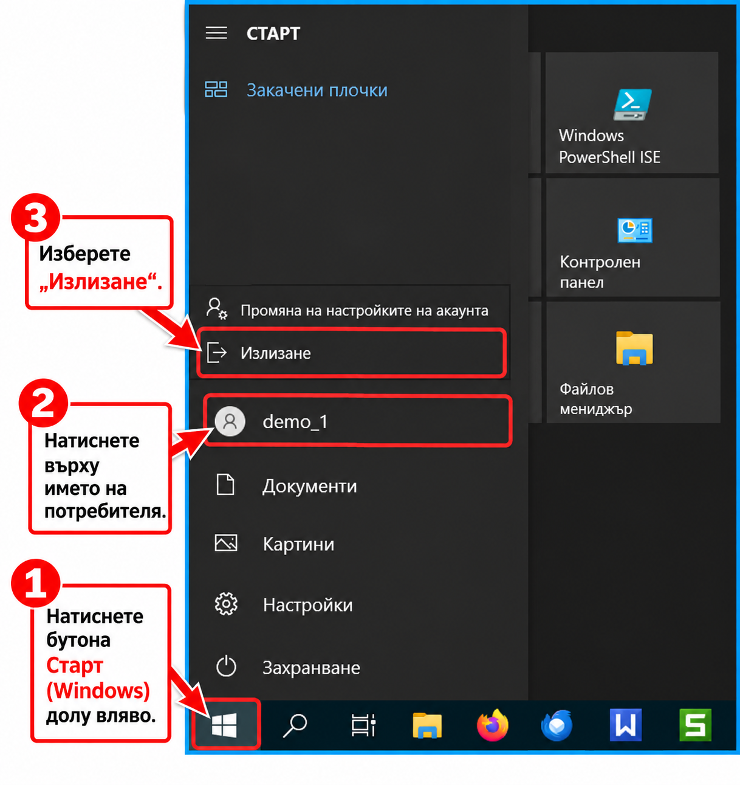

```{only} html
[Нагоре](../000-index)
```

# **Какво да направя, ако...**

## Не мога да вляза в **Dreem ERP**

Следвайте стъпките и проверете:  

- Имате ли интернет/мрежова връзка.  
- Правилно ли въвеждате потребителското име и паролата.  
- Включен ли е [*Caps Lock*] и правилен ли е езикът на клавиатурата.  
- Затворете програмата и я стартирайте отново.  
- Ако проблемът остава – запишете/снимайте съобщението за грешка и се обърнете към техническата поддръжка на *Unicontsoft*.  

## Не мога да печатам в терминалната сесия

Изпълнете последователно:  

- Проверете включен ли е принтерът и показва ли грешка.  
- Можете ли да отпечатате документ извън терминалната сесия.  
- Вижда ли се необходимият принтер в списъка с принтери в терминалната сесия.  
- Ако принтерът липсва, излезте от терминалната сесия (**Log off**) и влезте отново (**Log in**).  
> Не използвайте само затваряне на прозореца с [**X**] (**Disconnect**).  
По този начин сесията остава активна и принтерите отново може да не се заредят.  

- След повторното влизане проверете дали принтерът се е появил и опитайте да печатате.  
- Ако проблемът остава – обърнете се към техническата поддръжка на *Unicontsoft*.  

## Не знам как да затворя терминалната сесия

За излизане от сесията (**Log off**) изпълнете стъпките:  

- Натиснете бутона *Windows* (*Старт*) долу вляво.  
- Натиснете върху името/иконата на потребителя.  
- Изберете **Излизане**.  
> Не затваряйте прозореца с [**X**]. Това само прекъсва връзката (**Disconnect**), но не прекратява терминалната сесия.  

{ class=align-center w=15cm }