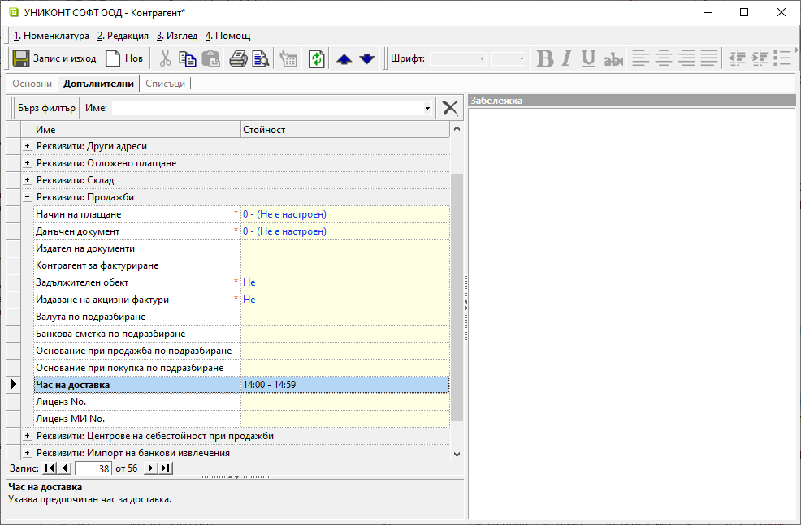
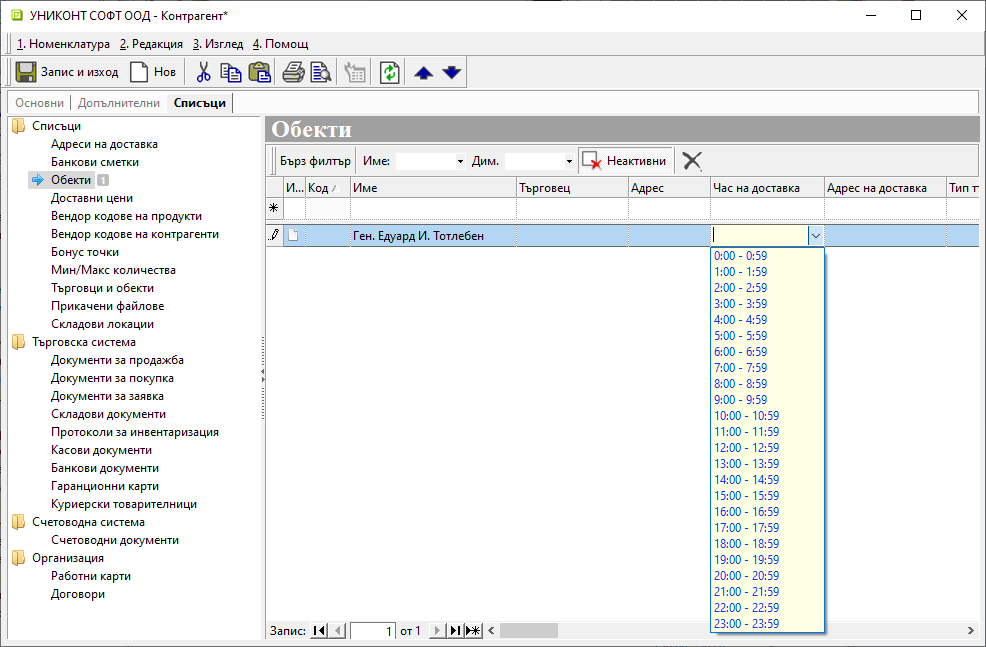

# Час на доставка

Добавена е нова настройка за желан час на доставка. Може да бъде дефинирана общо за контрагента, по обекти или комбинация от двете. С по-голяма тежест е индивидуалната настройка за обект.   

Системата попълва час за доставка автоматично в документи за заявка и продажба при избор на контрагент/обект.  
Когато документ за продажба се генерира от заявка, час на доставка се унаследява от нея.  

Реквизит **Час на доставка** е достъпен за настройка от формата за редакция на контрагент/обект в раздел **Допълнителни**. 

{ class=align-center w=15cm }

**Час на доставка** по обекти може да бъде настроен също от форма за редакция на контрагент в раздел **Списъци » Обекти**.  

{ class=align-center w=15cm }