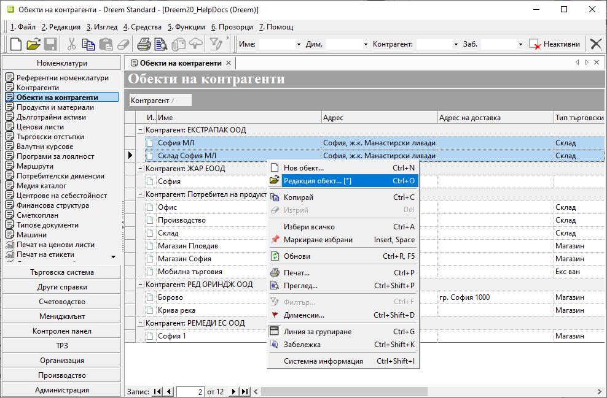
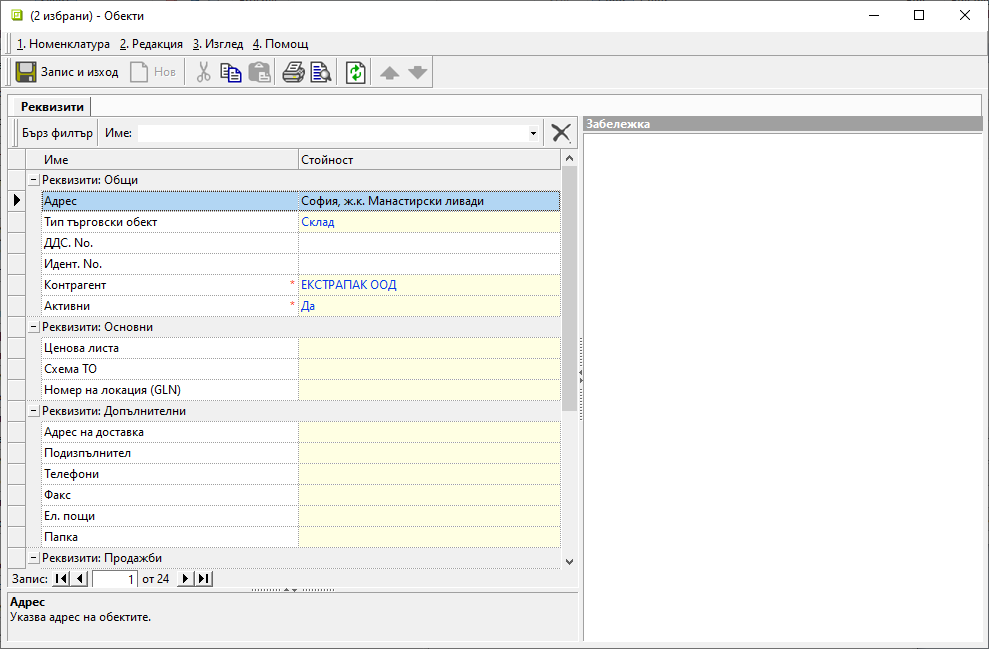
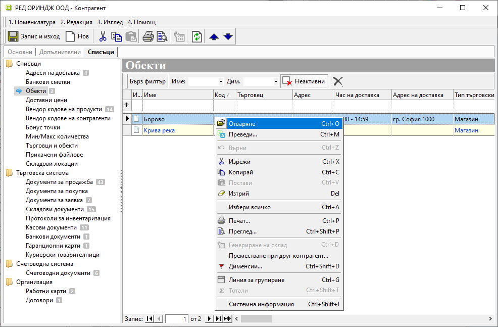

# Обекти на контрагенти

В модул **Номенклатури** е добавен нов списък с настройки - [**Обекти на контрагенти**](../guide/erp/001-ref/001-nomenclatures/003-sites-of-contragents.md).  
От списъка е достъпна индивидуална настройка за един обект или общо за няколко. За обща настройка избраните обекти трябва да се маркират. Чрез десен клик върху се избира **Редакция на обект**:     

{ class=align-center w=15cm }

Отваря се форма с избрани реквизити, достъпни настройка:  

{ class=align-center w=15cm }

Формата за редакция на обект може да бъде отворена и от раздел **Списъци » Обекти** във форма за редакция на контрагент.  
С десен клик върху реда с обекта се избира *Отваряне*:  

{ class=align-center w=15cm }