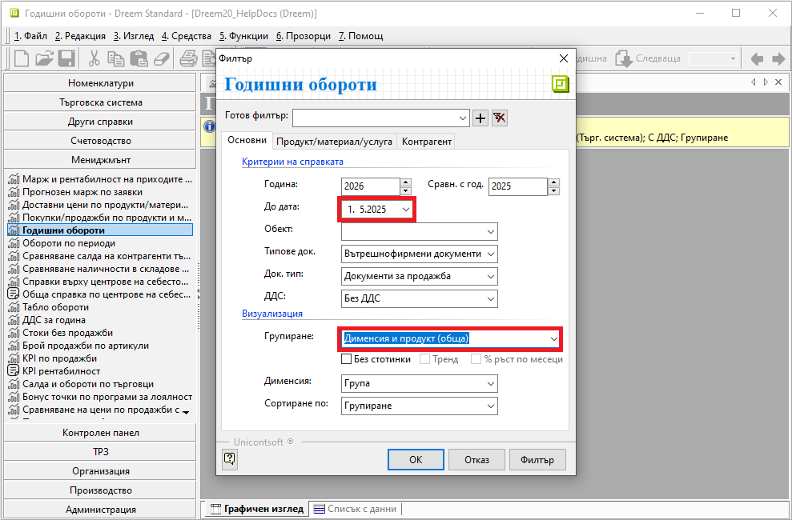
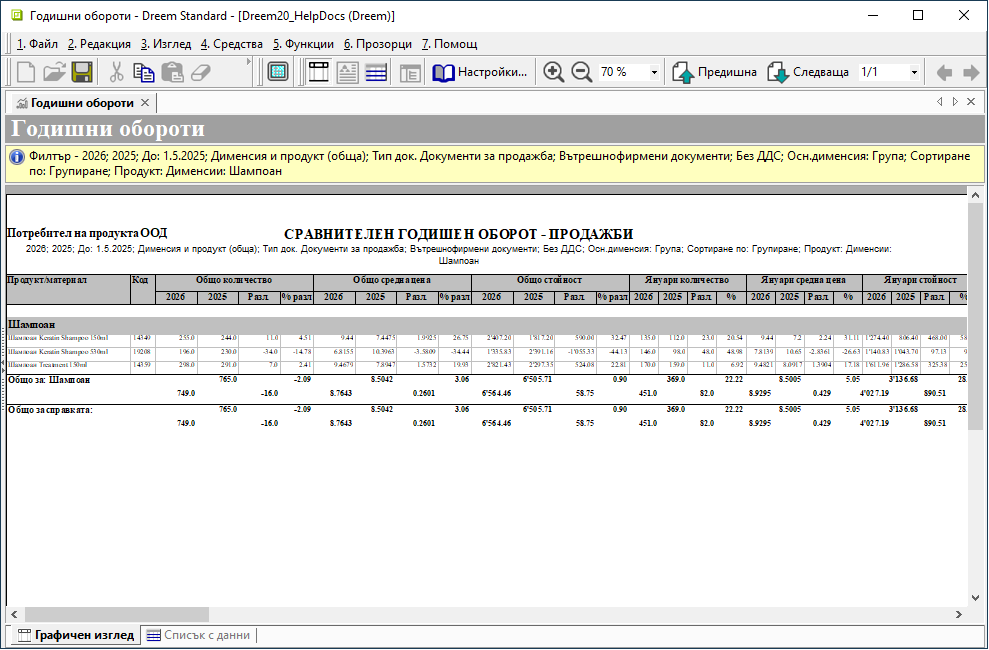

# Справка Годишни оороти

В справка **Годишни обороти** е добавен шаблон за визуализация **Дименсия и продукт (обща)**. Той е достъпен от филтъра на справката в реквизит **Групиране**.  

Във филтър формата е добавен също реквизит **До дата**. Използва се за указване на крайна дата при сравняване на данни между години.  

{ class=align-center w=15cm }

Този шаблон показва сравнение на данни и разлики за **Количество**, **Средна цена** и **Стойност**  общо за периода и отделно по месеци.  

{ class=align-center w=15cm }
