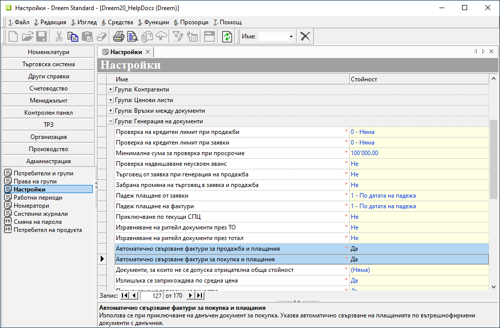
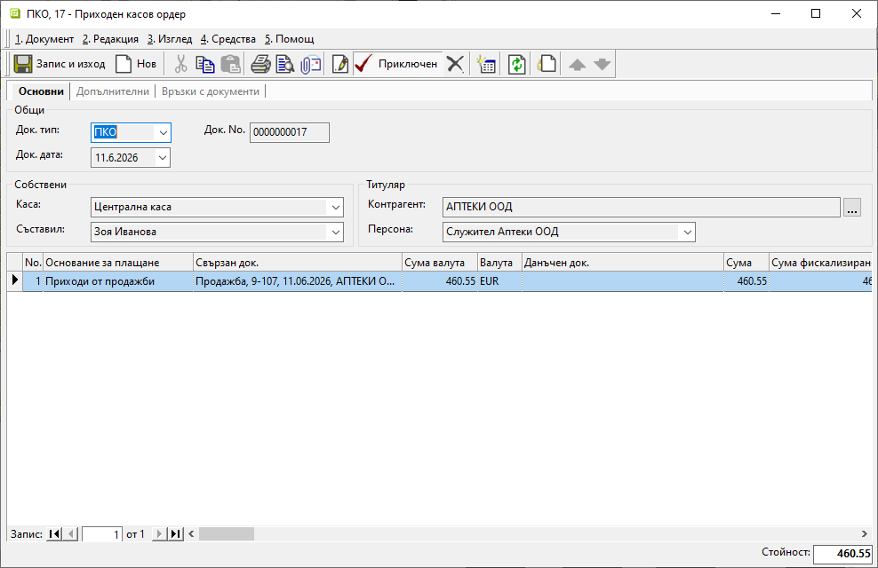
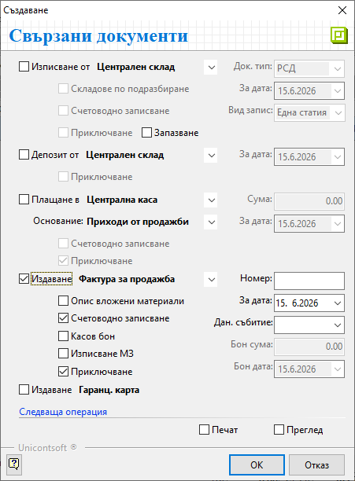
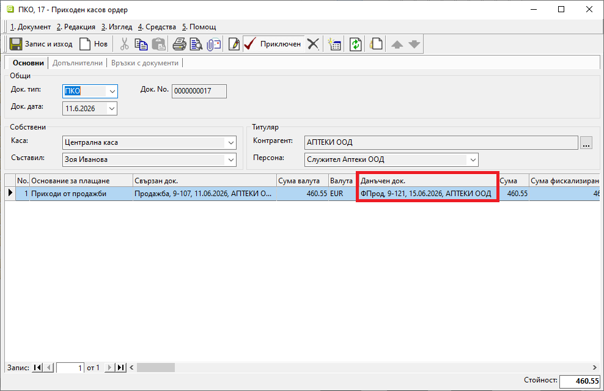

# Автоматично свързване на плащания

Добавена е възможност за автоматично свързване на регистрираните плащания по вътрешнофирмени документи с издадените в последствие данъчни.  
Новата функция има следните характеристики:    

   - Свързва само документи и плащания в евро.  
   - Работи за касови и за банкови документи.  
   - Свързва документи от един контрагент.  
   - Свързва данъчен и документ за плащане от една и съща година.  
   - Свързва данъчни документи без регистрирано плащане.  
   - При частични плащания или надвнасяне по вътрешнофирмените документи същите ще се пренесат и за данъчните.    

> Автоматичното свързване на плащания остава извън обхвата на ограниенията в **Работни периоди**.  

Новите параметри могат да бъдат дефинирани отделно за покупки и продажби.  
Опциите са достъпни от меню **Администрация » Настройки** в полета:  

- *Автоматично свързване фактури за продажба и плащания*  
- *Автоматично свързване фактури за покупка и плащания*  

{ class=align-center w=15cm }

<ins>Пример:</ins>  
Извършена е продажба, разплатена от клиента в брой.  
В последствие се издава данъчен документ - фактура.  

Процесът по обработка на документи би изглеждал по подобен начин в системата:  

1. Записва се настройката *Автоматично свързване фактури за продажба и плащания*: **Да**.  

2. Приключват се документ за продажба и **ПКО**-*Пиходен касов ордер* с осчетоводяване. В **ПКО** и в счетоводния запис към него ще се обзаведе единствено поле **Свързан док.**. Полето **Данъчен док.** остава празно, т.к. няма издадена фактура към момента.   

{ class=align-center w=15cm }  

3. В последствие се генерира данъчен документ **Фактура за продажба** със счетоводно записване.  

> Опцията *Касов бон* към фактурата не се маркира, когато за **ПКО** вече има генериран счетоводен запис.    

{ class=align-center }

4. След приключване на фактурата в **ПКО** и в счетоводния му запис полето **Данъчен док.** е вече обзаведено.  

{ class=align-center w=15cm }
